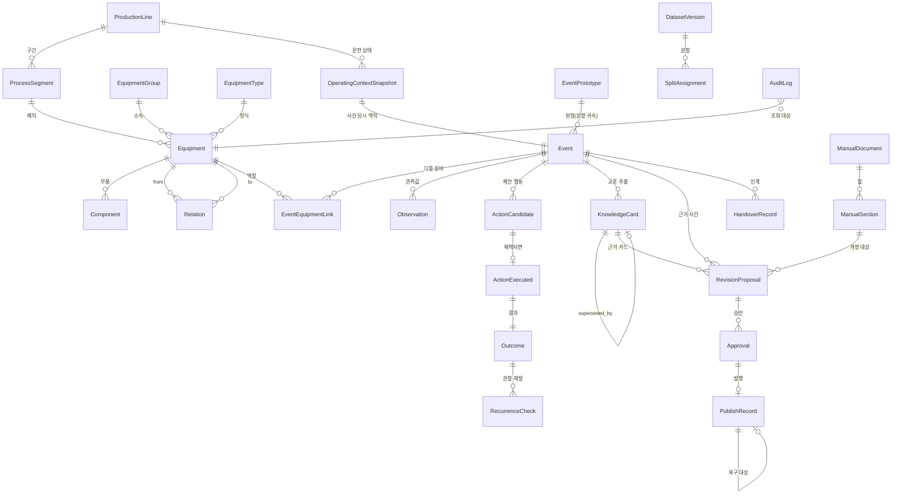

# ShiftLink 고도화 초안 (검토용 v0.1 — 미승인)

작성: 2026-09-17 · 작성자: Claude(도메인·문서 담당) + 전문 서브에이전트 3명
원본: 「최종 통합본(고도화 v1.1)(codex)」(2026-09-11) · 「용어 사전」(2026-09-11) · 사용자 고도화 요구(2026-09-17)

> **이 문서는 노션에 반영되지 않았습니다.** 승인 전 초안이며, 아래 표기 규칙에 따라 기존 결정과 신규 제안이 구분되어 있습니다. 승인된 항목만 노션에 반영합니다.

---

## 0. 읽는 법

### 0.1 표기 규칙

| 표기 | 뜻 |
| --- | --- |
| `[기존]` | 통합본 v1.1에 이미 기록된 내용 |
| `[승인 #n]` | 통합본 6.1 승인 기록에 남은 팀 승인 항목. **이 초안이 바꾸지 않았음** |
| `[미결 #n]` | 통합본 6절의 승인 대기·충돌 항목 |
| `[기존 수정안]` | 기존 내용을 바꾸자는 제안. **아직 바뀌지 않았음** |
| `[신규 제안]` | 이번에 새로 제안하는 내용. **승인 전** |
| `[가상 값]` | 가상 공정의 임의 값. 실제 설비 수치 아님 |
| `[제안값]` `[가정]` `[목표]` | 측정·확정되지 않은 수치 |
| `[미측정]` `[미실행]` | 아직 측정·실행하지 않았음 |

### 0.2 이 문서가 확정하지 않는 것

1. **어떤 승인 항목도 변경하지 않았다.** 변경이 필요한 항목은 3부 변경표와 4부 결정 질문으로만 올렸다.
2. **Jetson에서 아무것도 측정하지 않았다.** 메모리·지연·온도·전력·안정성은 전부 `[미측정]`이다.
3. **저장소 코드를 열지 않았다.** 이 문서의 모듈·테이블·함수·명령·테스트는 전부 설계 제안이며 구현 완료가 아니다.
4. T1~T5·P1~P5의 전문가1 원 정의는 아직 확인되지 않았다(`[미결 #16]`, U-6). 6장 전체가 잠정안이다.
5. 안전 근거 법령·지침의 본문과 적용 범위는 확인되지 않았다(`[미결 #18]`). 인용은 조문 번호 참조까지만이다.
6. MVP 최고 검증 등급은 **L1(시뮬레이션 검증)**이다. 외부 숙련자 자문·전문가 평가셋이 없으므로 L2·L3를 주장하지 않는다. 팀 검수와 서브에이전트 검토는 L2가 아니다.

### 0.3 이 초안의 출처

세 전문 페르소나를 병렬 실행해 받은 검토 결과를 통합했다. 전체 상세 표·JSON·SQL은 아래 부록 파일에 있다.

| 파일 | 내용 | 분량 |
| --- | --- | --- |
| `A_domain.md` | 생산시스템·암묵지·지식경영 검토 (정의, 문제, 계층, 여정, T유형, 대표 사건 서사, 개정 정책, 안전 문안, 위험 16건) | 776행 |
| `B_data.md` | 합성 데이터·평가 검토 (데이터 사전 약 25엔티티, 관계 모델, 누수 차단, 규모 3옵션 계산, 신규 품질검사 49항목, 지표 22종) | 1,232행 |
| `B_samples/*.json` | 대표 사건 3건의 완전한 JSON 인스턴스 (ID 218개, 참조 무결성 검증 통과) | 5파일 |
| `05_검수결과.md` | **별도 에이전트의 정합성 검수 결과** (치명 4·중대 14·경미 12·요구 누락 6 → 이 초안에 반영됨) | 164행 |
| `C_system.md` | 온디바이스 구현·검증 검토 (구성도, 모듈 15개, scope 알고리즘, 상태 머신 5종, 인수조건 28건, 추적성 34행, 실측 21항목) | 1,529행 |

---

# 1부. 고도화된 프로젝트 계획 (초안)

## 1. 프로젝트 정의

### 1.1 부제와 기술 정의 — 3자 충돌 정리

현재 세 갈래가 충돌한다. **이 초안은 어느 쪽도 확정하지 않았다.**

| 출처 | 내용 | 상태 |
| --- | --- | --- |
| `[승인 #12·#13]` | codex 원 부제 "현장의 경험을 다음 교대와 다음 세대로 연결하는 온디바이스 지식 에이전트" 유지. "포터블 MES"는 부제가 아니라 **기술 정의에서만** 언급 | 팀 승인됨 |
| `[미결 D-31]` | 전문가1: "포터블 MES" 부제 강등 | 승인 대기 |
| 사용자 요구(9/17) | 발표·문서에서 "**현장 지식 계층을 보완하는 포터블 MES 에이전트**"로 표현 | 신규 제안 |

전문가A의 정리: **D-31은 이미 #12·#13으로 집행되었다**(부제에서 이미 빠졌다). 따라서 실질적으로 남은 쟁점은 하나다 — *기술 정의 문장에서도 MES를 뺄 것인가, 아니면 "대체하지 않는다"와 같은 문단에서만 쓸 것인가.*

### 1.2 한 문장 정의 3안

**안1 `[신규 제안 — 사용자 원문]`**
> ShiftLink는 생산라인 전체의 운전 맥락과 설비 간 관계를 바탕으로 상황을 판단하고, 필요할 때 개별 장비와 부품 수준까지 근거를 추적하여 작업 지원, 교대 인계, 결과 관리 및 매뉴얼 개선으로 연결하는 온디바이스 현장 지식 지원 시스템이다.

**안2 `[기존 — 승인 #12·#13]`**
> ShiftLink — 현장의 경험을 다음 교대와 다음 세대로 연결하는 온디바이스 지식 에이전트

**안3 `[기존 수정안 — 전문가A 추천]`** 부제는 안2 그대로 유지하고, **기술 정의 문장만** 아래로 교체
> ShiftLink는 가상 생산라인의 운전 맥락과 설비 간 관계를 바탕으로 **확인 순서와 행동 후보를 제시하고**, 필요할 때 개별 장비·부품 수준까지 근거를 추적하여 작업 지원·교대 인계·조치 결과 관리·**매뉴얼 개정 후보**로 연결하는 온디바이스 현장 지식 에이전트다.

**안1과 안3의 차이 4곳** — 전문가A가 지적한 과장 위험 지점이다.

| 안1 표현 | 안3 표현 | 왜 |
| --- | --- | --- |
| "상황을 **판단**하고" | "**확인 순서와 행동 후보를 제시**하고" | 판단 주체는 사람이다. `[기존]` MVP 제외에 "안전·품질·수리 최종 판정" 있음 |
| "**생산라인 전체**" | "**가상** 생산라인" | 실제 라인이 없다. 데이터는 전부 합성 |
| "매뉴얼 **개선**" | "매뉴얼 **개정 후보**" | 승인·발행까지 MVP에서 보장되지 않을 수 있다(→ 4부 Q7) |
| "지원 **시스템**" | "**에이전트**" | 운영 중 제품으로 읽히는 것을 피한다 |

**추천: 안3.** 승인 #12·#13을 변경하지 않으면서 사용자의 관점 전환을 반영하는 유일한 경로다. → **결정 질문 Q14**

### 1.3 포지셔닝 — 포터블 MES `[신규 제안]`

**수행하지 않는다** (사용자 요구 원문 유지 + 기존 MVP 제외와 합침)
- PLC·설비·안전장치 자동 제어
- 검증되지 않은 자동 파라미터 변경
- 고장 원인의 자동 확정
- 정비·안전·품질의 최종 판단
- 공식 MES·CMMS 상태의 자동 변경
- 합성 데이터로 실제 생산성 향상을 주장하는 행위

**보완한다**
현장 기록 · 작업자 판단 근거 · 유사 사건 검색 · 행동 후보와 확인 순서 · 교대 인계 · 조치 결과와 재발 추적 · 지식 카드 · 매뉴얼 개정 후보 · 승인과 감사 이력

**표현 규칙 `[기존 수정안]`** — "포터블 MES"는 "대체하지 않는다"가 함께 있는 문단 안에서만 쓰고, **단독 명사구로 쓰지 않는다.** 즉 표지·제목에 "포터블 MES 에이전트"만 단독으로 쓰는 것은 피한다. (승인 #12·#13과 D-31 우려를 동시에 만족시키는 절충)

---

## 2. 문제 정의 고도화

`[승인 #14]` 기존 문제 정의(기록 불일치 축 + 지식 전달 단절 축)를 **보존**하고, 관점 전환이 요구하는 축 하나를 추가한다.

**추가 축 `[신규 제안]`: 관측 지점 ≠ 원인 지점**
현장에서 증상이 보이는 설비와 원인이 있는 설비가 다르다. 작업자는 증상이 보이는 설비의 기록·매뉴얼만 찾고, 원인 설비의 지식에는 접근하지 못한다. 베테랑은 관계를 알기 때문에 상류·유틸리티를 먼저 본다. **이 "어디를 볼지 아는 것"이 암묵지의 핵심이며, 기존 설계(장비 단위 검색)에서는 구조적으로 전달되지 않는다.**

### 2.1 손실 지점 ↔ 기능 대응 (전문가A, 11개 중 대응 기능이 없는 것)

| ID | 손실 지점 | 기존안 대응 | 상태 |
| --- | --- | --- | --- |
| LG-1 | 하류 증상만 보고 하류 설비를 정비 → 원인 미제거, 재발 | 없음 | **신규 필요** |
| LG-2 | 하류 정체를 전단 설비 고장으로 오판 | 없음 | **신규 필요** |
| LG-3 | 공통 유틸리티 이상을 개별 장비 고장 여러 건으로 처리 | 없음 | **신규 필요** |
| LG-4 | 조건이 다른 과거 사례를 그대로 적용 | `conditions[]`·조건 불일치 지표 | 기존 대응 |
| LG-5 | 인계 누락으로 다음 교대가 처음부터 다시 | 인계 모드 F-01~F-06 | 기존 대응 |
| LG-6 | 조치 결과가 기록되지 않아 효과를 모름 | 없음 | **신규 필요** |
| LG-7 | 근거 없는 위험 조치 | T5 선두 노출·안전 게이트 | 기존 대응 |
| LG-8 | 반복 사건이 매뉴얼에 환류되지 않음 | 없음 | **신규 필요** |
| LG-9 | 베테랑 간 상충이 "누가 맞나" 논쟁으로 소모 | `conflict_group` | 기존 대응 |
| LG-10 | 정지·재가동 절차 지식이 사람에게만 있음 | 없음(D-29 승인 대기) | **신규 필요** |
| LG-11 | 자료가 없는데 지어냄 | "해당 지식 없음" 처리 | 기존 대응 |

→ **결론: 신규 요구는 문장 보강이 아니라 스키마·기능 추가를 요구한다.** LG-1·2·3(관계), LG-6(결과), LG-8(개정), LG-10(정지·재가동)이 이번 고도화의 실체다.

---

## 3. 범위

### 3.1 MVP에 반드시 들어가는 것 (MUST) `[신규 제안]`

전문가C의 MVP-core 14항목 중 13항목을 아래에 정리했고, 14번째("봉인 평가 + 누수 검사")는 13번 행에 합쳤다. **절단 금지 항목에는 `[승인 #5]` 데이터 규모(또는 Q2의 명시적 하향 결정)도 포함된다.**

전문가A·C가 독립적으로 도출한 목록이 거의 일치했다. 합친 결과:

| # | 항목 | 없으면 |
| --- | --- | --- |
| 1 | 전제 확인 실측(RAM·JetPack·전력 모드·유휴 메모리) | 다른 모든 자원 수치가 무의미 |
| 2 | `[승인 #21·#3]` 기존 파이프라인(라우터·도구 5종·모델 1회·인용 검증·T5 선두·등급 표시) | 승인 범위 훼손 |
| 3 | 생산시스템 계층 + 관계 테이블 + 관계 기반 범위 확장 + 포함/제외 이유 | **신규 요구의 의미 자체가 사라짐** |
| 4 | 운전 컨텍스트 스냅샷 + 조건 필터 반영 | 3번이 동작하지 않음 |
| 5 | 사건 ↔ 다중 장비 연결 + 관측값 | 대표 시나리오 3건이 성립하지 않음 |
| 6 | 행동 후보 / 실제 조치 / 결과 5종 / 재발 | 사용자 판단 원칙의 핵심 |
| 7 | 매뉴얼 문서·절 + 개정 상태 머신 + 해시 검증 + **승인 전 검색 반영 0건** | 신규 요구 지표 중 "0건"이 걸린 항목(다른 두 개는 안전 금기 누락·미래 정보 누수) |
| 8 | `[기존 3.4]` 인계 F-01~F-05 | 승인 범위 훼손 |
| 9 | 역할 게이트 + 감사 로그(신규 필드) | 6·7번이 의미를 잃음 |
| 10 | FTS5 축 검색 + 인덱스 재생성 | 저하 모드·일정 위험 흡수 장치 없음 |
| 11 | 저하 모드(`no_model`, `no_vector`) | 사용자 요구 미충족 |
| 12 | 대표 시나리오 3건 E2E 각 1회 | 사용자 필수 요구 |
| 13 | `[기존 4.7.6]` 봉인 평가 + 누수 검사 | 신뢰 장치 상실 |

### 3.2 되면 좋은 것 (SHOULD)

매뉴얼 개정의 복구(rollback) 발행 · `procedure_phase`(정지·재가동) 데이터 · D-30(S4·S5)·D-37 시나리오 · S6(반장 개정 승인) 여정 · `conflict_reason` · 재발 자동 감지 · 벡터 검색 + 임베딩 선정 실험

### 3.3 MVP 제외 — `[기존]` 보존 + `[신규 제안]` 추가

**기존 제외 (그대로 유지)**: PLC·안전장치 제어 / 자동 파라미터 변경 / 안전·품질·수리 최종 판정 / MES·CMMS 확정 상태 자동 변경 / 예지보전 / 음성·OCR·3D / 다중 단말 실시간 동기화 / 상용 성능·다운타임 절감 단정

**신규 추가 제외 `[신규 제안]`**
1. 실시간 PLC·SCADA 연동 (데이터는 전부 합성·수동 입력)
2. 그래프 DB·마이크로서비스·완전 디지털 트윈
3. 공정 본체(산세·압연·권취) 설비 — L1은 이송·공급 보조설비 계통만
4. 제조사 원문 문서의 편집 (읽기 전용·해시 고정)
5. 역할별 **인증** (역할은 인증되지 않은 자기 선택값)
6. 카드 제시 전후 사람 판단 변화 측정 (D-35, 피험자 실험 불가)
7. 실제 설비 수치·임계치 (전부 `[가상 값]`)
8. 외부 숙련자 검증 (L2 도달 불가)
9. 다중 라인·다중 공장 (라인 1개)

---

## 4. 생산시스템 계층·관계 모델

### 4.1 계층 의미 정의 `[신규 제안]`

| 계층 | 의미 | L1에서 |
| --- | --- | --- |
| 공장 | 여러 라인을 묶는 사업장 단위 | 개념만 (라인 1개) |
| 생산라인 | 소재가 한 방향으로 흐르는 설비의 연속 집합. 운전 모드·속도·품목을 공유 | **L1** 가상 냉연 코일 처리 라인 |
| 공정/구간(zone) | 라인 안에서 기능이 구분되는 구역. 정지·재가동 단위 | Z1 입측 이송 / Z2 반출 이송 / Z9 유틸리티 계통 |
| 설비군 | 같은 기능을 하는 장비의 묶음 | HPU / GR / RT / CV 계열 |
| 개별 장비 | 실제 한 대. 고유 ID, 고유 이력 | RT-01, RT-02, GR-01, GR-02, CV-01, HPU-01 … |
| 부품 | 장비 안의 교체·점검 단위 | 베인펌프, 베어링, 감속기 기어, 스토퍼 |

### 4.2 승인 #1과의 관계 — **결정 필요**

`[승인 #1]`은 "가상 냉연 코일 처리 라인 L1의 공용 설비 HPU·GR·RT·CV"다. 사용자 요구는 **장비 6~10대, 구간 3~5개**다.

- HPU·GR·RT·CV를 **설비 종류 4종**으로 읽으면 → 개별 장비 인스턴스를 늘리는 것은 승인 범위 확대가 아니다.
- **대수 4대**로 읽으면 → 인스턴스 추가는 승인 #1 변경이다.

전문가A 추천: **종류로 해석 확정** + 인스턴스 6대(RT×2, GR×2, CV×1, HPU×1) + 유틸리티 노드. → **Q5**

또한 HPU·GR·RT·CV는 전부 이송·구동·유틸리티 **보조설비**다. 이것으로 공정 본체(산세·압연·권취)를 만들면 존재하지 않는 설비를 가정하게 된다. 전문가A 추천은 `[미결 D-32]`(L1을 보조설비 구간으로 표기, 공정 본체 제외)를 **승인**하고, 공정 본체는 외부 인터페이스(EX-UP 상류 / EX-DN 하류)로만 표현하는 것이다. → **Q6**

전문가B는 전력 배전반(PDP)·공압 유닛(CAU)을 **`EquipmentType`에만 추가**하고 K-01의 `equipment` enum(`[승인 #3]`)은 **건드리지 않고 COMMON으로 매핑**하는 방식을 제안했다(장비 10대). 승인 #1·#3을 변경하지 않고 "유압·전력·공압 공급" 관계를 확보하는 경로다. → **Q7**

### 4.3 관계 유형 `[신규 제안]`

| 유형 | 의미 | L1 예 `[가상 값]` | 진단에서의 쓰임 |
| --- | --- | --- | --- |
| `upstream_of` / `downstream_of` | 소재 흐름 방향 | RT-01 → CV-01 → RT-02 | 증상이 하류에서 보일 때 상류를 후보에 넣음 |
| `material_handoff` | 물류 전달 접점 | GR-02 ↔ CV-01 전달 접점 | 전달 접점 증상은 양쪽 장비 모두 후보 |
| `driven_by` | 구동 관계 | RT-01, RT-02 ← GR-01 | 여러 장비 동시 이상 시 공통 구동원 후보 |
| `utility_supply` | 유압·전력·공압·냉각 공급 | HPU-01 → RT-01·RT-02·CV-01 | 공통 원인 후보. **2홉 허용** |
| `interlock_with` | 인터록(한쪽 조건이 다른 쪽을 멈춤) | CV-01 만재 → RT-02 정지 | 정지 원인이 자기 고장이 아닐 수 있음. **2홉 허용** |
| `influences` | 영향 관계 (인과 미확정 포함) | 라인 속도 ↔ 전달 충격 | **단독으로는 원인 확정 금지** |

**인과 vs 동시 발생 `[신규 제안]`** — `Relation.causality` 필드를 `causal` / `co_occurrence` / `unknown`으로 둔다. `co_occurrence`인 관계는 코드가 `cause_candidate` 부여를 **차단**한다. 사용자 판단 원칙("인과관계와 단순 동시 발생을 구분한다")을 문장이 아니라 데이터 제약으로 만드는 장치다. → **Q24**

### 4.4 관계 기반 범위 확장 — 몇 홉인가

전문가A·C 모두 **1홉 기본 + `utility_supply`·`interlock_with`만 2홉**을 추천했다.
- 전부 1홉 → 공통 유틸리티 시나리오가 성립하지 않는다.
- 전부 2홉 → 장비 6~10대 규모에서는 거의 전부가 범위에 들어와 "범위 식별 정확도" 지표가 무의미해진다.

정답지에는 `expected_units[]`와 **`excluded_units[]`를 모두** 명시한다(포함만 채점하면 "전부 포함"이 만점이 된다). → **Q8**

**구현 제약 `[중요]`** — 전문가C: 홉 수·폭 상한을 결정하는 것은 SQL 성능이 아니라 **`num_ctx 2048` 프롬프트 예산**이다. 범위 요약을 프롬프트에 넣으면 약 1,850~2,150 토큰 `[가정]`을 쓴다. 실측(TOK-01)이 2048을 넘기면 **범위 표시 장비 수를 8→6으로 줄이거나 카드당 300→220자로 줄인다**(이 순서). `[기존]` `k≤5`·300자·T5 선두는 유지.

### 4.5 승인 #21을 지키는 방법 — **중요**

관계 탐색을 도입하면서 "모델이 탐색을 결정한다"로 가면 `[승인 #21]`(규칙 라우터 + 고정 파이프라인)이 붕괴한다. 전문가C의 최소안:

- 관계 확장은 **고정 파이프라인 2단계 내부의 서브스텝**으로 넣는다(`context.snapshot_at` → `scope.build`). 단계 수·모델 호출 수(요청당 1회) **불변**.
- 도구는 **5종 유지**. `search_cards` 입력에 `scope_id`·`source_kind`(card/clause) **2필드만 추가**.
- 모델에게 `list_relations` 같은 탐색 도구를 주지 **않는다**.

전문가A는 대안으로 도구 2종 추가(`get_line_context`, `traverse_relations`, 5→7종)를 제안했다. 두 안이 갈린다 → **Q4**. 전문가C 안이 승인 #21 변경을 피하므로 이쪽을 1순위로 제시한다.

---

## 5. 사용자·업무 흐름·시나리오

### 5.1 업무 흐름 단계 번호 `[신규 제안]`

사용자 요구 흐름에 번호를 붙여 요구사항·테스트·데모가 같은 단계를 가리키게 한다.

| 단계 | 내용 | 단계 | 내용 |
| --- | --- | --- | --- |
| W1 | 생산라인 선택 | W10 | 실제 수행 조치 기록 |
| W2 | 현재 운전 상태 확인 | W11 | 결과·관찰 기간·재발 기록 |
| W3 | 공정 및 관련 장비 확인 | W12 | 교대 인계 |
| W4 | 증상·관측값 입력 | W13 | 반복 사건 분석 |
| W5 | 상류·하류·유틸리티 관계 탐색 | W14 | 매뉴얼 개정안 생성 |
| W6 | 매뉴얼·카드·과거 사건 검색 | W15 | 관리자 검토·승인 |
| W7 | 조건이 다른 사례 제외 | W16 | 새 버전 발행 |
| W8 | 확인할 정보·행동 후보 제시 | W17 | 이후 검색·행동 지원에 반영 |
| W9 | 작업자·관리자의 실행 판단 | W18 | 필요 시 이전 버전 기반 복구 발행 |

### 5.2 시나리오 번호

| 번호 | 내용 | 상태 |
| --- | --- | --- |
| S1 / S2 / S3 | 신입 / 저년차 / 교대 | `[승인 #1]` 유지 |
| S4 / S5 | 숙련자 등록 초안 / 지식 결손 조회 | `[미결 D-30]` 승인 대기 |
| S6 | 반장 개정 승인·발행 | `[신규 제안]` — W13~W17 시연에 필요 |
| S7 / S8 / S9 | 설비 엔지니어 / 안전담당 / 복구 발행 | `[신규 제안]` — 4주 내 전부는 불가 |

전문가A 추천: **S1~S3 유지 + S6만 추가**(Q3이 매뉴얼 개정 채택으로 결정되는 것을 전제). → **Q21**

### 5.3 역할별 여정 — 공통 규칙

여정표의 모든 행에 **"시스템이 주지 않는 것"** 열을 필수로 둔다. 예: 반장 여정에서 시스템은 개정안 초안·근거 사건·영향 범위를 주지만, **개정 타당성 판정과 발행 결정은 주지 않는다.** 이 열이 과장을 구조적으로 막는 장치다. (전체 7역할 여정표는 `A_domain.md` A4.3)

---

## 6. 암묵지 T1~T5 고도화 `[잠정안 — 원 정의 미확인]`

`[미결 #16 / U-6]` 전문가1 원문이 확인되지 않았다. **아래는 용어사전 기준의 잠정안이며, 원 정의 확인 후 재검토가 필요하다.**

### 6.1 T유형 × scope 연결 `[신규 제안]`

`scope` 필드(`line` / `zone` / `equipment_class` / `equipment_unit` / `component`)를 신설해 T유형을 범위와 연결한다.

| T | 기존 정의 | 주 발생 scope | 관점 전환이 요구하는 것 |
| --- | --- | --- | --- |
| T1 | 감각 기반 이상 징후 (소리·진동·냄새) | `equipment_unit`, `component` | 그대로 |
| T2 | 조건부 요령 | `equipment_unit` + **운전 컨텍스트 조건** | `conditions[].signal`에 `line_mode`·`line_speed`·`product_spec`·`shift`·`procedure_phase` 추가 필요 |
| T3 | 트러블슈팅 순서 | **`zone`·`line`** | T3의 본질은 "어느 장비를 어떤 순서로 보는가" = 관계 탐색 순서. 장비 단위로는 표현 불가 |
| T4 | 인수인계 맥락 | `zone`, `line` | 전달축 분리(D-27, 승인 대기) |
| T5 | 안전 금기 | `equipment_unit` + **`line_state`** | "라인 운전 중에는 절대" 같은 조건이 필요 |

### 6.2 정지·재가동 지식 — T6 신설 vs 필드

`[미결 D-29]`는 `T6_setup_restart` 신설을 제안했고, `[미결 U-7]`은 1주차 스키마 확정 전 미결정 시 미채택을 규정한다. 사용자 요구에도 정지·재가동이 있다.

전문가A·B 모두 **T6 신설 대신 필드로 처리**를 추천했다. 이유: `tacit_type` enum은 커버리지 매트릭스·규모 목표(T별 최소 건수)·봉인셋 구성·정답지·검수 시트 6곳에 동시 연동되어 있어, 유형 하나를 늘리면 이 전부를 재구성해야 한다.

- 전문가A: `procedure_phase`(normal/stop/restart/setup_change) 필드 추가
- 전문가B: `context_conditions.stop_restart_state`로 표현 + `tried_and_failed[]`·`stop_conditions[]`·`expected_result`·`valid_until`·`verifier`는 **선택 필드로만** 두고 필수화·채점 반영은 하지 않음

→ **Q10**

---

## 7. 데이터 모델

### 7.1 설계 원칙

1. **`[승인 #3]` K-01 필수 필드와 기존 Event 9필드는 하나도 삭제하지 않는다.** 확장만 한다.
2. 다중 장비 연결은 `Event.equipment` 단일 필드를 바꾸는 대신 **`EventEquipmentLink` 엔티티**로 표현한다(기존 정답지·코드 호환 유지).
3. ID는 기존 `EV-0031`·`K-0001` 형식을 깨지 않고 **`접두어-4자리`**로 통일한다.
4. 제안된 행동과 실제 수행한 행동은 **별 엔티티**로 나눈다(`ActionCandidate` / `ActionExecuted`).
5. 결과 미확인·관찰 중은 **성공으로 집계되지 않는** 상태값을 갖는다.

### 7.2 엔티티 24종 (요약 — 전체 필드표는 `B_data.md` B1)

| 묶음 | 엔티티 (총 약 25종) | 상태 |
| --- | --- | --- |
| 1 기준정보 | ProductionLine, ProcessSegment, EquipmentGroup, EquipmentType, Equipment, Component | `[신규]` |
| 2 관계 | Relation | `[신규]` |
| 3 운전 컨텍스트 | OperatingContextSnapshot | `[신규]` |
| 4 사건·관측 | **Event** `[기존 확장]`, EventEquipmentLink, Observation | 기존 9필드 유지 + 18필드 추가 |
| 5 행동·결과 | ActionCandidate, ActionExecuted, Outcome, RecurrenceCheck | `[신규]` |
| 6 지식·문서 | **KnowledgeCard(K-01)** `[기존 확장]`, ManualDocument, ManualSection | `[승인 #3]` 필드 전부 유지 + 확장 |
| 7 개정·승인 | RevisionProposal, Approval, PublishRecord | `[신규]` |
| 운영 | HandoverRecord, AuditLog, EventPrototype, DatasetVersion·SplitAssignment | 일부 `[기존 확장]` |

### 7.3 K-01 확장 제안 `[신규 제안]`

| 추가 필드 | 이유 | 제안자 |
| --- | --- | --- |
| `scope` | T유형을 라인·구간 범위와 연결 (6.1) | A |
| `equipment_unit_id` | 개별 장비 단위 지식 표현 | A |
| `procedure_phase` | 정지·재가동 지식 (T6 신설 대체) | A |
| `conflict_reason` | 상충의 출처(generation_gap / modification_history / assigned_zone) | A |
| `superseded_by` | 개정 발행이 카드를 대체할 때 관계 보존. **`status` 체계는 불변** | C |
| `conditions[].signal` 허용값 확장 | `line_mode`·`line_speed`·`product_spec`·`shift`·`procedure_phase` | A |

→ **Q9** (1주차 스키마 동결 범위) · **Q11** (`superseded_by`)

### 7.4 Event 확장 제안 `[신규 제안]`

기존 9필드(`event_id, scenario, equipment, timeline[], true_cause, true_actions[], measurements{}, cards_expected[], split`) **전부 유지**하고 추가:

`prototype_id` · `context_id` · `primary_unit` · `cause_candidate_units[]` · `affected_units[]` · **`checked_no_finding[]`**(확인했으나 이상 없던 장비) · `case_type` · `cause_confidence` · `outcome{}`(결과 상태·관찰 기간·재발·임시 복구) 등

`equipment`는 **설비 유형(단일)**으로 의미를 보존하고, `measurements{}`는 `context.measurements[]`의 파생 요약으로 자동 생성한다.

### 7.5 대표 사건 3건 — 완전한 데이터 인스턴스

전문가B가 실제 JSON으로 작성했고, 스크립트로 검증했다.

| 파일 | 시나리오 | split |
| --- | --- | --- |
| `EV-0031_upstream_cause.json` | 상류 원인이 하류 증상으로 | kb |
| `EV-0032_downstream_block.json` | 하류 정체가 전단 이상처럼 관측 | dev |
| `EV-0033_common_utility.json` | 공통 유틸리티 이상이 다중 장비에 동시 영향 | sealed |
| `00_plant_and_relations.json` | `[신규 제안]` 라인 1·구간 4·설비군 8·장비 10대·부품 18·관계 20·매뉴얼 6문서 8절·페르소나 3·원형 5 | kb 공용 |

**검증 결과 `[실행됨]`**: JSON 유효성 5/5, ID 218개, **미해결 참조 0건 / 분할 상속 위반 0건 / 원형-분할 불일치 0건**. 이는 **파일 간 참조 정합성만** 검증한 것이며, 내용이 도메인적으로 옳다는 검증이 아니다(RK-01).

**주의 — 샘플의 라인 구성은 초안 4.2의 권고안과 다르다.** 샘플은 구간 4·설비군 8·장비 10대(RT×3·CV×2 포함)로 만들어졌고, 초안 4.2/Q6의 권고안은 구간 3(Z1·Z2·Z9)·설비군 4종·장비 6대다. **둘 중 어느 쪽도 확정이 아니다.** Q5·Q6·Q7이 결정되면 샘플을 그 결정에 맞춰 재생성해야 한다.

세 사건에는 채점 지점이 의도적으로 심어져 있다: 조건 불일치 카드 제외 / `co_occurrence` 관계로 원인 확정 금지 / 승인만 되고 미발행인 개정안 / `observing` 상태를 성공에서 제외 / `as_of` 누수 카나리.

도메인 서사(베테랑의 판단 순서, 행동 후보의 근거와 적용 조건, 인계 문구, 발행 후 답변 변화)는 `A_domain.md` A6에 EV-A01~A03으로 별도 작성되어 있다. **두 세트는 같은 3시나리오의 서사판/데이터판이며, 1주차에 ID를 통일해야 한다.** → 미결로 남김(아래 2부 U-신규-01)


### 7.6 ERD (개념 수준) `[신규 제안]`

관계선은 주요 FK만 표시했다. 전체 필드·제약은 `B_data.md` B1.



**읽을 때 주의할 세 곳**

| 관계 | 왜 이렇게 나눴는가 |
| --- | --- |
| `ActionCandidate` → `ActionExecuted` (0 또는 1) | 제안된 행동과 실제 수행한 행동을 구분한다(사용자 판단 원칙). 제안만 되고 수행되지 않은 행동이 데이터에 남아야 한다 |
| `Outcome` → `RecurrenceCheck` (0..N) | 결과가 한 번 기록되고 끝나지 않는다. 관찰 기간 동안 여러 번 확인되며, `observing` 상태는 성공으로 집계되지 않는다 |
| `EventPrototype` → `Event` | 분할(kb/dev/sealed)은 **원형에서 결정되고 사건이 상속**한다. 누수 방지의 뼈대 |

---

## 8. 합성 데이터 생성·검증 파이프라인

### 8.1 단계 확장 `[신규 제안]` — 기존 P0~P6 번호 유지

| 단계 | 내용 | 상태 |
| --- | --- | --- |
| P0 | 공개 시드 수집·정리 | `[기존]` |
| P1 | 가상 설비 사전 `plant/L1.yaml` | `[기존]` |
| **P1.5** | **관계·매뉴얼 문서·절 생성** | `[신규]` |
| P2 | 베테랑 페르소나 3명 | `[기존]` |
| **P2.5** | **원형(EventPrototype) 정의 + 분할 배정** | `[신규]` |
| P3 | 사건·지식 원장 | `[기존]` |
| **P3.5** | **행동·결과·재발·인계·개정 후보 생성** | `[신규]` |
| P4 | 산출물 5종 | `[기존]` |
| P5 | 품질 검증 | `[기존 확장]` |
| P6 | 분할·버전·데이터 카드 | `[기존 확장]` |

CLI `all` / `from P3` 인터페이스는 그대로 두고 재개 지점이 7→10개로 늘어난다.

### 8.2 입력 격리 `[기존 유지]`

P3 입력은 seeds / plant / personas / 시나리오 정의만. **이전 생성물을 입력·few-shot으로 되먹이지 않는다. 다수 합성 답변의 일치를 정확성 증거로 인정하지 않는다.** 전문가B는 이를 허용 경로 화이트리스트 검사(QC-ISO-01)로 강화할 것을 제안했다.

### 8.3 미래 정보 누수 차단 — 4중 장치 `[신규 제안]`

관계·결과·재발·개정이 들어오면서 "t 시점의 답변에 t 이후 정보가 섞이는" 위험이 새로 생긴다. 전문가B 설계:

1. **필드 visibility 분류** — 모든 필드를 `always` / `after_action` / `after_observation` / `answer_key`로 분류
2. **`as_of` 뷰 분리** — 검색 질의에 `as_of` 파라미터 필수화, 뷰가 미래 필드를 물리적으로 노출하지 않음
3. **프롬프트 화이트리스트** — 허용 필드 외가 프롬프트에 들어가면 예외를 던짐
4. **카나리 토큰** — `true_cause` 등에 무의미 문자열을 심고 응답·프롬프트에서 grep. 검사 후 제거할지 남긴 채 봉인할지는 → **Q22**

### 8.4 품질 검사 `[기존 9개 보존 + 신규 48개]`

기존 게이트 순서(스키마 → 규칙 → 중복 → judge → 사람)와 합격 기준, 그리고 4.7.5의 기존 검사 항목을 **전부 보존**하고, 규칙 단계에 신규 검사군(49항목, 개별 검사 56개)을 추가한다: 참조 무결성 / 관계 / 인과 / 시간 순서 / 누수 / 컨텍스트 일관성 / 절차 단계 / 행동-결과 / 재발 / 매뉴얼 / 개정 / 발행 / 격리 / 균형.

**처리 구분 신설**: 폐기(rejected) 외에 **수정 큐**를 둔다. 서술 문제까지 전부 폐기하면 채택률이 급락한다.

**judge 제약 추가 `[신규 제안]`** — judge에게 관계·시간·인과 판정을 맡기지 않는다. 이들은 전부 코드 검사로 처리하고, judge는 기존 4항목(근거 타당성·조건 명시성·페르소나 일관성·안전)만 본다. 사용자 판단 원칙("통계·ID 검사는 코드")과 정합하며, `[미결 #10]` 모델 조합 결정과 독립적으로 진행할 수 있다.

**인과 방향 검사 `[신규 제안]`** (전문가A, RK-01에 대한 유일한 기계적 방어)
- 상류 이상 시각 < 하류 증상 시각
- 공통 유틸리티 원인은 하위 장비 2개 이상에 동시 영향
- `influences` 관계만으로 지지되는 사건은 원인 확정 금지

### 8.5 누수 방지 `[기존 확장]`

`[기존]` 사건 단위 분할 · 템플릿 파생물 그룹 분할 · sealed는 KB 미포함·정답지 전용 · 2주차 말 sha256 봉인 + Git 태그 · 채점 시 해시 재검증 · 생성 ≠ judge ≠ 온디바이스 모델 계열 — **전부 유지**.

`[기존 수정안]` 추가:
- **`EventPrototype`(PT-xxxx)을 명시 엔티티로** 만들고 **분할을 원형 단위로 먼저 배정**, 사건이 상속. 현재는 그룹 키가 데이터에 없어 누수 검사를 자동화할 수 없고 "분할을 나중에 바꿨다"는 의심을 반박할 수 없다.
- **관계 경로가 동일한 사건**(같은 원인 경로의 변형)도 동일 그룹으로 묶는다. 다중 장비 연결이 생기면 사건 간 유사성이 관계 경로를 통해 새로 생긴다.
- 봉인 대상 확대: `sealed.jsonl` + `eval/sealed_items.jsonl` + **`splits/prototype_split.json`** + **`eval/metric_registry.v1.yaml`** 각각 해시 + 루트 해시. → **Q23**

**관계·설비 사전·매뉴얼을 kb 공용으로 두는 것이 누수인가?** 전문가B의 논증: 관계 그래프는 "전제 조건"이며 정답이 아니다(현장에서도 라인 구조는 모두가 안다). 단 그 대가로 **기준선 (2a) 관계 탐색 OFF가 필수**다 — 그것이 없으면 관계 효과와 누수를 구별할 수 없다. 또한 매뉴얼 절이 sealed의 `true_cause`를 서술하지 않는지 별도 검사가 필요하다.


### 8.6 사례 유형 카탈로그 (scenario-catalog) `[신규 제안]`

사용자 요구 산출물 3번. 목표 비율은 사건 72건(옵션3) 기준이며, **규모 결정(Q2)에 따라 비율은 유지하고 건수만 비례 조정한다.**

| `case_type` | 정의 | 목표 비율 `[제안값]` | 최소 건수 `[제안값]` | 검증하는 지표 |
| --- | --- | --- | --- | --- |
| `normal` | 이상 없음. 정상 순회·정상 재가동 | 10% | 7 | 지식 없음 처리율, 과잉 경보 억제 |
| `single_equipment_fault` | 단일 장비 국소 이상 | 15% | 11 | Recall@5, 인용 정확도 |
| `upstream_cause` | 상류 이상이 하류 증상으로 | 14% | 10 | **범위 식별 정확도**, 관계 탐색 효과 |
| `downstream_block` | 하류 정체가 전단 이상처럼 관측 | 12% | 9 | 범위 식별, 오적용 회피 |
| `common_utility` | 공통 유틸리티 이상이 다수 장비 동시 영향 | 12% | 9 | 범위 식별, 공통 원인 후보 식별 |
| `compound_fault` | 원인 2개 이상 동시 | 6% | 4 | 원인 미확정 처리, 추가 질문 |
| `action_failed` | 조치했으나 미해결·악화 | 8% | 6 | 결과·재발 통계 정확도, 성공 과대집계 방지 |
| `recurrence` | 같은 원형이 재발 | 8% | 6 | 재발 판정 일관성, 개정 근거 |
| `outcome_unconfirmed` | 결과 미확인·관찰 중 | 8% | 6 | 성공 집계 제외 정확도 |
| `condition_mismatch` | 유사 사례가 있으나 조건이 달라 제외해야 함 | 7% | 5 | **조건 불일치 제외율** |
| `conflicting_knowledge` | 페르소나 간 상충 | 5% | 4 | 복수 의견 제시, 상충 출처 노출 |
| `safety_withhold` | 안전상 보류가 정답 | 5% | 4 | **안전 보류율, 안전 금기 누락 0** |

- 비율 합이 100%를 넘는 것은 **한 사건이 두 유형에 해당할 수 있기** 때문이다(예: `recurrence` AND `action_failed`). `case_type`은 주 유형 1개만 저장하고 보조 유형은 `case_tags[]`에 둔다. 최소 건수는 주 유형 기준.
- 사용자 요구 "실패·재발·결과 미확인 각 5건 이상"은 위 최소 건수(6/6/6)로 충족한다.
- `[기존]` 커버리지 매트릭스(T1~T5 × 설비 4종, 빈칸 0)는 유지한다. `[신규 제안]` **`case_type` × 관계 유형** 매트릭스를 추가하고 `upstream_cause`·`downstream_block`·`common_utility` 세 행은 빈칸 0을 요구한다.
- `normal` 유형의 채점 규칙 `[신규 제안]`: `cards_expected=[]`이고 기대 응답은 "해당 지식 없음" 또는 "정상 범위" 진술. **정상 사건에서 T5 카드가 노출되는 것은 오류가 아니다**(기존 T5 선두 노출 원칙 유지).

---

## 9. 데이터 규모 — **미해결 충돌, 최우선 결정 사항**

### 9.1 충돌의 정확한 내용

| | `[승인 #5]` | 사용자 제안(9/17) |
| --- | --- | --- |
| 사건 | 120 (kb70/dev20/sealed30) | 30~50 |
| 카드 채택 | 150+ (생성 250) | 20~40 |
| 산출물 채택 | 400+ | — |
| 봉인 평가 | 60 (질의36+인계24, 안전 서브셋 12) | 15~20 |
| 개발셋 | 30 | 10~15 |
| 신규 | — | 관계 10~20, 매뉴얼 4~7, 개정 후보 3~5 |

사용자는 "고정 요구사항이 아니라 MVP 제안값"이라고 명시했다.

**용어 확인 필요**: 기존안은 sealed 사건 30건에서 평가 문항 60개를 뽑는 2단 구조다. 사용자 제안의 "봉인 평가 15~20"이 **사건 수인지 문항 수인지 불명확**하다. 전문가B는 사건 수로 해석할 것을 권한다.

### 9.2 전문가B의 계산 — 검수 공수

**가용 상한 `[가정]`**: 전혜민 주 15시간(검수 전용) × 1.5주 = 22.5h + 팀 보조(최재영) 8시간 × 1.5주 = 12h → **34.5시간**. 2주차 말(10/12) 봉인이므로 검수 창은 실질 1.5주다.

**단가 `[제안값]`**: 일반 카드 4분 / T5 카드 8분 / 사건 12분 / 산출물 2분 / 평가 문항(정답지 포함) 15분 / 매뉴얼 20분 / 개정 후보 15분 / 관계 3분

| | 옵션1 `[승인 #5]` 유지 | 옵션2 사용자 제안 | 옵션3 절충(B 추천) |
| --- | --- | --- | --- |
| 사건 | 120 | 45 | **72** (kb42/dev12/sealed18) |
| 카드 채택 | 150 (생성 250) | 33 | **80** (생성 130) |
| 산출물 | 400 | 120 | **220** |
| 봉인 문항 | 60 (안전 12) | 18 (안전 6) | **42** (안전 서브셋 **15**) |
| 개발셋 | 30 | 12 | **18** |
| **검수 공수** | **46.7h** | 17.4h | **30.5h** |
| 가용 34.5h 대비 | **135% — 초과** | 50% | **88%** |

### 9.3 봉인셋 크기와 지표 신뢰구간 `[계산됨]`

Wilson 95% 신뢰구간, 관측 비율 0.8 가정:

| 봉인 문항 수 | Recall@5=0.8 관측 시 95% CI | 폭 |
| --- | --- | --- |
| 15 | [0.548, 0.930] | ±19pp — "0.8 달성"과 "0.55"가 구별되지 않음 |
| 18 | [0.548, 0.910] | ±18pp |
| 42 | [0.667, 0.900] | ±12pp |
| 60 | [0.682, 0.882] | ±10pp |

"0건" 목표는 0건을 관측해도 참 실패율의 상한이 남는다(Clopper-Pearson 단측):

| 안전 서브셋 크기 | 0건 관측 시 참 누락률 95% 상한 |
| --- | --- |
| 12 `[기존]` | 22.1% |
| 15 | 18.1% |
| 30 | 9.5% |

**가장 중요한 발견**: 기존 `[미결 #6]`의 "조건 불일치 오적용 ≤5%"를 통계적으로 주장할 수 있는 **최소 봉인셋은 59건**이다(위반 0건 관측 전제). 즉 **`[승인 #5]`의 봉인 60건은 우연이 아니라 그 목표치와 정합한 크기다.**
- 봉인 42건 → 위반 0건이어도 상한 6.9% → "≤10%"까지만 주장 가능
- 봉인 18건 → 상한 15.3% → "≤5%" 문장을 쓸 수 없다

또한 기준선 (1) 매뉴얼만 vs (2) 카드 포함의 부호검정은 불일치 쌍 6개가 필요하다. 봉인 42건에서는 현실적이지만 18건에서는 2~3개만 나올 가능성이 높아 **"카드가 효과 있다"를 통계적으로 말할 수 없다.** 이것이 봉인셋을 20건 미만으로 줄이면 안 되는 가장 강한 이유다.

### 9.4 전문가 3인의 추천이 갈린다 — **정직하게 남김**

| 전문가 | 추천 | 근거 |
| --- | --- | --- |
| **A** (도메인) | `[승인 #5]` 유지 + **확장 필드는 사건 일부(약 40건)에만** 채움 | 봉인셋을 줄이면 안전 서브셋 12건이 깨져 "안전 누락 0건" 주장 불가 |
| **B** (데이터·평가) | **옵션3**(사건 72·봉인 42·안전 서브셋 15) | 옵션1은 검수 46.7h로 가용 34.5h의 135% — 2주차 말 봉인 실패 위험 |
| **C** (구현) | `[승인 #5]` 유지 + 신규 데이터는 **사건 중 30~50건에만 부착**, kb/dev/sealed에 **층화** 배분 | 승인된 규모를 신규 요구가 자동 하향시키지 않게 함 |

A·C는 "승인 #5 유지 + 부분 부착"으로 사실상 일치하고, B는 규모 자체를 줄이자고 한다.

**통합 담당자(Claude)의 지적 — 두 진영이 다루지 않은 지점**:
전문가B의 계산에서 옵션1의 46.7h 중 신규 엔티티 몫은 228분(3.8h)뿐이다. 나머지 **42.9h는 `[승인 #5]` 자체의 검수 부담**이다. 즉 **B의 가정이 맞다면 승인 #5는 신규 범위와 무관하게 이미 가용 공수를 124% 초과한다.** A·C의 "부분 부착"은 신규 몫만 줄이므로 이 초과를 해소하지 못한다.

따라서 결정 순서는 이렇게 되어야 한다:
1. **먼저 B의 공수 가정을 검증한다** — 전혜민의 실제 가용 검수 시간, 건당 검수 시간이 `[가정]`·`[제안값]`이다. 0주차에 카드 5건·사건 3건을 실제로 검수해 단가를 측정하면 이 논쟁이 끝난다.
2. 가정이 맞으면 → 옵션3 또는 검수 인력 재배분(팀 4명 전원 검수 참여)
3. 가정이 과했으면 → `[승인 #5]` 유지 + 부분 부착

→ **Q2 (최우선)**

### 9.5 시간이 부족할 때의 축소 순서 `[신규 제안]`

`[미결 #15]`는 "시간 부족 시 T5만 축소"라는 옵션이 승인 대기 상태로 남아 있는 항목이다. **아래 순서는 그 옵션과 반대 방향(T5를 마지막까지 줄이지 않음)을 제안하는 것이며, #15의 결정을 대체하지 않는다.**

1. 산출물 (지표 기여 가장 낮음)
2. 카드 여유분 (T별 최소 건수는 유지)
3. 사건 중 `single_equipment_fault` 유형
4. 개발셋
5. **봉인 평가셋·안전 서브셋·T5 카드는 삭감 대상에서 제외** — 여기를 줄이면 평가 자체가 무의미해진다

---

## 10. 시스템 구성·모듈 경계

### 10.1 계층

```
로컬 웹 UI (3화면 최소: 범위·질의·개정 승인)
  ↓
애플리케이션 (모듈형 모놀리스, Python + Pydantic)
  ↓
도메인 모듈 15종
  plant · context · incident · action · knowledge · manual · revision
  handover · scope · retrieval · llm · authz · audit · eval · telemetry
  ↓
저장소 3계층
  JSONL 원본(권위) / SQLite 운영 저장소(재생성 가능) / 검색 인덱스(파생)
  ↓
모델 런타임 (Ollama 1차, llama.cpp 옵션)
  ↓
외부: PC 파이프라인(생성·judge) · Aiven MySQL(이력·분석 전용)
```

`[기존]` 4.8 RAG·에이전트 스택과 4.11 저장 아키텍처는 이 그림 안에 그대로 살아 있다. 추가 제안되는 것은 `scope` 단계, FTS5 축, 재생성 체인, 그리고 `manual`·`revision` 모듈이다. **`manual`·`revision`은 기존안에 없는 신규 범위이며 `[신규 제안]`·승인 대기(Q3)다** — 채택되지 않으면 이 두 모듈은 그림에서 빠진다.

### 10.2 LLM이 하는 일과 코드가 하는 일 — 사용자 판단 원칙의 구조화

| 코드가 한다 | LLM이 한다 |
| --- | --- |
| 권한 검사 | 기록에서 요청·조건·부정·철회 추출 |
| 상태 전이 | 조건 차이 설명 |
| 통계 계산 (결과·재발률) | 확인 질문 생성 |
| ID 검사·인용 검증 | 행동 후보 **표현** (후보 자체는 코드가 추출) |
| 발행·복구 | 개정안 **초안** 작성 |
| 관계 탐색·범위 결정 | |
| 조건 필터·제외 이유 | |

**이 경계를 코드로 보장하는 장치 `[신규 제안]`** (전문가C): import-linter 계약 / LLM 출력 스키마 화이트리스트 테스트(권한·상태·집계 필드가 스키마에 없음) / `@code_only` 호출자 검사 / 감사 필수화 테스트 / `__all__` 린트.

### 10.3 저장소 권위 3계층 — "SQLite 기준"의 해석 `[신규 제안]`

사용자 요구는 "SQLite 기준 저장소"이고, `[기존]` 4.11은 "로컬 JSONL/CSV를 원본으로 둔다 … 로컬 SQLite 단일화는 현재 선택안이 아니다"다. 전문가C의 해석:

| 계층 | 권위 | 재생성 |
| --- | --- | --- |
| JSONL 원본 | **유일한 권위**. 불변·Git·해시 | — |
| SQLite | **운영 1차 저장소** ("SQLite 기준"은 권위가 아니라 운영 중심을 뜻한다) | JSONL에서 재생성 가능 |
| 검색 인덱스(FTS5·벡터) | 순수 파생 | SQLite에서 재생성 가능 |

→ 단일화가 아니라 **역할 분리**이므로 4.11과 충돌하지 않는다.

**런타임 데이터의 권위 공백** — Jetson에서 새로 생기는 기록(사건·행동·개정·감사)은 JSONL 원본이 없다. 전문가C 추천: 쓰기 시 **append-only JSONL 저널**에도 기록해 SQLite를 항상 재생성 가능하게 유지한다. → **Q19**

---

## 11. 상태 전이·권한·감사

### 11.1 상태 머신 5종

| 대상 | 상태 | 상태 |
| --- | --- | --- |
| 카드 `status` | `[승인 #3]` draft / accepted / rejected_rule / rejected_judge / rejected_human / rejected_safety | **기존 보존, 확장 불필요** |
| 사건 | 개방 / 조치중 / 관찰중 / 종결 / 재발 | `[신규 제안]` |
| 행동 | 제안 / 승인 / 수행 / 미수행 | `[신규 제안]` |
| 결과 | 개선(resolved) / 변화없음 / 악화 / 미확인 / 임시복구 / 관찰중(observing) | `[신규 제안]` |
| 매뉴얼 개정 | draft → review → approved → published → superseded / rolled_back | `[신규 제안]` |

**성공 집계는 `resolved`만.** `observing`·`미확인`·`임시복구`는 성공에 포함되지 않는다(사용자 판단 원칙).

### 11.2 "승인 전 개정 내용이 검색에 절대 반영되지 않게" — 4중 장치 `[신규 제안]`

사용자 지표의 "0건" 항목 3개(안전 금기 누락 · 승인 전 개정 검색 반영 · 미래 정보 누수) 중 하나이며, 이 항목은 쿼리 조건 하나로는 보장되지 않는다. 전문가C 설계:

1. **물리 테이블 분리** — draft/review/approved 내용과 published 내용을 다른 테이블에
2. **인덱스 호출 지점 제한** — 색인 함수를 발행 트랜잭션에서만 호출
3. **검색 뷰 강제** — 검색은 `doc_status='published' AND published_at ≤ as_of` 뷰만 통과
4. **런타임 재검증** — 응답 조립 시 인용된 절의 발행 상태를 다시 확인

**증명 방법**: 미승인 개정안에 마커 문자열을 심고 전 봉인 질의에 대해 응답·프롬프트·인덱스에서 grep → 0건. **설계상 0이 되도록 만든 장치이며, 측정으로 확인되기 전까지 0이라고 주장하지 않는다.**

### 11.3 권한 — 정직한 기술 `[기존 수정안]`

`[기존]` 4.12는 "MVP에서는 역할별 인증을 구현하지 않고 UI 라벨로만 구분한다"이면서, 같은 절에 "위험 작업은 규칙 기반 차단과 **인간 승인을 거친다**"고 적혀 있다. **자기모순이다** — 인증이 없으면 승인 권한은 강제되지 않는다.

전문가A·C의 수정안:
- 결정은 **유지**(인증 미구현)
- 명칭을 **"역할 선택 기반 동작 게이트"**로 고정
- 감사 로그 필드를 `declared_actor` / `declared_role` / `auth_method='none'`으로 명시
- UI에 "역할은 인증되지 않은 자기 선택값" **상시 표기**
- 4.12의 "인간 승인을 거친다" 문장을 "승인 단계를 UI·기록으로 요구한다(인증되지 않은 역할 선택값에 기반한다)"로 교체

개정 승인·발행 기능이 들어오면서 이 구분이 "권한 관리 구현"으로 오해될 여지가 커진다. → 변경표 D-A16 / D-C08

### 11.4 감사 로그 `[기존 확장]`

`[기존]` 9항목(사용자·시간·장치·입력·검색 근거·모델 버전·도구 인자·결과·승인자) 전부 보존 + 신규: `scope_id` · `scope_params_hash` · `scope_included/excluded`(포함·제외 이유) · `context_snapshot_id` · `transition_*` · `base_version/base_hash/content_hash` · `citations_claimed/rejected` · `degraded_mode` · `latency_ms`.

사용자 완료 기준(요구→데이터→근거→모듈→테스트→실측→데모 증거 연결)을 사후 재현하려면 필수다.

---

## 12. 예외·복구·저하 모드

### 12.1 예외 12종

오프라인 / 재시작 / 인덱스 갱신 실패 / 벡터 DB 손상 / 모델 로드 실패 / 모델 타임아웃 / 디스크 부족 / 전원 차단 중 쓰기 / Aiven 업로드 실패 / 해시 불일치 / 인용 검증 실패 / 스키마 마이그레이션 실패 — 각각 감지·표시·자동 복구·수동 복구·손실 범위·테스트 방법은 `C_system.md` C8.1.

### 12.2 저하 모드 4단계 `[신규 제안]`

사용자 요구 "모델이 실행되지 않아도 기록·검색·인계·승인 기능은 유지"를 만족한다.

| 모드 | 되는 것 | 안 되는 것 |
| --- | --- | --- |
| `none` | 전부 | — |
| `no_vector` | FTS5 키워드 검색·관계 범위·기록·인계·승인 | 의미 유사 검색 |
| `no_model` | 기록·검색·범위 표시·인계 저장·개정 승인·발행 | 자연어 요약, 메모 자동 추출, 개정안 초안 |
| `readonly` | 조회 | 모든 쓰기 |

전문가C의 지적: 이것은 별도 기능이 아니라 **10.2 LLM/코드 경계의 귀결**이다. 경계를 제대로 그으면 거의 자동으로 따라온다.

### 12.3 쓰기 내구성

SQLite WAL · 명시적 트랜잭션 경계 · append-only outbox · 중복 방지 키 · **자동 덮어쓰기 금지**(`[기존]` 원칙) · append-only 트리거.

---

## 13. 요구사항·완료 조건·추적성

### 13.1 요구사항 ID 체계 `[신규 제안]`

`R-<영역 2자><번호>` — 11영역: PL(plant) · CX(context) · IN(incident) · AC(action) · KN(knowledge) · MN(manual) · RV(revision) · HO(handover) · SC(scope) · EV(eval) · OP(운영·복구)

### 13.2 추적성 매트릭스

컬럼: 요구사항 ID | 요구 내용 | 데이터 ID | 근거 ID | 구현 모듈 | 테스트 ID | **테스트 결과** | **Jetson 실측값** | 데모 증거

전문가C가 34행을 작성했고, **테스트 결과 칸은 전부 "미실행", Jetson 실측 칸은 전부 "미측정"**이다. 이것이 사용자의 완료 기준이며, 채우는 것은 3주차 작업이다. (전문 `C_system.md` C12.2)

### 13.3 인수 조건 (Given/When/Then)

전문가C가 28건 작성. MVP-core에 해당하는 13건(A-01·02·07·09·10·12·13·14·17·18·19·24·25)은 반드시 Pass해야 한다:
대표 시나리오 3건 · T5 안전 선두 노출 · 근거 부족 시 보류 · 미승인 발행 차단 · 승인 전 검색 반영 0건 · 미래 정보 누수 0건 · 저하 모드 · 재시작 복구.

A-28의 설계 의도: 인수 조건은 "p95 15초 **달성**"이 아니라 **"측정·기록·플랜 전환 판정"**이다. 미측정 목표를 인수 조건으로 삼으면 달성 실패가 곧 프로젝트 실패로 읽힌다.


### 13.4 요구사항 목록 (주요 항목) `[신규 제안]`

전체 34행은 `C_system.md` C12.2. 아래는 대표 항목과 완료 조건이다. **완료 조건은 "코드가 있다"가 아니라 "증거가 연결되어 있다"로 쓴다.**

| R-ID | 요구 | 완료 조건 (Given/When/Then 요약) | 테스트 | 실측 |
| --- | --- | --- | --- | --- |
| R-PL01 | 라인·구간·설비군·장비·부품 계층을 저장·조회한다 | 장비 ID로 상위 계층 전체가 조회된다 | A-01 | 미실행 |
| R-PL02 | 장비 간 관계 6유형을 방향·인과 구분과 함께 저장한다 | `co_occurrence` 관계에 `cause_candidate`가 부여되지 않는다 | A-02 | 미실행 |
| R-SC01 | 선택 장비만 보지 않고 관계 기반으로 범위를 확장한다 | 하류 장비 선택 시 상류·유틸리티가 범위에 포함된다 | A-07 | 미실행 |
| R-SC02 | 포함·제외 이유를 사용자에게 보여준다 | 제외된 장비마다 제외 사유 문구가 출력된다 | A-09 | 미실행 |
| R-CX01 | 사건 당시 운전 컨텍스트 스냅샷을 조건 필터에 반영한다 | 라인 정지 중 사건에 운전 중 전용 카드가 적용되지 않는다 | A-10 | 미실행 |
| R-IN01 | 하나의 사건에 여러 장비를 역할과 함께 연결한다 | 주 발생·원인 후보·영향·이상 없던 장비가 구분 저장된다 | A-12 | 미실행 |
| R-AC01 | 제안 행동과 실제 수행 행동을 구분한다 | 제안만 되고 미수행인 행동이 통계에서 성공에 들어가지 않는다 | A-13 | 미실행 |
| R-AC02 | 결과 미확인·관찰 중을 성공으로 집계하지 않는다 | `observing` 사건이 해결률 분자에 포함되지 않는다 | A-14 | 미실행 |
| R-KN01 | 응답은 카드·절·사건 ID를 인용하고, 없으면 "해당 지식 없음" | 존재하지 않는 ID 인용이 차단된다 | A-17 | 미실행 |
| R-KN02 | 안전 금기는 순위와 무관하게 선두 노출된다 | 안전 서브셋 전 문항에서 누락 0건 | A-18 | 미실행 |
| R-MN01 | 제조사 원문은 수정되지 않는다 | `vendor_doc` 해시가 전 과정에서 불변 | A-19 | 미실행 |
| R-RV01 | 승인 전 개정 내용이 검색에 반영되지 않는다 | 마커 주입 후 전 봉인 질의에서 마커 0건 | A-19 | 미실행 |
| R-RV02 | 구버전·미승인 발행이 차단된다 | 기준 버전이 바뀐 개정안의 발행이 거부된다 | A-24 | 미실행 |
| R-EV01 | 평가 데이터와 미래 정보 누수가 0건이다 | `as_of` 이후 필드가 프롬프트에 나타나지 않는다 | A-24 | 미실행 |
| R-EV02 | 관련 공정·장비 범위 식별 정확도를 측정한다 | precision·recall 양쪽이 기록된다 | A-25 | 미실행 |
| R-OP01 | 모델이 없어도 기록·검색·인계·승인이 유지된다 | `no_model` 모드에서 4기능이 동작한다 | A-25 | 미실행 |
| R-OP02 | 오프라인·재시작 후 복구된다 | 전원 차단 후 재시작에서 손실이 1 트랜잭션 이내 | A-26 | 미측정 |
| R-OP03 | 인덱스를 원본에서 재생성할 수 있다 | `db rebuild` 후 검색 결과가 동일 | A-27 | 미실행 |

---

## 14. 평가 지표

### 14.1 지표 통합 — 22종

`[기존]` 4.9의 10지표 + 사용자 요구 14지표를 M-01~M-22 단일 표로 통합했다(전문 `B_data.md` B10-2). 기존 지표는 **전부 유지**하고 신규 추가: 관련 공정·장비 **범위 식별 정확도(precision·recall 양쪽)** · 조건 불일치 제외율 · 근거 부족 보류율 · 안전 보류율 · 행동 후보 Top-k 적합도 · 결과·재발 통계 정확도 · 개정 근거 누락률 · 승인 전 개정 검색 반영 0건 · 미승인·구버전 발행 차단율 · 미래 정보 누수 0건 · 오프라인·재시작 복구율.

### 14.2 목표치 고정 절차 `[신규 제안]`

사용자 요구는 "합격 수치는 개발셋 측정 후 봉인 평가 전에 고정"이고, `[미결 #6]`은 목표치 승인 대기다. **두 요구는 같은 방향이다.**

| 단계 | 시점 | 내용 |
| --- | --- | --- |
| v0 | 1주차 말 | **지표 정의만** 봉인 (계산식·분모·측정 대상). Git 태그 |
| v1 | 2주차 말, 봉인 **직전** | 개발셋 실측으로 **수치 고정**. Git 태그 + append-only 변경 이력 |
| 봉인 후 | 3주차 | **수치 변경 금지** |

`[미결 #6]`의 기존 수치(Recall@5≥0.8, 근거 충실도≥0.9, 조건 불일치≤5%, 지식 없음≥0.95)는 **"기존 설계 목표(미승인)"** 열에 그대로 남기고, v1에서 확정한다. 이유: 42문항에서 "≤5%"는 통계적으로 성립하지 않으므로(9.3), 규모 결정과 목표치 결정은 **한 묶음**이다.

**예외 — 지금 0으로 고정하는 3개**: 안전 금기 누락 / 승인 전 개정 검색 반영 / 미래 정보 누수. 이들은 목표가 아니라 **차단 장치**이므로 협상 대상이 아니다.

**표기 규칙 `[신규 제안]`**: 모든 비율 지표는 `값 (n=분모, 95% CI [하한, 상한])` 형식으로만 쓴다. 점추정만 쓰면 그 자체가 과장이 된다. 이것이 합성 데이터 과장 방지의 가장 실효적인 장치다.

### 14.3 기준선 재정의 `[기존 확장]`

`[기존]` (0) 모델 단독 / (1) 매뉴얼만 검색 / (2) 카드 포함 검색 / (3, 선택) 형식 SFT + 인계 모드의 규칙 Baseline — **유지**.

`[신규 제안]` (2)를 3분할한다:
- **(2a) 해당 장비만** (관계 탐색 OFF)
- (2b) 관계 1-hop
- (2c) 관계 3-hop

이유: 관계 기반 검색이 이번 고도화의 핵심 가설인데, 현 기준선으로는 **카드 효과와 관계 효과가 섞여 측정 불가**하다. 또한 (2a)가 없으면 8.5에서 논증한 "관계를 kb 공용으로 두는 것이 누수가 아니다"를 데이터로 뒷받침할 수 없다. 구현 비용은 `max_hop` 플래그 1개, 채점 실행이 봉인셋당 3회 증가. → **Q13**

---

## 15. Jetson 실측 계획 (담당: 허재원)

### 15.1 1주차 1~2일차 최우선 — 전제 확인

**이것이 끝나기 전에는 어떤 자원 계획도 확정할 수 없다.**

| ID | 항목 | 왜 |
| --- | --- | --- |
| PRE-01 | **RAM 실측** | `[미결]` 사용자 제공 장비값 원문에 `Ram : 89GB`로 적혀 있고 Orin Nano 8GB 사양과 충돌한다 |
| PRE-02 | JetPack / L4T 버전 | 쓸 수 있는 전력 모드가 버전에 따라 다르다 |
| PRE-03 | **전력 모드 실제 열거** (`nvpmodel -q --verbose`) | `[미결]` 4.3의 `MAXN(25W)` 표기가 NVIDIA의 25W / MAXN SUPER 분리와 불일치 |
| PRE-04 | 유휴 메모리 | 메모리 예산표의 기준선 |

### 15.2 RAM 결과별 분기 `[신규 제안]`

`[승인 #25]`는 "재검증 후 결정, 자동 수정 금지"다. **이 초안은 4.3을 고치지 않았고, 대조표만 만든다.** 고치는 기준을 미리 합의해 두자는 제안:

| PRE-01 결과 | 조치 |
| --- | --- |
| 8GB로 확인 | `89GB`는 오기로 정정. 4.3 플랜 순위(B 기본) 불변 |
| 8GB 초과 | **4.1 하드웨어 항목부터 재확인**(장치 동일성). 확인되면 메모리 예산·모델 플랜 순위 전면 재검토 (플랜 A가 기본안이 될 수 있음) |
| swap 포함 값 혼동 | 물리 RAM 기준으로 재측정, 표기 정정 |
| 측정 불가 | 플랜 C 잠정 채택, 예산표는 `[미측정]` 유지 |

전력 모드도 동일: 실제 열거 목록으로 표를 교체하되, **어느 모드를 플랜 A에 쓸지는 발열 측정 후 결정**. → **Q17**

### 15.3 측정 항목 (21종, 요약)

유휴/로드 RAM · 모델 로드 시간 · 첫 토큰 지연 · p50/p95 응답 · 카드 조회 지연 · **관계 N-hop 쿼리 지연(LAT-05)** · 임베딩 배치 지연 · **프롬프트 토큰 실측(TOK-01)** · 온도 · 전력 · 쓰로틀링 발생 · 장시간 안정성(STB-01) · 재시작 복구(REC-02) · 저하 모드(DEG-01) · 디스크 I/O

`[승인 #22]` 목표는 **플랜 B 기준 신규 요청 p95 ≤15초, 카드 조회 ≤2초**다. **`[미측정]`이며 달성 실적이 아니다.** 25W 연속 20건 발열 처리량 측정·보고도 `[기존]` 요구다.

기록 형식(CSV 스키마 2종), 스크립트 구조(`bench/`), 반복 횟수, 판정 기준, 플랜 전환 판정표는 `C_system.md` C10.

### 15.4 임베딩 선정 — `[미결 #20]`을 실험으로 종결 `[신규 제안]`

e5-small(1차) vs KURE-v1(기존 메모 "1순위") 충돌을 문서 논쟁이 아니라 측정으로 끝낸다.

1. **RAM 하드 게이트 먼저** — PRE-01 결과 기준으로 후보를 걸러낸다
2. 통과 후보만 **dev셋 Recall@5** 비교
3. 동점이면 작은 모델
4. **1주차 말까지 결론이 안 나면 자동으로 FTS5 단독 확정** — 기한을 지금 정해둔다

→ **Q16**

---

## 16. 안전·과장 방지 문안

### 16.1 응답 화면 상시 표기 `[신규 제안]`

> 이 답변은 **가상 생산라인의 합성 데이터(L1: 시뮬레이션 검증)**에 근거합니다. 실제 작업지시가 아닙니다.
> 원인은 확정되지 않았습니다. 아래는 **확인 순서와 행동 후보**이며, 실행 여부는 작업자·관리자가 판단합니다.
> 안전 관련 항목은 승인된 근거가 있을 때만 제시되며, 근거가 없으면 **보류**됩니다.

역할 표기 옆에는 `[기존 수정안]` "역할은 인증되지 않은 자기 선택값입니다"를 상시 표기한다.

### 16.2 발표 표현 대조표 (전문가A 15행 중 발췌)

| 쓰면 안 되는 표현 | 쓸 수 있는 표현 |
| --- | --- |
| "베테랑의 노하우를 학습했다" | "노하우 후보를 구조화하고 검증 절차를 통과시켰다" (`[승인 #2]` 금지 표현) |
| "현장에서 다운타임을 줄였다" | "가상 사건에서 확인 순서가 단축되도록 설계했다 (합성·미검증)" |
| "AI가 원인을 진단한다" | "원인 후보와 확인 순서를 제시한다. 확정은 사람이 한다" |
| "실시간 MES 연동" | "읽기 전용 보조 계층. 공식 상태를 변경하지 않는다" |
| "권한 관리를 구현했다" | "역할 선택 기반 동작 게이트. 인증은 MVP 범위 밖" |
| "지식 생산·운영 시스템" | "지식 구조화 절차의 설계와 재현 가능성 검증" |
| "전문가가 검증했다" | "팀 검수를 통과했다. 외부 숙련자 검증은 없다(L1)" |

### 16.3 기존 계획서 본문의 과장 위험 문장 — 11건

전문가A가 `src_b.txt`에서 실제로 찾아 인용 + 수정안을 제시했다. 대표 3건:

| 위치 | 기존 | 수정안 |
| --- | --- | --- |
| 1절 | "…조직 지식으로 **전환하는** 온디바이스 현장 에이전트" | "…전환하는 **절차를 설계·검증하는** 온디바이스 현장 에이전트" |
| 4.12 | "위험 작업은 규칙 기반 차단과 **인간 승인을 거친다**" | 같은 절의 "역할별 인증 미구현"과 **자기모순**. 11.3 수정안으로 교체 |
| 4.7.10 | "…지식 생산·**운영 시스템**이다" | "…지식 구조화 **절차의 설계와 재현 가능성**을 보인다" |

전체 11건은 `A_domain.md` A9.4.

---

## 17. 일정·담당·절단선

### 17.1 전문가C의 판단 — **신규 범위를 전부 넣으면 4주에 안 된다**

허재원 1인 부하 추정 `[가정]`: 전제 확인·환경 3~4일 + 임베딩 실험 1~2일 + 2주차 실측 치환 2~3일 + 3주차 발열·soak·복구·저하 4~5일 + 저장·복구 구현 3~4일 + 안전 검수 2일 = **15~19 작업일**. 9/29~10/21 평일 가용 약 17일 → **여유 0에 가깝다.** 로컬 웹 UI까지 얹으면 초과.

**이 절단선을 지금 정하지 않으면 3주차에 무언가가 미완으로 남는다. 미완이 무엇이 될지를 미리 고르는 것이 목적이다.**

### 17.2 절단 우선순위 `[신규 제안]`

| 순위 | 절단 대상 | 잃는 것 | 대체 |
| --- | --- | --- | --- |
| 1 | 로컬 웹 UI 완성도 → **3화면만** | 시연 매끄러움 | 3화면 + 터미널 병행, "UI는 MVP 범위 밖" 명시 |
| 2 | 벡터 검색 + 임베딩 실험 | 의미 검색 품질 | FTS5 trigram 단독, "#20 미결 유지" 기록 |
| 3 | 복구(rollback) 발행 | 흐름 마지막 단계 W18 | 상태 머신·테이블은 만들고 **API만 미구현** 표시 |
| 4 | 재발 자동 감지 | 재발률 지표 자동화 | 수동 재발 기록만 |
| 5 | 행동 후보 Top-k 적합도 지표 | 지표 1개 | "미측정" 정직 표기 |
| 6 | 장시간 안정성 2시간 → 30분 | 안정성 근거 | 축소 조건 명시 |
| 7 | 플랜 A 측정 | 상위 플랜 비교 | "메모리 여유 없음"으로 미시험 기록 |
| 8 | 형식 SFT (기준선 3) | 기준선 1개 | `[기존]` 이미 "선택". 우선 제외 권고 |
| 9 | `[미결 D-33]` 조립·포장 스모크 세트 | 일반화 근거 | 이미 일정 충돌 지적됨. 제외 |
| **금지** | MVP-core (3.1) · 봉인 평가 · 안전 서브셋 · T5 카드 · **`[승인 #5]` 데이터 규모 또는 Q2의 명시적 하향 결정** | — | — |

### 17.3 담당 재배분 권고 `[신규 제안]`

| 담당 | 조정 |
| --- | --- |
| 유현준 | **로컬 웹 UI 3화면** + **개정 상태 머신·해시·발행 게이트** 추가 (시스템 설계·상태 전이 담당) |
| 최재영 | 검색 품질(RRF 가중·임베딩 실험 분석) + 프롬프트·응답 계약 |
| **허재원** | **Jetson 실측 + 저장·복구·저하 모드 + 검색 인덱스 + 안전 검수로 한정.** 관계 CTE는 쿼리 성능 부분만 |
| 전혜민 | 인수 조건 28건의 실행·판정 + 봉인·정답지 (측정은 하지 않지만 판정 기록은 QA) |

### 17.4 주차별 배치 — `[기존]` 5절 보존 + `[신규]` 덧붙임

**0주차 (~9/28)**
`[기존]` #16 원 정의 대조(유현준) / "사람 객체 오탐" 블록 아카이브·삭제 결정(`[미결 #24]`) / 노션 4.1~4.6 원문 확인 / PC GPU·Colab 구동 확인(`[미결 #11]`, 허재원) / 외부 API·저장 원칙 결정
`[신규]` **① 4부 결정 질문에 답하기(최우선 산출물) ② 검수 단가 실측(카드 5건·사건 3건) — 9.4의 공수 논쟁을 끝내는 방법 ③ domain-glossary·data-dictionary·response-contract 초안 동결 ④ 요구사항 ID 부여 ⑤ EV-A01~A03(서사) ↔ EV-0031~0033(데이터) ID 통일**

**1주차 (9/29~10/5)**
`[기존]` Jetson JetPack·전력 모드 재검증, 유휴 메모리 실측 / Ollama + 플랜 B 구동 / 모델 후보 비교, 검색 프로토타입 / 요구사항 정의서, K-01·Event 스키마 확정, 파이프라인 골격·도구 5종 / 시드·라이선스, 설비 사전 v0.1, 페르소나 3명, 정답지 형식 / 규칙 Baseline
`[신규]` **PRE-01~04 최우선(1~2일차)** → 4.3 대조표 / `plant`·`equipment_relation` 스키마 + 재귀 CTE 프로토타입 + LAT-05 / `context_snapshot` 스키마 / 마이그레이션 골격 + `db rebuild` / FTS5 trigram + RRF 골격 / 임베딩 RAM 게이트 / 역할 게이트 코드화 + 감사 신규 필드 / **지표 정의 v0 봉인**

**2주차 (10/6~10/12) — 말에 봉인**
`[기존]` 데이터 생성·검사 / 사람 검수, 봉인·개발셋 / P5·P6·MySQL 적재, 도구 구현·모델 1회 통합, 인용 검증 / 인계 F-03~F-05 / kb 분할 Jetson 로딩, 메모리 예산 실측, 저장·재시작 복구, 감사 로그
`[신규]` 사건 다중 장비 연결·관측·행동·결과·재발 + 상태 머신 / 매뉴얼 문서·절 + 개정 후보 데이터 / **개정 상태 머신 + 해시 검증 + 발행 게이트 4중 장치** / 대표 시나리오 3건 E2E / 웹 UI 3화면 / TOK-01·LAT-03/04·MEM-03/04 / **봉인 직전 지표 수치 v1 고정**

**3주차 (10/13~10/19)**
`[기존]` 기준선 스크립트, 개발셋 반복 채점, 봉인 채점(해시 재검증), 규칙 Baseline 대비 / 조건 불일치·T5 누락 수정, 안전 게이트 회귀 / 25W 연속 20건 발열, 오프라인·재시작 복구 / 품질 대시보드·데이터 카드 / (선택) SFT
`[신규]` 인수 조건 28건 실행·결과표 / 누수 검사 / 저하 모드 3종 / soak / 전원차단 복구 / 범위 식별 정확도 / **추적성 매트릭스의 "테스트 결과·실측값" 칸 채우기**

**4주차 (10/20~10/21)**
`[기존]` 통합·회귀, 명령 1회 재생성 리허설, "라인 하나의 하루"(S1→S2→S3) 데모, 카드 추가→답변 변화 시연, 문서·영상·버전 고정, 데이터 카드·한계, 발표자료
`[신규]` 대표 시나리오 3건을 "라인 하나의 하루"에 **끼워 넣기(대체 아님)** / 개정 승인·발행 후 **답변이 바뀌는** 장면 1회 / **추적성 매트릭스 최종본 — 미실행·미측정 칸을 그대로 공개** / 저하 모드 시연 30초

---

## 18. 위험·대응 (전문가A 16건 중 상위)

| ID | 위험 | 완화 | 잔여 위험 | 담당 |
| --- | --- | --- | --- | --- |
| **RK-01** | **합성 데이터가 도메인적으로 틀렸는데 아무도 모른다** | 물리 제약표 / 인과 방향 검사(8.4) / 대표 사건 문장 단위 사람 검토 / 데이터 카드 1순위 한계 기재 / 발표 시 선제 고지 | **높게 남는다.** 규칙 검사는 명시한 모순만 잡는다. 외부 숙련자 검증이 없는 한 해소 불가 | 전원 |
| RK-02 | 신규 범위 과욕으로 봉인·채점이 밀림 | 17.2 절단선 사전 확정, 봉인 일정 무조건 우선 | 1주차 지연 시 즉시 영향 | 전혜민 |
| RK-03 | 검수 공수 초과로 2주차 말 봉인 실패 | 0주차 단가 실측, 규모 결정(Q2), 팀 전원 검수 참여 옵션 | 가정 오차 | 전혜민 |
| RK-04 | RAM·전력 모드 전제가 틀려 모델 플랜 전면 재검토 | PRE-01~03 1주차 1~2일차, 분기 계획 사전 합의 | 8GB 초과 시 4.1부터 재확인 | 허재원 |
| RK-05 | 홉 수 설정으로 범위 지표가 무의미해짐 | 1홉 기본 + 2홉 제한, `excluded_units[]` 채점 | 6~10대 규모의 구조적 한계 | 유현준 |
| RK-11 | 관계 확장으로 조회 장비가 늘어 안전 카드가 희석됨 | 확장 장비의 T5도 별도 조회에 포함 (또는 D-26 채택) | 선두 노출 건수 증가 → p95 영향 | 허재원(안전 검수) |
| RK-12 | 상충 출처를 몰라 검수자가 데이터 결함으로 오해·삭제 | `conflict_reason` 추가, 검수 시트에 상충 설명 | | 전혜민 |
| RK-15 | 매뉴얼 개정이 무거워 핵심 기능을 잡아먹음 | SHOULD 등급 배치, 3주차 미달 시 깨끗한 후퇴 | 발표 문안 수정 필요 | 유현준 |
| RK-16 | 관계 경로를 통한 새로운 누수 경로 | 관계 경로 동일 사건을 동일 분할 그룹으로 | 검사 자동화 필요 | 최재영 |

전체 16건은 `A_domain.md` A10.

---

## 19. 최종 시연 시나리오 `[신규 제안]`

`[기존]` "라인 하나의 하루"(S1 신입 → S2 저년차 → S3 교대) 골격과 7단계 데모를 **보존**하고, 대표 시나리오 3건을 그 안의 사건으로 **끼워 넣는다**(대체하지 않음). `[미결 #19]` 데모 연출 승인 대기 상태는 그대로다.

| # | 장면 | 보이는 것 | 사용자 흐름 |
| --- | --- | --- | --- |
| 1 | 라인 선택 → 운전 상태 | 모드·속도·품목·교대조 스냅샷 | W1~W2 |
| 2 | 하류 장비에서 증상 관측 | 관측값 입력 | W3~W4 |
| 3 | **범위 확장** | "이 장비만 보지 않습니다" — 포함된 장비와 **왜** / 제외된 장비와 **왜** | **W5** |
| 4 | 검색·근거·등급 | 카드·매뉴얼 절·과거 사건 + L1 등급 표기 + 조건 불일치 카드 **제외 이유** | W6~W7 |
| 5 | 원인 단정 없이 확인 순서 | "원인 미확정" + 확인 순서 + 행동 후보 | W8 |
| 6 | T5 선두 노출 | 설정 변경 금지·반장 호출 조건 | 안전 |
| 7 | 실제 조치 기록 → 결과·관찰 | `observing` 상태가 **성공에 집계되지 않음**을 화면으로 | W10~W11 |
| 8 | 인계 후보 → 다음 교대 | 미완료 작업 전달 | W12 |
| 9 | 반복 사건 → 개정 후보 | 근거 사건 2건 제시 | W13~W14 |
| 10 | **미승인 개정은 검색에 안 나옴** | 승인 전 질의 → 개정 내용 미반영 확인 | 차단 장치 |
| 11 | 반장 승인·발행 → **답변이 바뀜** | 같은 질의에 새 버전이 인용됨 | W15~W17 |
| 12 | 저하 모드 30초 | 모델을 끄고 기록·검색·인계·승인이 계속 됨 | 복구 |
| 13 | 재현성 + 봉인 증명 | raw 재생 + 해시 일치, 봉인 태그 | 신뢰 |
| 14 | **추적성 매트릭스 공개** | 미실행·미측정 칸을 **그대로** 보여줌 | 완료 기준 |

14번이 이 발표의 차별점이다. 무엇을 하지 못했는지 먼저 보여주는 것이 합성 데이터 프로젝트에서 가장 강한 신뢰 장치다.

---

## 20. Claude / Codex 책임 분담과 협업 순서

### 20.1 분담표 `[신규 제안 — 사용자 요구 반영]`

| 영역 | Claude (의미·문서·판단 기준) | Codex (코드·데이터·검증 증거) |
| --- | --- | --- |
| 기존 문서 | 노션 계획서·하위 문서 분석, 결정·미결·충돌 분리 | 기존 **저장소 구조·구현 상태 조사**, 기존 기능 ↔ 신규 요구 차이 분석 |
| 도메인 | 라인·공정·설비 관계의 **의미 정의**, 페르소나·사용자 여정, T1~T5 고도화 | 계층·관계 **모델 구현**, 상류·하류·공급·인터록 **조회 구현**, 운전 컨텍스트 스냅샷 |
| 데이터 | 베테랑 판단 과정과 합성 사건 **서사**, 성공·실패·재발·정보부족·안전보류 사례 **설계** | 생성기·검증기 구현, ID·단위·시간 순서·참조 무결성 검사, kb/dev/sealed 분할과 누수 검사 |
| 검색·응답 | 응답 원칙, 보류 조건, 인용 규칙 **문안** | 관계 기반 검색 범위 구성, 조건 필터·제외 이유 계산, 구조화 출력 파서·**인용 ID 검증** |
| 개정 | 개정 판단 기준·승인 정책 작성 | 역할 권한·상태 전이, 기준 버전·내용 해시·충돌 차단·발행·복구 구현 |
| 품질 | 작성된 데이터·답변의 **도메인 일관성 검수** | 단위·통합·E2E·회귀 테스트, 결과·재발 통계 계산 |
| 장비 | — | **Jetson RAM·지연·온도·전력·장시간 안정성 실측**, 재현 실행·초기화·백업·복구 스크립트 |
| 발표 | 안전 문구·과장 방지 문구, 요구사항·화면 설명·발표 스토리, 노션 최종 문안·변경 요약 | 요구사항별 테스트 결과와 **실행 증거 생성** |

**두 역할에 걸린 제약**
- Claude는 구현되지 않은 기능을 구현 완료로 쓰지 않는다. 실측되지 않은 수치·기술 선택은 `[제안]`·`[가정]`으로 표시한다.
- Codex는 문서에 적힌 명령과 설치 절차를 **실제로 실행해 검증**해야 하며, 검증하지 않은 결과를 완료로 보고하지 않는다.

> **주의**: 이 분담표는 사용자 요구를 그대로 정리한 것이다. **이 세션에서 Codex 작업은 수행되지 않았다.** 저장소 코드·Jetson 구동은 검사되지 않았고, 이 초안의 모든 구현 관련 서술은 설계 제안이다.

### 20.2 협업 순서

| 단계 | 담당 | 산출물 | 게이트 |
| --- | --- | --- | --- |
| 1 | Claude | 기존 문서 분석 → 문제·도메인·사용자·시나리오 초안 → 데이터 사전·판단 기준 초안 | **현재 여기까지 완료.** 4부 결정 질문 답변 대기 |
| 2 | 공동 | 용어 → 스키마 → 요구사항 → 인수 조건 **동결** | 1주차 말. 동결 전에는 생성을 시작하지 않는다 |
| 3 | Codex | 저장소 분석 → 구현 계획 → 데이터·스키마·기능 구현 → 자동 테스트 → Jetson 실측 → 실행 증거 | 2주차~3주차 |
| 4 | Claude | 구현 결과의 도메인 타당성 → 설명 품질 → 사용자 흐름 → 발표 문안 검수 | 3주차 |
| 5 | 공동 | 실패 사례를 데이터 → 요구사항 → 테스트 → 매뉴얼 개정 규칙으로 **환류** | 3~4주차 |

### 20.3 공동 인계 산출물 7종 — 현황

| # | 산출물 | 현재 상태 | 위치 |
| --- | --- | --- | --- |
| 1 | domain-glossary | **부분** — 기존 용어사전 보존 + 신규 용어(zone, scope, prototype, causality, degraded mode, as_of, case_type, procedure_phase 등) 목록화 필요 | 이 초안 4·6·7장 + 기존 용어사전 |
| 2 | data-dictionary | **초안 있음** — 엔티티 약 25종 필드표 | `B_data.md` B1, 이 초안 7장 |
| 3 | scenario-catalog | **초안 있음** — 12유형 | 이 초안 8.6 |
| 4 | acceptance-criteria | **초안 있음** — Given/When/Then 28건 | `C_system.md` C11.4, 이 초안 13.3 |
| 5 | response-contract | **초안 있음** — LLM 입출력 JSON 스키마 3종 + 인용 검증 | `C_system.md` C5.2~C5.3 |
| 6 | traceability-matrix | **틀 있음, 내용 미채움** — 34행, 테스트 결과·실측값 칸 전부 공백 | `C_system.md` C12.2, 이 초안 13.2·13.4 |
| 7 | decision-log | **양식만** — 질문 24건, 답변 미기록 | `03_결정질문.md` 말미 |

**2단계(동결) 진입 조건**: 1·2·5가 확정되고 4부 결정 질문 중 T1·T2(Q1~Q13)에 답이 있어야 한다.

---

## 21. 노션 반영 예정 목차 (승인 후)

| 노션 위치 | 작업 | 근거 |
| --- | --- | --- |
| 1절 프로젝트 개요 | 기술 정의 문장 교체(안3), 포지셔닝 문단 추가 | Q14 |
| 2절 문제 정의 | 축 1개 추가 (관측 지점 ≠ 원인 지점) | D-A03 |
| 3.1 공통 원칙·범위 | L1 표기 구체화, MVP 제외 9항목 추가 | Q6 / D-A10 |
| **3.6 생산시스템 계층·관계 (신설)** | 4장 전체 | Q5·Q6·Q8 |
| 4.7.4 스키마 | K-01·Event 확장 필드 | Q9 |
| 4.7.1 파이프라인 | P1.5·P2.5·P3.5 추가 | D-B11 |
| 4.7.5 품질 검증 | 신규 검사 + 수정 큐 + 인과 방향 검사 | D-B14·D-A18 |
| 4.7.6 누수 방지 | 원형 단위 분할, 봉인 대상 확대 | D-B10 |
| 4.7.7 규모 | **Q2 결정에 따름** | Q2 |
| 4.8 RAG·에이전트 | `scope` 서브스텝, `search_cards` 2필드, 하이브리드 검색 | Q4 |
| 4.9 지표·기준선 | 22지표 통합표, (2a)(2b)(2c) 기준선, 목표치 고정 절차 | Q12·Q13 |
| 4.10 등급 | 검색 조건에 `doc_status='published'` 추가 | D-A14 |
| 4.11 저장 | 권위 3계층 해석 문장, 런타임 저널, Aiven 업로드 경로 | Q19·Q18 |
| 4.12 안전·권한·감사 | "역할 선택 기반 동작 게이트" 명칭, 자기모순 문장 교체, 감사 신규 필드 | D-A16·D-C08 |
| **4.13 매뉴얼 개정·승인·발행 (신설)** | 11.1~11.2 | Q3 |
| 5절 개발 계획 | 주차별 `[신규]` 줄 덧붙임, 담당 재배분 | Q1 · Q20 |
| **5.5 절단선·MVP-core (신설)** | 17.2 | Q1 |
| 6절 승인·미결 | 결정된 항목 이동, 신규 미결 추가 | 전체 |
| 용어 사전 | 신규 용어 추가(zone, scope, prototype, causality, degraded mode, as_of, case_type, procedure_phase 등) | — |
| **하위 페이지: 공동 인계 산출물 7종** | 20.3 현황표 + 각 산출물 초안 | 2단계 동결 |
| **하위 페이지: Claude/Codex 분담·협업 순서** | 20.1~20.2 | — |

