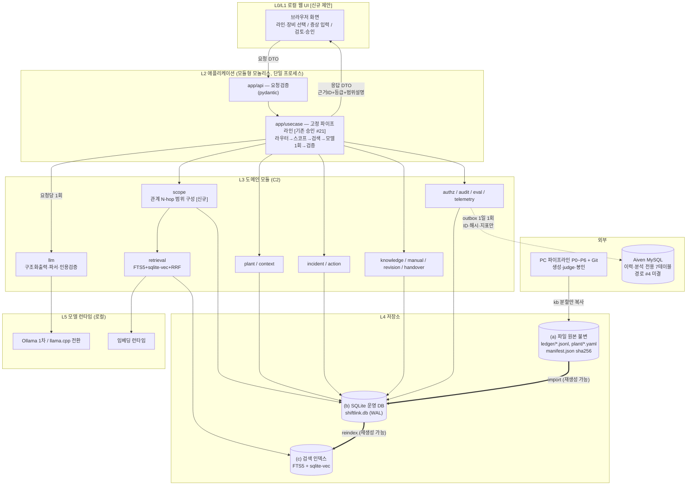
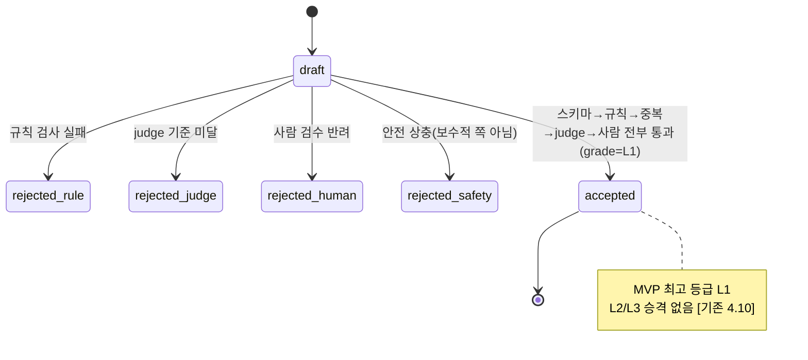
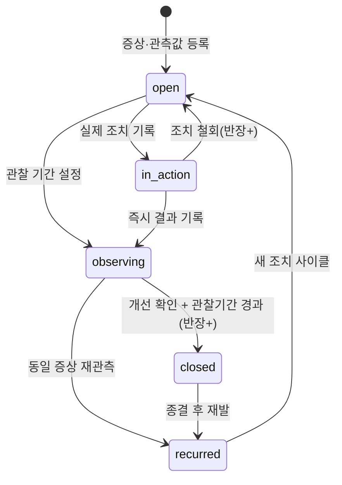
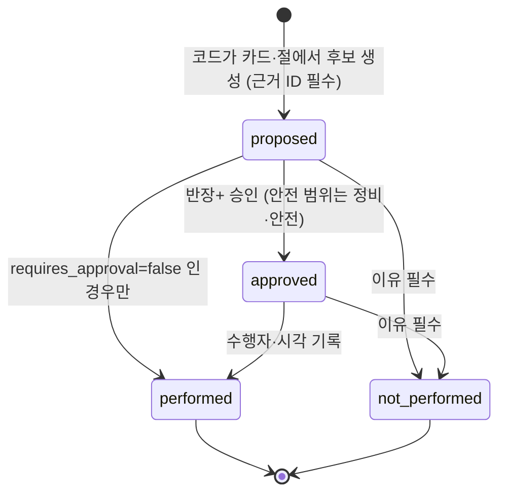
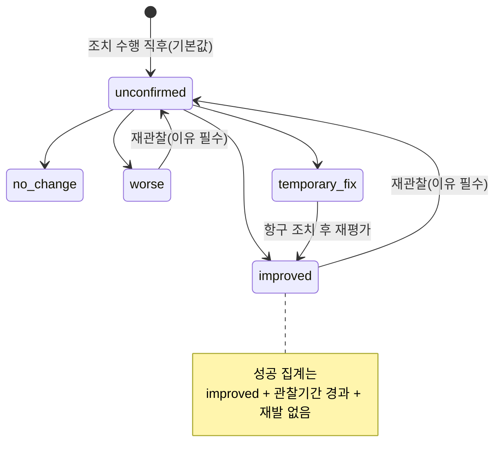
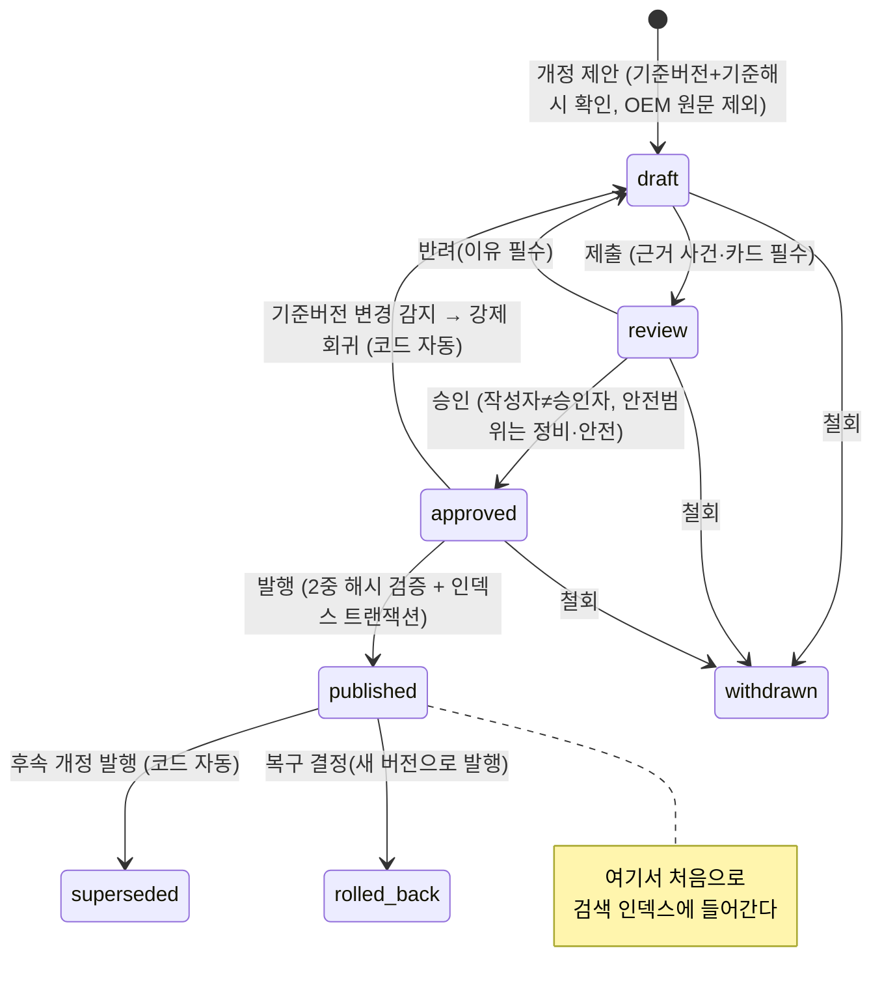

# 전문가C — 온디바이스 시스템·구현·검증 설계서

> 작성 2026-09-17. 기준 문서: 「최종 통합본(고도화 v1.1)(codex)」(2026-09-11, 이하 **통합본**) · 「용어사전」(2026-09-11) · 사용자 2026-09-17 신규 요구(src_c).
> 표기 규칙: **[기존]** 통합본에 이미 있는 내용 / **[기존 수정안]** 기존 내용의 변경 제안(승인 필요) / **[신규 제안]** 이 문서에서 처음 제안하는 내용(승인 필요) / **[가정]·[목표]·[제안값]** 실측·확정되지 않은 수치.
>
> **이 문서의 한계 선언 (먼저 읽을 것)**
> 1. 이 문서는 **설계 문서**다. Jetson에 접속하지 않았고, 저장소 코드를 열어보지 않았으며, 어떤 수치도 측정하지 않았다. 문서에 나오는 모든 메모리·지연·온도·전력 값은 **[가정]/[목표]/[제안값]** 이다.
> 2. 통합본 **4.1~4.6은 용어사전 10절이 "이미 결정되어 수정하지 않기로 한 확정 스택"으로 규정한 부분**이다. 이 문서는 4.1~4.6을 인용·보존하며, 변경이 필요한 곳은 C14 변경표에 **제안**으로만 올린다. 특히 4.3(모델 플랜·전력 모드)은 **[승인 #25] 재검증 후 결정** 대상이므로 이 문서에서 자동 수정하지 않는다.
> 3. **[승인 #21]**(규칙 라우터 + 고정 파이프라인, 도구 5종 전부 읽기 전용, 모델 호출 요청당 1회), **[승인 #22]**(플랜 B 기준 p95 ≤15초 / 카드 조회 ≤2초, 미측정), **[승인 #5]**(데이터 규모)를 이 문서의 상수로 취급한다. 신규 요구가 이들과 충돌하는 지점은 숨기지 않고 C14·C15에 올린다.
> 4. 일정 9/29~10/21(0주차 ~9/28 포함)은 원문 그대로 보존한다. 오늘 9/17 → **착수까지 12일**.
> 5. 팀은 4명 학생이고, 이 문서의 담당 표기 중 **Jetson 환경·로컬 추론·임베딩·메모리/발열 실측·저장·재시작 복구·안전 검수는 전부 허재원 1인**이다. 4주 안에 1인이 처리 가능한 양을 넘는 항목은 C13에서 **절단선(descope)** 으로 명시했다.

---

## C0. 이 문서가 다루는 신규 요구와 기존 구조의 접점 (요약)

| 신규 요구(src_c) | 기존 구조와의 관계 | 이 문서의 처리 |
| --- | --- | --- |
| 생산시스템 계층(공장→라인→공정→설비군→장비→부품) | [기존] 설비 사전 `plant/L1.yaml`이 설비 4종 × 부품만 다룸. 계층·관계 테이블 없음 | C2 `plant` 모듈, C9 SQLite 스키마로 **추가**. 기존 YAML은 원본으로 유지 |
| "장비를 선택해도 그 장비만 보지 않는다" | [기존] 4.8 검색은 `설비 ID` 메타데이터 필터(단일 설비) | C3 `scope` 모듈을 **고정 파이프라인 2단계 앞에 코드 단계로 삽입**. 모델은 탐색에 관여하지 않음 |
| SQLite 기준 저장소 | [기존] 4.11은 "로컬 JSONL/CSV 원본 + Jetson SQLite + Aiven MySQL(이력·분석 전용)" | C9에서 **3계층 권위 분리**: JSONL=불변 원본, SQLite=재생성 가능한 운영 저장소, 인덱스=SQLite에서 재생성 |
| 매뉴얼 개정·승인·발행·복구 | [기존] 없음(4.10에 "상위 버전이 대체한 관계를 보존한다"는 원칙만, 범위 밖 표기) | C6 (e) 상태 머신 **신규**. 승인 전 검색 반영 0건을 인덱스 레벨로 보장 |
| 행동·결과·재발 | [기존] 없음. `incident.create`는 [승인 #21]에서 **MVP 제외** | C6 (b)(c)(d) 신규 + C15 Q1에서 범위 결정 질문으로 올림 |
| 웹 기반 로컬 UI | [기존] 4.12는 "UI 라벨로만 역할 구분", UI 기술 미명시 | C1에 로컬 웹 UI 계층 추가. C13에서 **절단 1순위 후보**로 표시 |
| 모델 없이도 기록·검색·인계·승인 유지 | [기존] 없음(오프라인 원칙만 있음) | C8 저하 모드(degraded mode) **신규** |

---

## C1. 시스템 구성도

### C1.1 계층과 경계 (텍스트)

```
[L0] 사용자 단말 (브라우저, Jetson 로컬 네트워크)
      │ HTTP(localhost 또는 사내 LAN), 화면 상태만. 인증 없음(4.12 [기존])
      ▼
[L1] 로컬 웹 UI (정적 자산 + 서버 렌더 페이지)            [신규 제안]
      │  ─ 보내는 것: 라인/장비 선택, 증상·관측값, 메모 원문, 검토 수락/거절, 개정안 승인 요청
      │  ─ 받는 것: 범위 설명(포함/제외 이유), 근거 카드·절 ID + 등급 라벨, 행동 후보,
      │             상태 배지(저하 모드/합성 L1/실제 작업지시 아님), 감사 로그 열람
      ▼
[L2] 애플리케이션 계층 (모듈형 모놀리스, 단일 Python 프로세스)
      │  app/api      : HTTP 경계. 요청 검증(pydantic) → 유스케이스 호출 → 응답 DTO
      │  app/usecase  : 고정 파이프라인 오케스트레이션 [기존 승인 #21] + 트랜잭션 경계
      ▼
[L3] 도메인 모듈 (15개, C2 참조) — 순수 로직 + 저장소 인터페이스 의존만
      │  plant context incident action knowledge manual revision handover
      │  scope retrieval llm authz audit eval telemetry
      ▼
[L4] 저장소 계층
      ├── (a) 파일 원본 (권위 원본, 불변)  : seeds/ plant/ personas/ ledger/*.jsonl
      │        artifacts/*.jsonl splits/ manifest.json(sha256)  [기존 4.7·4.11]
      ├── (b) SQLite 운영 DB (재생성 가능)  : shiftlink.db — 관계·컨텍스트·사건·행동·결과·
      │        카드·문서·절·개정·인계·감사·검토 큐·outbox  [기존 4.11의 "Jetson 로컬 SQLite" 확장]
      └── (c) 검색 인덱스 (재생성 가능)     : FTS5 가상 테이블 + sqlite-vec 벡터 테이블
               (b)에서 재빌드, (b)는 (a)에서 재빌드  → C9.2 재생성 체인
      ▼
[L5] 모델 런타임 (로컬, 외부 추론 API 없음 [기존 3.1])
      ├── Ollama 1차 (LLM keep_alive=-1, num_ctx 2048, NUM_PARALLEL=1)  [기존 4.3·4.8]
      ├── llama.cpp(GGUF) 전환 옵션                                     [기존 4.3]
      └── 임베딩 런타임 (keep_alive=0 언로드 또는 플랜B 상주 비교)        [기존 4.8]

[외부] ── PC 파이프라인 (P0~P6, Git) : 생성·judge·봉인. Jetson에는 kb 분할만 복사 [기존 4.7]
       └─ Aiven Cloud MySQL (이력·분석 전용, 7테이블, ID·해시·지표·메타만) [기존 4.11, 경로 #4 미결]
```

### C1.2 경계별 데이터 흐름 (무엇이 오가는가)

| 경계 | 방향 | 오가는 것 | 오가지 않는 것(금지) |
| --- | --- | --- | --- |
| L0↔L1 | 양방향 | 화면 입력/출력, 세션 라벨(역할 선택값) | 인증 토큰(MVP 미구현 [기존 4.12]), 외부 인터넷 호출 |
| L1↔L2 | 양방향 | pydantic 검증된 요청 DTO / 응답 DTO(근거 ID·등급·범위 설명 포함) | 원시 SQL, 저장소 객체, LLM 원문 미검증 출력 |
| L2↔L3 | 단방향 호출 | 유스케이스 → 도메인 인터페이스 | 도메인 → 유스케이스 역참조(순환 금지, C2.3 린트) |
| L3↔L4(a) | 읽기 전용 | JSONL 원본 적재(import 시점만) | 런타임 중 원본 파일 수정 |
| L3↔L4(b) | 읽기·쓰기 | 트랜잭션 단위 쓰기(WAL), append-only 감사·outbox | 감사 로그 UPDATE/DELETE, 자동 덮어쓰기 [기존 4.11 원칙] |
| L3↔L4(c) | 읽기 + 재빌드 | 검색 질의, 발행 시점 인덱스 반영 | 미승인(draft/review/approved) 개정 내용의 인덱스 진입 (C6.6) |
| L3↔L5 | 요청당 1회 | 도구 결과로 만든 프롬프트 → 구조화 JSON 출력 | 모델이 도구·탐색을 스스로 선택하는 호출 [기존 승인 #21] |
| Jetson↔PC | 단방향(복사) | kb 분할 카드·설비 사전·문서 절 | dev/sealed 분할 [기존 4.7.6·4.10] |
| Jetson/PC↔Aiven | 단방향(업로드) | ID·해시·지표·메타(7테이블) | 원문, judge 코멘트, 실명 [기존 4.11]. 전송 주체는 **#4 미결** |

### C1.3 Mermaid



> 보존 확인: 위 그림에서 **[기존 4.8]** RAG·에이전트 스택(라우터 + 고정 파이프라인 4단계, 도구 5종, 메타데이터 필터 → 벡터 top-k, T5 별도 조회 후 선두 병합, 구조화 출력 + 온도0 재시도 1회 → 검토 큐, 인용 ID 검증)은 그대로 살아 있다. 추가된 것은 **`scope` 코드 단계**, **FTS5 병합**, **파일→DB→인덱스 재생성 체인**, **로컬 웹 UI**, **매뉴얼/개정/행동 모듈**뿐이다. **[기존 4.11]** 3경로(런타임 Jetson / PC 파이프라인 / Aiven 이력)도 그대로 유지되며, "Jetson 로컬 파일·SQLite" 칸이 (b)+(c)로 구체화된 것이다.

---

## C2. 도메인 모듈 경계

### C2.1 모듈 카드 (15개)

의존 방향 규칙: **core(0) ← domain(1) ← orchestration(2) ← api(3)**. 화살표 역방향 호출 금지. 같은 레이어 간 의존은 아래 표의 "의존" 칸에 적힌 것만 허용.

| # | 모듈 | 레이어 | 책임 | 공개 인터페이스(예시 시그니처) | 의존 | 상태 보유 | 담당 |
| --- | --- | --- | --- | --- | --- | --- | --- |
| 1 | `plant` | 1 | 공장·라인·공정/구간·설비군·장비·부품·관계(상류/하류·물류·구동·유압/전력/공압/냉각 공급·인터록·영향)의 기준정보 조회. **관계 그래프의 유일한 소유자** | `get_line(line_id)` / `get_equipment(eq_id)` / `list_components(eq_id)` / `neighbors(eq_id, rel_types, direction)` | 없음 | DB 읽기 전용(런타임). 쓰기는 import 시점만 | 유현준(스키마) · 허재원(적재·성능) |
| 2 | `context` | 1 | 사건 시각의 운전 컨텍스트 스냅샷(운전 모드, 라인 속도, 생산 품목, 공정 상태, 교대조, 정지·재가동, 알람·측정값) 로드/기록 | `snapshot_at(line_id, ts)` / `put_snapshot(ctx)` | `plant` | 스냅샷 append-only | 유현준 |
| 3 | `incident` | 1 | 사건과 **다중 장비 연결**(주 발생/원인 후보/영향/확인했으나 이상 없음/공통 원인 후보), 관측값, 생산·품질·안전 영향 | `create(draft)`(권한 필요) / `link_equipment(inc_id, eq_id, role, evidence)` / `get(inc_id)` / `transition(inc_id, to)` | `plant` `context` `authz` `audit` | 사건 상태 머신(C6 b) | 전혜민(데이터 설계) · 유현준(구현) |
| 4 | `action` | 1 | 제안 행동 후보 / 실제 조치 / 승인 여부 / 즉시 결과 / 관찰 기간 / 재발 / 미확인·임시복구. **성공 집계 규칙의 소유자** | `propose(inc_id, candidates)` / `record_actual(action_id, payload)` / `record_outcome(...)` / `stats(scope)` | `incident` `authz` `audit` | 행동·결과 상태 머신(C6 c,d) | 유현준 |
| 5 | `knowledge` | 1 | 지식 카드(K-01 [기존 4.7.4]) CRUD-읽기, 등급·상태·split 게이트, 카드 검색 파라미터 구성 | `get_card(card_id)` / `search(spec) -> [CardHit]` / `visible_filter()` | `retrieval` `plant` | 없음 | 최재영 |
| 6 | `manual` | 1 | 문서(제조사 원문/조직 보조 매뉴얼/라인·공정·장비·부품 절차)·**절(clause)**·버전. 제조사 원문은 **읽기 전용 불변** | `get_doc(doc_id, ver)` / `get_clause(clause_id, ver)` / `published_view()` | `plant` | 문서·절 버전(불변 추가) | 전혜민(내용) · 유현준(구현) |
| 7 | `revision` | 1 | 개정 제안→검토→승인→발행→대체/복구. 기준 버전 확인, 내용 해시, 충돌 차단, 발행·복구 레코드 | `create_draft(...)` / `submit_review(rev_id)` / `approve(rev_id, approver, reason)` / `publish(rev_id, base_ver_hash)` / `rollback(doc_id, to_ver, reason)` | `manual` `authz` `audit` `retrieval(reindex)` | 개정 상태 머신(C6 e) | 유현준 |
| 8 | `handover` | 1 | 인계 항목 추출 후보·수락·보존·재검토 표시(F-01~F-05 [기존 3.4]) | `list_open(shift, eq_ids)` / `propose(extraction)` / `accept(item_id)` / `mark_recheck(item_id, reason)` | `incident` `authz` `audit` | 인계 항목 상태 | 유현준 |
| 9 | `scope` | 1 | **관계 기반 분석 범위 구성**(C3). 선택 장비 + 시각 + 증상 → 후보 장비 집합 + 포함/제외 이유 | `build(selection) -> ScopeResult` | `plant` `context` | 없음(결과는 요청 스코프 캐시) | 허재원(쿼리·성능) · 유현준(규칙) |
| 10 | `retrieval` | 1 | 메타데이터 필터 → FTS5 + 벡터 병합(RRF) → T5 선두 병합 → k≤5 절단. 인덱스 재생성 | `search(query, filters, k)` / `reindex(target)` / `rebuild_all()` | `plant` | 인덱스(파생, 재생성 가능) | 허재원 · 최재영 |
| 11 | `llm` | 1 | 프롬프트 조립, 구조화 출력 강제(Ollama `format`/GBNF), pydantic 파싱, **온도0 재시도 1회 → 검토 큐**, 인용 ID 검증 | `answer(ctx) -> Answer|Abstain|ReviewQueued` / `extract_handover(memo, ctx)` / `draft_revision(evidence)` | `knowledge` `manual` `telemetry` | 없음(무상태) | 최재영 · 유현준 |
| 12 | `authz` | 0 | 역할 → 허용 동작 판정. 모든 상태 전이·발행·복구의 사전 관문 | `can(role, action, target) -> Decision` / `require(...)` (위반 시 예외) | 없음 | 정책 표(코드·설정) | 허재원(정책) · 유현준(적용) |
| 13 | `audit` | 0 | append-only 감사 로그 기록·조회 | `log(event)` / `query(filter)` | 없음 | append-only 테이블 | 허재원 |
| 14 | `eval` | 1 | 개발셋·봉인셋 채점, 지표 계산, 누수 검사 | `score(run_id, split)` / `leak_check()` | `knowledge` `retrieval` `action` | 실행 이력 | 전혜민 · 최재영 |
| 15 | `telemetry` | 0 | 단계별 지연·토큰·메모리 계측 기록(C10 CSV 산출) | `span(name)` 컨텍스트매니저 / `flush()` | 없음 | append-only CSV/테이블 | 허재원 |

### C2.2 LLM이 하는 일과 코드가 하는 일의 경계

사용자 판단 원칙(src_c)을 **모듈 배치로 물리적으로 강제**한다.

| 일 | 담당 | 강제 방식 |
| --- | --- | --- |
| 권한 판정 | **코드** (`authz`) | `llm` 모듈은 `authz`를 import하지 않는다. LLM 출력에 `approved: true` 같은 필드를 **스키마에 두지 않는다**(C5.2) |
| 상태 전이 | **코드** (`incident`/`action`/`revision`/`handover`의 `transition`) | 전이 함수는 `llm`에서 호출 불가(레이어 규칙). LLM 출력 스키마에 상태 값 필드 없음 |
| 통계 계산(성공률·재발률) | **코드** (`action.stats`) | 집계는 SQL. LLM에는 집계 결과를 **문장으로 설명**하는 역할만 |
| ID 검사·인용 검증 | **코드** (`llm.verify_citations`, 단 검증 로직은 순수 함수) | 검증은 모델 호출 **후** 코드 단계. 실패 시 "해당 지식 없음" 치환 [기존 4.8 4단계] |
| 발행·복구 | **코드** (`revision.publish/rollback`) | LLM은 `draft_revision`으로 **초안 텍스트만** 생성. publish는 별도 유스케이스 |
| 관계 탐색 범위 결정 | **코드** (`scope.build`) | 모델에게 탐색 도구를 주지 않음 [기존 승인 #21 유지] |
| 조건 필터·제외 이유 | **코드** (`retrieval` + `knowledge.conditions` 평가기) | 조건식은 `conditions[](signal·op·value)` [기존 4.7.4]을 코드가 평가 |
| 기록 추출(메모→구조화) | **LLM** | `llm.extract_handover`. 출력은 후보, 저장은 사용자 수락 후 [기존 F-04] |
| 차이 설명(기준 버전 vs 제안) | **LLM** | diff 계산은 코드, **설명 문장만** LLM |
| 확인 질문 생성 | **LLM** | 근거 부족 시 abstain + 질문 목록(C5.2) |
| 행동 후보 표현 | **LLM** | 후보 **선정**은 코드(카드·절에서 추출), **문장화·순서 설명**만 LLM |
| 개정안 초안 | **LLM** | 초안 상태로만 저장. 승인·발행은 코드+사람 |

### C2.3 경계를 코드로 보장하는 장치 [신규 제안]

1. **레이어 규칙 + 정적 검사**: `import-linter`(또는 `pytest` 내 자체 AST 검사) 계약 파일로 아래를 CI에서 강제.
   - `llm` → `authz`·`audit`·`revision`·`incident`·`action` import 금지
   - `domain(1)` → `usecase(2)`·`api(3)` import 금지(순환 금지)
   - `retrieval` → `llm` import 금지(검색이 모델에 의존하지 않음)
2. **출력 스키마 화이트리스트 테스트**: LLM 응답 pydantic 모델의 필드 목록을 테스트에 고정해, `status`/`approved`/`published`/`role`/`count` 류 필드가 추가되면 테스트 실패. (`test_llm_schema_has_no_authority_fields`)
3. **전이 함수 호출자 검사**: `transition()`·`publish()`·`rollback()`에 `@code_only` 데코레이터를 달고, 호출 스택에 `llm` 모듈 프레임이 있으면 즉시 예외 + 감사 로그. (런타임 방어, 테스트로 검증)
4. **감사 로그 필수화 테스트**: 권한이 필요한 모든 공개 함수는 호출 후 `audit` 레코드가 1건 이상 생겨야 한다는 파라미터라이즈 테스트(`test_every_privileged_call_writes_audit`).
5. **모듈 경계 문서 = 코드**: 각 모듈 `__init__.py`의 `__all__`이 공개 인터페이스이고, 다른 모듈은 `__all__` 외 심볼 import 금지(린트 규칙).

> [가정] 위 5개 장치의 구현 비용은 합계 0.5~1일 [제안값]이다. 실제로 측정하지 않았다.

---

## C3. 관계 기반 분석 범위 구성 (`scope` 모듈) — 사용자 핵심 요구

### C3.1 문제와 제약

- 사용자 요구: "RT 이상이 관측되더라도 RT만 분석하지 않고 HPU 압력, GR 구동, 하류 CV 정체, 라인 속도·운전 모드를 함께 비교한다."
- **[기존 승인 #21] 제약**: 에이전트는 규칙 라우터 + **고정 파이프라인**이고, 모델 호출은 요청당 1회다. 따라서 **모델이 "다음에 어디를 볼까"를 결정하는 구조는 금지**된다. 관계 확장은 **모델 호출 이전, 코드 단계에서 완결**되어야 한다.
- **[기존 4.8] 파이프라인 4단계**를 다음과 같이 **단계 추가 없이 2단계 내부를 확장**한다(단계 수·모델 호출 수 불변).

```
1. 규칙 라우터 (모델 호출 없음)                                  [기존, 변경 없음]
2. 고정 도구 실행 (코드)                                          [기존 골격 유지 + 내부 확장]
   2-0. context.snapshot_at(line_id, ts)          ← [신규] 운전 컨텍스트 로드
   2-1. scope.build(selection)                     ← [신규] 관계 N-hop 확장 + 이유 기록
   2-2. lookup_equipment (범위 내 장비 일괄)        [기존 도구]
   2-3. search_cards (scope_id 필터 포함)           [기존 도구 + 입력 1개 추가]
   2-4. list_handover / get_checklist               [기존 도구]
3. 모델 1회 호출                                                  [기존, 변경 없음]
4. 코드 검증(인용 ID·등급 부착) + 범위 설명 부착                    [기존 + 범위 설명 추가]
```

### C3.2 알고리즘

```
입력: selection = {line_id, primary_eq_id, incident_ts, symptom_text, symptom_signals[]}

S1. 컨텍스트 스냅샷 로드
    ctx = context.snapshot_at(line_id, incident_ts)
    → 운전 모드, 라인 속도, 생산 품목, 공정 상태, 교대조, 정지·재가동, 알람·측정값
    ※ 스냅샷이 없으면 scope는 "컨텍스트 미확인" 플래그를 세우고 확장 깊이를 1로 제한한다.

S2. 시드 집합
    seeds = {primary_eq_id}
         ∪ {같은 설비군(equipment_group) 장비}            (가중 낮음, depth 0으로 취급)

S3. 관계 그래프 N-hop 확장 (BFS, 관계 유형별 깊이 상한·가중치)
    for each 관계 유형 t: 허용 방향(up/down/both), max_depth[t], weight[t]
    누적 점수 score(e) = max over path( Π weight[t_i] )   (경로 곱, 최대값 채택)
    포함 조건: score(e) ≥ SCORE_MIN 그리고 depth ≤ max_depth[t]
    각 포함 장비에 (관계 경로, 깊이, 최종 점수)를 이유로 기록

S4. 조건 필터 (제외 이유 기록)
    - 사건 시각에 정지/미가동(공정 상태) → 제외 이유 "사건 시각 비가동"
    - 증상 신호와 무관한 유틸리티(예: 냉각 증상인데 공압 공급만 연결) → "증상-관계 유형 불일치"
    - 운전 모드 불일치(예: 수동 점검 모드 장비) → "운전 모드 불일치"
    - 동일 라인 외부 장비 → "라인 범위 밖"
    ※ 제외는 **삭제가 아니라 라벨링**이다. UI에 "확인 대상 / 제외(이유)"로 함께 표시한다.

S5. 폭 상한 적용
    포함 집합을 score 내림차순 정렬 → 상한 MAX_EQ 개로 절단
    절단된 장비는 "폭 상한 초과(점수 하위)"로 제외 이유 기록

S6. 검색 범위 확정
    ScopeResult = {
      scope_id,              # 감사·재현용 해시 ID
      included: [{eq_id, depth, rel_path, score, why}],
      excluded: [{eq_id, reason}],
      process_ids: [...],    # 포함 장비가 속한 공정/구간
      context_ref: ctx.id,
      params_hash            # 가중치·상한 설정의 해시(재현성)
    }
```

### C3.3 관계 유형별 가중치·깊이 상한 [제안값 — 전부 미검증]

| 관계 유형 | 방향 | max_depth | weight | 근거(설계 의도) |
| --- | --- | --- | --- | --- |
| `material_flow`(물류 상류→하류) | both | 2 | 0.9 | 사용자 시나리오 1·2의 핵심 축. 상류 원인/하류 정체 모두 2홉이면 도달 |
| `drive`(구동: 모터·감속기→피구동) | both | 2 | 0.9 | GR→RT 같은 직접 구동 |
| `utility_supply`(유압·전력·공압·냉각 공급) | 공급원 방향 우선 | 2 | 0.95 | 시나리오 3(공통 유틸리티 1개 → 다수 장비 동시). 공급원에서 **역방향 팬아웃**이 커서 S5 폭 상한이 필수 |
| `interlock` | both | 1 | 0.8 | 인터록은 직접 연결만 의미 있다고 가정 |
| `influence`(경험적 영향 관계) | both | 1 | 0.6 | 근거가 약한 관계. 1홉만 |
| `contains`(라인⊃공정⊃설비군⊃장비⊃부품) | 하향 | 1 | 1.0 | 계층 전개용. 깊이 계산에 포함하지 않음(구조 관계) |

전역 상한 [제안값]: `MAX_DEPTH_GLOBAL = 2`, `MAX_EQ = 8`, `SCORE_MIN = 0.5`.

**왜 이 상한인가 (Jetson 성능 근거 — [가정])**
- MVP 권장 범위(src_c)는 장비 6~10대, 핵심 관계 10~20개다. 즉 **그래프 자체가 작다**. 2홉 확장의 이론적 최대 도달 범위가 이미 전체 라인에 가깝다.
- `MAX_EQ = 8`은 [기존 4.8] 검색 정책(`k≤5`, 카드당 300자, num_ctx 2048)과 맞물린다. 포함 장비가 늘면 메타데이터 필터 후보가 늘고, 프롬프트에 붙일 장비 요약이 커져 **2048 토큰 상한을 먼저 깬다**. 장비 8 × 요약 60토큰 ≈ 480토큰 + 카드 5 × 300자 ≈ 750~900토큰 + 지시문 ≈ 400토큰 → **총 약 1,700~1,800토큰 [가정]**. 여유 약 250토큰. 이 계산은 **토크나이저로 검증하지 않았다** → C10 측정 항목 `TOK-01`로 올림.
- 깊이 3 이상을 허용하면 유틸리티 공급원 역방향 팬아웃 때문에 후보가 라인 전체로 폭발한다. 재귀 CTE 자체는 빠르지만(수십 행 규모), **프롬프트 예산과 사용자 인지 부담**이 먼저 한계다.
- 상한 값은 C10의 `SCOPE-01`(N-hop 쿼리 지연) 측정과 `TOK-01`(프롬프트 토큰) 측정 후 1주차 말에 고정한다.

### C3.4 SQLite 재귀 CTE 예시 [신규 제안 — 미실행]

스키마 전제(C9.3): `equipment(eq_id, line_id, group_id, process_id, eq_type, model, status)`,
`equipment_relation(src_eq, dst_eq, rel_type, direction, valid_from, valid_to)`,
`rel_policy(rel_type, max_depth, weight)`(설정 테이블, 코드 기본값의 DB 미러),
`context_equipment_state(ctx_id, eq_id, running, op_mode)`.

```sql
-- :seed_eq, :ctx_id, :max_depth_global, :score_min, :max_eq 는 바인드 파라미터
WITH RECURSIVE
policy AS (
  SELECT rel_type, max_depth, weight FROM rel_policy
),
edge AS (
  -- 무방향 취급이 허용된 관계는 양방향으로 펼친다
  SELECT src_eq AS a, dst_eq AS b, rel_type FROM equipment_relation
   WHERE (valid_to IS NULL OR valid_to > :ts) AND valid_from <= :ts
  UNION ALL
  SELECT dst_eq AS a, src_eq AS b, rel_type FROM equipment_relation
   WHERE direction = 'both' AND (valid_to IS NULL OR valid_to > :ts) AND valid_from <= :ts
),
walk(eq_id, depth, score, rel_path, visited) AS (
  SELECT :seed_eq, 0, 1.0, '', '|' || :seed_eq || '|'
  UNION ALL
  SELECT e.b,
         w.depth + 1,
         w.score * p.weight,
         w.rel_path || '>' || e.rel_type || ':' || e.b,
         w.visited || e.b || '|'
    FROM walk w
    JOIN edge e   ON e.a = w.eq_id
    JOIN policy p ON p.rel_type = e.rel_type
   WHERE w.depth + 1 <= MIN(p.max_depth, :max_depth_global)   -- 관계별 + 전역 깊이 상한
     AND w.score * p.weight >= :score_min                      -- 점수 하한으로 조기 절단
     AND instr(w.visited, '|' || e.b || '|') = 0                -- 사이클 차단
),
best AS (                                     -- 같은 장비에 여러 경로가 있으면 최고 점수 경로 채택
  SELECT eq_id, MIN(depth) AS depth, MAX(score) AS score,
         (SELECT w2.rel_path FROM walk w2
           WHERE w2.eq_id = walk.eq_id ORDER BY w2.score DESC, w2.depth ASC LIMIT 1) AS rel_path
    FROM walk GROUP BY eq_id
)
SELECT b.eq_id, b.depth, b.score, b.rel_path,
       COALESCE(s.running, 0) AS running, s.op_mode
  FROM best b
  LEFT JOIN context_equipment_state s
         ON s.ctx_id = :ctx_id AND s.eq_id = b.eq_id
 ORDER BY b.score DESC, b.depth ASC
 LIMIT :max_eq;
```

구현 주의(미검증):
- `MIN(a,b)` 스칼라 함수는 SQLite에서 사용 가능하지만, 재귀 CTE 내부에서 집계 `MIN`과 혼동될 수 있다 → 실행 실패 시 `CASE WHEN p.max_depth < :max_depth_global THEN p.max_depth ELSE :max_depth_global END`로 대체.
- `visited` 문자열 누적은 장비 수가 작을 때만(≤수십) 적합하다. MVP 규모(6~10대)에서는 충분 [가정].
- 조건 필터 S4·폭 상한 S5의 일부는 SQL(위 `LEFT JOIN` + `LIMIT`)로, **제외 이유 라벨링은 Python 코드**로 처리한다(이유 문구를 SQL에 넣지 않는다 → 테스트 용이).
- 재귀 CTE 실행 계획과 지연은 **C10 `SCOPE-01`에서 실측**한다. 현재 숫자 없음.

### C3.5 설명 가능성 구조 (사용자에게 보여주는 것)

```
분석 범위 (scope_id: SC-7f3a…, 기준 시각 2026-xx-xx 14:12, 컨텍스트 CTX-0042)
포함 8대
  RT-01  직접 선택            depth 0  점수 1.00
  GR-01  RT-01 구동           depth 1  점수 0.90   (drive)
  HPU-01 GR-01 유압 공급       depth 2  점수 0.86   (drive>utility_supply)
  CV-02  RT-01 하류 물류       depth 1  점수 0.90   (material_flow)
  …
제외 3대 (검색하지 않음)
  CV-05  사건 시각 비가동
  HPU-02 증상-관계 유형 불일치(공압 공급만 연결, 증상은 유압 압력 저하)
  RT-09  폭 상한 초과(점수 0.54, 하위)
사용된 설정: params_hash = P-2a91 (MAX_DEPTH 2 / MAX_EQ 8 / SCORE_MIN 0.5)
```

- `scope_id`·`params_hash`는 **감사 로그와 평가 레코드에 그대로 기록**한다(C7.3) → "왜 이 장비가 포함/제외됐는지"를 사후 재현 가능.
- 평가 지표 "관련 공정·장비 범위 식별 정확도"(src_c)는 `included` 집합을 사건 원장의 정답 집합(`cause_candidates ∪ affected ∪ checked_no_finding`)과 비교해 **코드로** 계산한다(`eval` 모듈). LLM은 이 계산에 관여하지 않는다.

### C3.6 도구 5종 확장 필요성 — 최소 추가안 (승인 필요)

**[기존 승인 #21]** 도구 5종: `lookup_equipment`, `search_cards`, `list_handover`, `propose_handover`, `get_checklist`.

| 제안 | 내용 | 승인 필요 이유 | 대안(승인 불필요) |
| --- | --- | --- | --- |
| **T-A [기존 수정안]** | `search_cards` 입력에 `scope_id`(또는 `equipment_ids[]`) 1개 추가 | 기존 입력은 "설비 ID" 단수. 다중 장비 범위를 넘기려면 계약 변경 | `lookup_equipment`를 장비별로 N회 호출 후 코드에서 합집합 → 호출 수 증가, 감사 로그 복잡. **비추천** |
| **T-B [신규 제안]** | `get_line_context(line_id, ts)` — 운전 컨텍스트 스냅샷 조회, 읽기 전용 | 도구 6종이 됨 → #21 범위 변경 | `scope.build` 내부 함수로만 두고 **도구 목록에 넣지 않는다**. LLM은 컨텍스트를 프롬프트로만 받음. → **이 대안을 1차 추천** |
| **T-C [신규 제안]** | `search_manual(scope, query, k)` — 문서 절 검색, 읽기 전용 | 매뉴얼은 기존 도구 5종에 없다. 신규 요구(문서·절·개정)를 쓰려면 필요 | `search_cards`에 `source_kind`(card/clause) 필터를 추가해 **하나의 도구로 통합** → 도구 수 5종 유지. **이 대안을 1차 추천** |
| **T-D [신규 제안]** | `list_relations(eq_id)` — LLM이 관계를 직접 조회 | **도입 금지 권고.** 모델이 탐색을 결정하게 되어 #21의 "고정 파이프라인" 원칙 위반 | — |

**추천 결론**: **도구는 5종을 유지**하고, `search_cards`의 입력 계약만 2필드 확장(`scope_id`, `source_kind`)한다. 컨텍스트·관계 확장은 도구가 아니라 **코드 단계**로 둔다. → C14 `D-C03`, C15 Q3에서 결정 요청.

---

## C4. 검색 아키텍처

### C4.1 파이프라인 (기존 정책 보존)

```
[1] 메타데이터 필터 (SQL WHERE, 코드)
      status = 'accepted'  AND split = 'kb'  AND grade = 'L1'          [기존 4.10 — 불변]
      AND eq_id IN (scope.included)                                     [신규: 관계 범위]
      AND (source_kind = 'card' OR source_kind = 'clause')              [신규: 매뉴얼 절 포함]
      AND clause_visibility = 'published'                               [신규: C6.6 발행 게이트]
      AND 조건식 평가 통과 (conditions[] signal·op·value)                 [기존 4.7.4]
      → 후보 축소 (예상 수십~수백 건, MVP 규모에서 [가정])
[2] 병렬 두 검색
      (a) 키워드: FTS5 MATCH (trigram 또는 unicode61) → rank
      (b) 벡터  : sqlite-vec KNN (질의 임베딩 1회)     → distance
[3] 병합: RRF (Reciprocal Rank Fusion)  score = Σ 1/(60 + rank_i)      [신규 제안]
[4] T5 / safety_flag 별도 조회 후 선두 병합                             [기존 4.8 — 불변]
      * 순위 재배열로 대체하지 않는다(원문 명시)
[5] k ≤ 5 절단, 카드당 300자 이내 절단                                  [기존 4.8 — 불변]
[6] 결과에 등급 라벨(L1 합성·시뮬레이션 검증) 부착                        [기존 4.10 — 불변]
```

> 보존 확인: `k≤5`, `카드당 300자`, `T5 별도 조회 후 선두 병합`, `status/split/grade 게이트`는 모두 원문 그대로다. 추가된 것은 **관계 범위 필터**, **FTS5 병합**, **발행 게이트**뿐이다.

### C4.2 FTS5 단독으로 갈 수 있는가

사용자는 "SQLite FTS5 또는 경량 벡터 검색"이라 했고, [기존 4.8]도 "플랜 A처럼 임베딩 상주 여유가 부족한 조건에서는 FTS5를 대안으로 검토"라 적혀 있다. 기술적으로는 셋 다 가능하다.

| 방식 | 장점 | 한국어 관련 위험 | 메모리 | 판정 |
| --- | --- | --- | --- | --- |
| FTS5 단독 (`unicode61`) | 임베딩 모델 0GB, 지연 밀리초급 | **공백 단위 토큰화 → 한국어 조사·어미 결합("압력이/압력은/압력") 미스매치**. "이음 소리"↔"이상음" 같은 동의어 전무 | ≈0 | 단독 채택 **비추천** |
| FTS5 + `tokenize='trigram'` | 부분 문자열 매칭으로 조사 문제 상당 완화, 오타 내성 | 인덱스 크기 증가(3~5배 [가정]), 짧은 질의에서 잡음 증가. `trigram`은 `LIKE`/`MATCH` 모두 지원하지만 prefix 최적화가 다름 | ≈0 | **1차 채택(키워드 축)** |
| sqlite-vec 단독 | 의미 검색, 동의어 흡수 | 고유명사·설비 ID·알람 코드 정확 매칭 약함("HPU-02"와 "HPU-01" 혼동) | 임베딩 모델 상주분 | 단독 채택 **비추천** |
| **하이브리드(FTS5 trigram + sqlite-vec, RRF)** | 두 약점 상호 보완. 임베딩 실패·미탑재 시 **FTS5만으로 저하 운전 가능** | 구현 2배, 튜닝 필요 | 임베딩 상주분 | **채택 권고** |

**결론 [신규 제안]**: 하이브리드를 기본으로 하고, **FTS5 축을 필수·벡터 축을 선택으로 설계**한다. 그러면
- 플랜 A(메모리 여유 없음)나 임베딩 로드 실패 시 `retrieval` 설정 한 줄(`vector_enabled=false`)로 **FTS5 단독 저하 모드**로 내려갈 수 있다(C8 저하 모드와 동일 장치).
- 임베딩 선정(#20)이 1주차에 결론 나지 않아도 **검색 기능 자체는 1주차에 동작**한다. 일정 위험을 줄이는 설계다.

RRF 파라미터 [제안값]: `k_rrf = 60`(관례값), 가중 `w_fts = 1.0`, `w_vec = 1.0`. 개발셋 Recall@5로 `w` 비율을 1주차 말~2주차 초에 1회 튜닝하고 **봉인 전에 고정**한다(봉인 후 변경 금지 [기존 4.7.6 원칙]).

### C4.3 인덱스 재생성 보장

사용자 요구: "검색 인덱스는 원본 데이터에서 재생성 가능."

- 인덱스는 **권위가 없는 파생물**이다. 언제든 삭제하고 다시 만들 수 있다.
- 재생성 명령 [신규 제안]:
  - `python -m shiftlink.index rebuild --target fts` (모델 불필요, 초 단위 [가정])
  - `python -m shiftlink.index rebuild --target vec` (임베딩 모델 필요)
  - `python -m shiftlink.index rebuild --all`
- 재생성 가능성을 **테스트로 고정**: `test_index_rebuild_is_deterministic` — 인덱스 삭제 → 재빌드 → 개발셋 질의 10건의 결과 ID 집합이 재빌드 전과 동일해야 한다(벡터 축은 float 오차 허용, 상위 5 ID 집합 일치로 판정).
- 인덱스 메타 테이블 `index_meta(target, source_row_count, source_max_updated_at, embed_model, embed_dim, built_at, ok)` — 소스 행 수/최종 갱신 시각이 어긋나면 **UI에 "인덱스 낡음" 배지**를 띄우고 재빌드를 권고한다(C8 `E-03`).
- 임베딩 모델을 바꾸면 `embed_dim`이 달라져 기존 벡터 테이블과 호환되지 않는다 → `embed_model` 불일치 시 **자동으로 벡터 축을 비활성**하고 FTS5 단독으로 동작(조용한 오답보다 명시적 저하).

### C4.4 임베딩 선정 실험 설계 — 미결 #20을 데이터로 종결

**[미결 #20]**: [기존 4.8]은 `multilingual-e5-small`을 1차로, `KURE-v1`을 "기존 메모 1순위"로 적어 **우선순위가 충돌**한 상태다. 이 문서는 어느 쪽도 선택하지 않고 **실험으로 넘긴다**.

후보 (5종, [기존 4.8] 표 그대로):

| ID | 모델 | 파라미터 | 차원 | 최대 길이 |
| --- | --- | --- | --- | --- |
| EM-1 | intfloat/multilingual-e5-small | 0.1B | 384 | 512 |
| EM-2 | intfloat/multilingual-e5-base | 0.3B | 768 | 512 |
| EM-3 | BAAI/bge-m3 | (카드 미기재) | 1024 | 8192 |
| EM-4 | nlpai-lab/KURE-v1 | 0.6B | 1024 | 8192 |
| EM-5 | jhgan/ko-sroberta-multitask | 0.1B | 768 | 128 |

측정 항목 × 판정:

| 항목 | 측정 방법 | 반복 | 판정 기준 [제안값] |
| --- | --- | --- | --- |
| M1 상주 RAM 증가분 | 로드 전/후 `free -m` + jtop, LLM 플랜 B 상주 상태에서 | 3회 | **하드 게이트**: 플랜 B 상주 + 임베딩 + OS 합계가 실측 가용 RAM의 **80% 이하** |
| M2 모델 로드 시간 | 콜드 스타트 wall clock | 3회 | 참고값(게이트 아님) |
| M3 질의 임베딩 지연(1건) | `telemetry.span("embed_query")` p50/p95 | 30회 | **하드 게이트**: p95 ≤ **0.8초** (조회 2초 목표 내 여유 확보) |
| M4 배치 임베딩 처리량 | 카드 100건 배치 | 3회 | 인덱싱 시간이 5분 이내 [제안값] |
| M5 dev셋 Recall@5 | 개발셋 30건 [기존 #5], 정답 카드 ID 집합 | 3회(동일 결과 확인) | **주 판정 지표** |
| M6 하이브리드 기여도 | FTS5 단독 대비 RRF 결합 시 Recall@5 증가분 | 1회 | 증가분 < 0.03이면 **벡터 축 포기 근거** |
| M7 max_len 적합성 | 카드 본문 평균·최대 토큰 길이 vs 모델 최대 길이 | — | 카드 본문이 잘리는 모델은 탈락(EM-5 128토큰은 [기존 4.8]에서 이미 "본문 부적합" 표기) |

실행 순서와 절단 [신규 제안]:
1. **1주차**: EM-1만 구동 → M1·M2·M3 측정. 통과하면 검색 프로토타입 완성(= [기존] 1주차 완료 기준 "카드 10건 인덱싱·질의 3건 검색 2초 이내" 충족).
2. **1주차 말**: EM-4(KURE-v1) M1 측정. **RAM 게이트 실패 시 즉시 탈락**하고 실험 종료 → #20은 "EM-1 채택, KURE-v1은 RAM 초과로 탈락" 으로 종결.
3. **2주차 초**: RAM 게이트를 통과한 후보만 M5(dev Recall@5) 비교. **동점(차 <0.03)이면 RAM이 작은 쪽 채택**.
4. EM-2·EM-3·EM-5는 **예비**. 1·2가 모두 실패할 때만 진행(일정 위험).

산출: `bench/embedding_selection.csv` + `docs/decision-log.md`에 `#20 종결` 레코드(선택/대안/이유/결정자/결정일/재검토 조건).

> **정직성 주의**: 위 판정 기준 수치(80%, 0.8초, 0.03)는 전부 **[제안값]** 이며 어떤 측정에도 근거하지 않는다. 1주차 `PRE-01`(실제 RAM 확인)이 끝나기 전에는 M1 게이트의 분모조차 모른다.

### C4.5 컨텍스트 예산 (프롬프트) [가정]

`num_ctx = 2048` [기존 4.8] 유지 전제의 배분 [제안값]:

| 구성 | 예산(토큰) | 비고 |
| --- | --- | --- |
| 시스템 지시 + 출력 스키마 설명 | 400 | [기존 4.8] "프롬프트에도 스키마 설명을 넣는다" |
| 운전 컨텍스트 요약 | 150 | 모드·속도·품목·정지 여부 등 고정 필드 요약 |
| 범위 요약(장비 8대 × 이유 1줄) | 250 | C3 `MAX_EQ=8` 근거 |
| 검색 결과 k=5 × 300자 | 700~900 | [기존 4.8] 절단 정책 |
| 질의·증상·관측값 | 150 | |
| 출력 여유 | 200~300 | JSON 응답 |
| **합계** | **≈1,850~2,150** | **2048를 넘길 수 있음** → C10 `TOK-01`에서 실측, 초과 시 `MAX_EQ`를 6으로 또는 카드 300→220자로 축소 |

---

## C5. API·함수 계약

### C5.1 계약표 (주요 함수·엔드포인트)

권한 표기는 C7.1 역할 코드. 멱등성 표기: **Y**=같은 입력 반복 시 상태 변화 없음, **키**=중복 방지 키로 보장, **N**=비멱등.

| 이름 | 입력(타입) | 출력(타입) | 실패 모드 | 멱등성 | 권한 | 감사 |
| --- | --- | --- | --- | --- | --- | --- |
| `GET /api/lines` | — | `[LineDTO]` | DB 미초기화 → 503 + 초기화 안내 | Y | 전원 | 아니오(조회량 과다) |
| `GET /api/lines/{id}/context?ts=` | line_id, ts | `ContextSnapshotDTO` | 스냅샷 없음 → 200 + `found:false` | Y | 전원 | 아니오 |
| `POST /api/scope` | `ScopeRequest{line_id, primary_eq_id, ts, symptom_signals[]}` | `ScopeResult` (C3.2) | 장비 미존재 → 404 / 관계 테이블 비어있음 → 200 + `included=[seed]` + warning | Y | 전원 | **예** (scope_id, params_hash, included/excluded) |
| `POST /api/query` | `QueryRequest{scope_id?, line_id, eq_id, question, observations[]}` | `AnswerDTO` \| `AbstainDTO` \| `ReviewQueuedDTO` | 모델 미가동 → **저하 모드 응답**(검색 결과만, C8) / 파싱 2회 실패 → 검토 큐 | N(캐시 히트 시 Y) | 전원 | **예** |
| `POST /api/handover/extract` | `memo_text`, `shift`, `eq_ids[]` | `HandoverCandidates` | 모델 미가동 → 503 + "수동 입력 폼" 전환 | N | 작업자+ | **예** |
| `POST /api/handover/{id}/accept` | item_id, actor | `HandoverItem` | 이미 accepted → 200(변화 없음) / 원문 정정됨 → 409 + 재검토 표시 | **키**(item_id+version) | 반장+ | **예** |
| `POST /api/incidents` | `IncidentDraft` | `Incident` | 참조 장비 미존재 → 422 | **키**(client_request_id) | 작업자+ | **예** |
| `POST /api/incidents/{id}/links` | eq_id, role(primary/cause_candidate/affected/checked_no_finding/common_cause), evidence_ids[] | `IncidentLink` | 같은 (inc,eq,role) 중복 → 200(무변화) | **키** | 작업자+ | **예** |
| `POST /api/incidents/{id}/transition` | to_state, reason | `Incident` | 불법 전이 → 409 + 허용 전이 목록 | **키**(to_state 동일 시 무변화) | C6.2 표 | **예** |
| `POST /api/actions/propose` | inc_id, candidates[] (코드가 카드·절에서 생성) | `[ActionCandidate]` | 근거 ID 미검증 → 422 | **키** | 작업자+ | **예** |
| `POST /api/actions/{id}/actual` | performed_by, performed_at, deviation_note | `Action` | 승인 필요 행동인데 미승인 → 403 | **키** | C6.3 표 | **예** |
| `POST /api/actions/{id}/outcome` | outcome(improved/no_change/worse/unconfirmed/temporary_fix), observe_until, recurrence | `Outcome` | observe_until < now이면서 unconfirmed 유지 → 경고 플래그 | **키** | 작업자+ | **예** |
| `GET /api/stats/actions?scope=` | 필터 | `ActionStats` | — | Y | 반장+ | 아니오 |
| `POST /api/revisions` | `RevisionDraft{doc_id, base_version, base_clause_hash, before, after, reason, evidence_ids[], scope, affected[]}` | `Revision(status=draft)` | base_version이 현재가 아님 → 409 `STALE_BASE` | **키**(doc_id+base_clause_hash+content_hash) | 베테랑+ | **예** |
| `POST /api/revisions/{id}/submit` | — | `Revision(status=review)` | 필수 근거 없음 → 422 `MISSING_EVIDENCE` | **키** | 베테랑+ | **예** |
| `POST /api/revisions/{id}/approve` | approver, reason | `Revision(status=approved)` | 자기 승인 → 403 / 기준 버전 변경됨 → 409 | **키** | 반장+ (안전 범위는 정비·안전) | **예** |
| `POST /api/revisions/{id}/publish` | expected_base_hash | `DocumentVersion` + 인덱스 반영 | 해시 불일치 → 409 `HASH_MISMATCH`(발행 차단) / 인덱스 실패 → **롤백 + published 취소** | **키**(expected_base_hash) | 반장+ | **예** |
| `POST /api/documents/{id}/rollback` | to_version, reason | `DocumentVersion`(복구본 = 새 버전) | to_version 미존재/미발행 → 422 | **키**(doc_id+to_version+reason_hash) | 반장+ | **예** |
| `POST /api/search` | `{scope_id?, query, source_kind, k}` | `[SearchHit]` | 인덱스 낡음 → 200 + `stale:true` / 인덱스 손상 → 503 + 재빌드 안내 | Y | 전원 | 아니오(요약만 질의 로그) |
| `POST /api/index/rebuild` | target(fts/vec/all) | `RebuildReport` | 디스크 부족 → 507 + 소요 공간 / 임베딩 없음 → fts만 성공 + 부분 보고 | **키**(진행 중 재요청은 409) | 시스템관리자 | **예** |
| `POST /api/upload/daily` | — | `UploadReport` | 네트워크 실패 → outbox 보존 + 재시도 예약 | **키**(outbox row id) | 시스템관리자 | **예** |

실패 모드 공통 규약 [신규 제안]:
- 오류 응답은 `{code, message_ko, detail, retryable, suggested_action}` 고정 형태. `code`는 테스트에서 문자열 상수로 고정(`STALE_BASE`, `HASH_MISMATCH`, `ILLEGAL_TRANSITION`, `MISSING_EVIDENCE`, `MODEL_UNAVAILABLE`, `INDEX_STALE`, `INDEX_CORRUPT`, `DISK_FULL`, `FORBIDDEN_ROLE`).
- **자동 덮어쓰기 금지** [기존 4.11 원칙]: 충돌(409)은 절대 자동 해결하지 않고 사용자에게 선택을 요구한다.

### C5.2 LLM 입출력 JSON 스키마 (response-contract) [신규 제안]

공통 규약:
- 모든 스키마에 `abstain`(보류) 경로가 있다. LLM이 근거 부족을 **표현할 수 있어야** 한다 [기존 3.3 "보류"].
- 스키마에 **권한·상태·집계 필드를 두지 않는다**(C2.2). `approved`, `published`, `status`, `success_rate` 같은 키는 금지 → C2.3 장치 2가 테스트로 막는다.
- `citations[]`의 ID는 **반드시 이번 요청의 검색 결과 집합 안에 있는 ID**여야 한다(C5.3 검증).
- 출력 언어는 한국어. 수치를 새로 만들어내지 않는다(프롬프트 규칙 + 사후 검증 C5.3 d).

**(1) 질의 응답 — `QueryAnswer`**

```json
{
  "mode": "answer",                       // "answer" | "abstain"
  "summary": "string (<=300자)",
  "scope_explanation": "string (<=200자)",   // 왜 이 장비들을 함께 봤는지 (코드가 만든 ScopeResult를 문장화만)
  "findings": [
    { "statement": "string", "citations": ["K-0012", "CL-0033"] }   // 문장마다 근거 1개 이상 필수
  ],
  "check_next": [ { "question": "string", "why": "string" } ],      // 확인 정보(확인 질문)
  "action_candidates": [
    { "label": "string", "citations": ["K-0012"], "conditions_note": "string",
      "requires_approval_hint": true }        // hint: UI 표시용 문구. 실제 권한 판정은 코드(authz)
  ],
  "safety_notices": [ { "text": "string", "citations": ["K-0088"] } ],
  "uncertainty": "string",
  "no_knowledge_fields": ["string"]        // 자료가 없어 답하지 못한 항목
}
```

```json
{ "mode": "abstain",
  "reason_code": "no_evidence | condition_mismatch | conflicting_evidence | safety_requires_approval | context_missing",
  "explanation": "string",
  "check_next": [ { "question": "string", "why": "string" } ],
  "escalate_to": "veteran | supervisor | maintenance_safety | none" }
```

**보류(abstain) 조건 — 코드가 강제하는 것 [신규 제안]**
| 조건 | 판정 주체 | 결과 |
| --- | --- | --- |
| 검색 결과 0건 | 코드(모델 호출 전) | 모델 호출 없이 "해당 지식 없음" 즉시 반환 [기존 3.1] |
| 안전 행동인데 `safety_basis` 있는 근거 0건 | 코드 | 강제 abstain + `safety_requires_approval` [사용자 원칙] |
| 조건식(`conditions[]`) 평가 실패가 전 후보 | 코드 | 강제 abstain + `condition_mismatch` |
| `conflict_group` 내 안전 상충 | 코드 | 보수적 쪽만 노출 [기존 4.7.3] |
| 컨텍스트 스냅샷 없음 + 증상이 라인 상태 의존 | 코드 | abstain + `context_missing` 또는 깊이 1 제한(C3.2 S1) |
| 모델이 `mode:"answer"`인데 `findings[].citations`가 전부 무효 | 코드(사후) | **"해당 지식 없음"으로 치환** [기존 4.8 4단계] |

**(2) 인계 추출 — `HandoverExtraction`**

```json
{
  "mode": "extract",
  "items": [
    { "temp_id": "H-t1",
      "kind": "follow_up | observation | request | risk_note",
      "text": "string",
      "equipment_ids": ["RT-01"],
      "due_shift": "string|null",
      "source_span": "메모 원문에서 인용한 부분 문자열",   // 원문 근거(할루시네이션 탐지용)
      "citations": ["K-0031"],                            // 있으면 첨부, 없으면 빈 배열 허용
      "confidence_note": "string" }
  ],
  "unextracted_note": "string",     // 추출하지 못한 부분을 명시
  "abstain": false
}
```
- `source_span`이 원본 메모 문자열의 부분열이 아니면 **해당 항목 폐기 + 검토 큐**(코드 검증). 이것이 인계 모드의 인용 검증 대체 장치다.
- 저장은 **후보**로만. 사용자 수락 후 확정 [기존 F-04].

**(3) 개정안 초안 — `RevisionDraftText`**

```json
{
  "mode": "revision_draft",
  "target": { "doc_id": "DOC-003", "clause_id": "CL-0033", "base_version": "v1.2" },
  "diff_explanation": "string",          // 코드가 만든 diff를 설명만 (diff 생성은 코드)
  "proposed_after_text": "string",
  "reason": "string",
  "evidence": { "event_ids": ["EV-0031"], "card_ids": ["K-0012"], "clause_ids": ["CL-0033"] },
  "applicable_scope": "string",
  "affected": { "process_ids": [], "equipment_ids": [] },
  "verification_needed": ["string"],     // 검증 필요사항
  "open_questions": ["string"],
  "abstain": false
}
```
- **필수 근거 필드**: `evidence.event_ids`와 `evidence.card_ids`가 **둘 다 비어 있으면 422**로 거절(코드). 사용자 원칙 "근거 사건과 카드"를 스키마 레벨에서 요구.
- `proposed_after_text`는 **제조사 원문 문서(`doc.kind='oem'`)에는 적용 불가**. 코드가 `doc.kind`를 확인해 조직 보조 매뉴얼(`kind='org_supplement'`)에만 개정을 허용한다 [사용자 원칙 "제조사 원문 직접 수정 금지"].
- 모델이 생성한 개정안은 **`source='llm_draft'`로 표시**되고, 통계·성공 사례 집계에서 영구 제외된다 [사용자 원칙 "AI 답변·개정안을 현장 성공 사례로 재집계 금지"] → `action.stats`의 SQL WHERE에 `source <> 'llm_draft'` 고정 + 테스트.

**파싱 실패 처리 [기존 승인 #21 그대로]**
```
1차 호출(온도 기본) → pydantic 검증 실패
  → 2차 호출(temperature=0, 동일 프롬프트 + 실패 사유 부착) 1회
    → 재실패 → 사용자 검토 큐(review_queue)에 원문 저장 + UI "모델 출력 검증 실패, 검색 결과만 표시"
```
- 모델 호출은 최대 2회(원칙 1회 + 예외 재시도 1회). **3회 이상 금지**를 테스트로 고정(`test_llm_call_count_at_most_two`).

### C5.3 인용 ID 검증 알고리즘 [신규 제안]

```
입력: llm_output, retrieval_result(이번 요청의 허용 ID 집합 A), 원문 저장소

(a) 형식 검사
    ID 정규식: 카드 K-\d{4} / 절 CL-\d{4} / 사건 EV-\d{4} / 인계 H-\d{4} / 문서 DOC-\d{3}
    불일치 → 해당 인용 제거

(b) 화이트리스트 검사 (존재하지 않는 ID 차단의 핵심)
    cid ∈ A ?  (A = 이번 요청에서 코드가 실제로 검색·조회해 프롬프트에 넣은 ID 집합)
    ※ DB에 존재하는지만 보지 않는다. "이번 요청에 제공된 것"이어야 한다.
       그래야 모델이 과거 대화·사전학습에서 기억한 ID를 끌어오는 것을 막는다.
    불일치 → 해당 인용 제거 + audit(code='CITATION_OUT_OF_SCOPE', cid)

(c) 가시성 재검사 (TOCTOU 방어)
    cid의 현재 status/split/grade/clause_visibility를 다시 조회
    accepted·kb·L1·published 아니면 제거 + audit(code='CITATION_NOT_VISIBLE')

(d) 내용 일치 검사 (인용된 내용이 실제 원문과 맞는가)
    문장 s와 인용 원문 t에 대해:
      d1. 숫자·단위 추출 비교: s에 나온 모든 (수치, 단위) 쌍이 t 또는 관측값 입력에 존재해야 한다.
          없는 수치가 있으면 → 문장 s를 '근거 불일치'로 표시
      d2. 어휘 중첩: 문자 3-gram Jaccard(s, t) ≥ THETA_OVERLAP [제안값 0.12]
          (한국어 형태소 분석기 없이도 동작하도록 문자 3-gram 사용. 값은 개발셋으로 캘리브레이션)
      d3. 금지 표현 검사: "반드시 ~해도 된다", "원인은 ~이다"(단정) 등 단정·확정 패턴이
          `safety_flag` 근거 없이 나오면 문장 강등(→ 확인 질문으로 이동)
    ※ d2는 **정밀 도구가 아니다.** 목적은 "완전히 무관한 문장이 근거를 달고 나가는 것"의 차단이며,
      의미 수준 충실도는 평가 단계(eval, 정답지 대조)에서 사람·judge가 본다. 이 한계를 문서에 남긴다.

(e) 결과 판정
    유효 인용 0건인 findings 문장 → 제거
    findings 전부 제거됨 → mode='abstain', reason_code='no_evidence'로 치환  [기존 4.8 4단계]
    safety_notices의 인용이 무효 → 해당 notice 제거하되,
        코드가 별도 조회한 T5 카드는 LLM 인용과 무관하게 선두 노출 유지  [기존 4.8 불변]
    최종 응답에 각 인용의 등급 라벨 부착                                    [기존 4.10]

(f) 기록
    audit: {citations_claimed, citations_accepted, citations_rejected[], reject_codes[]}
    telemetry: 인용 거절율(평가 지표 "인용 정확도"의 원천 데이터)
```

- **왜 (b)가 "DB 존재 검사"보다 강한가**: DB에 K-0500이 실제로 있어도, 이번 질의의 범위·조건 필터를 통과하지 못했다면 인용되어서는 안 된다. 범위 밖 인용은 "그럴듯하지만 조건이 다른 카드"를 끌어오는 전형적 실패이며, 신규 요구의 "조건 불일치 사례 제외율" 지표와 직결된다.
- **(c)가 필요한 이유**: 검색 시점과 응답 시점 사이에 개정 발행/철회가 일어나면 가시성이 바뀔 수 있다. 짧은 시간이지만 "승인 전 개정 검색 반영 0건"을 보장하려면 마지막 관문이 필요하다.

---

## C6. 상태 전이 설계

공통 원칙: **모든 전이는 `authz.require()` 통과 후, 단일 트랜잭션 안에서, `audit.log()`와 함께** 수행된다. 전이 함수는 `(from, to)` 쌍이 허용 표에 없으면 `ILLEGAL_TRANSITION` 예외를 던진다(기본 거부). 상태는 **현재 상태 컬럼 + 전이 이력 테이블**을 둘 다 갖는다(append-only 이력).

### C6.1 (a) 카드 `status` — 기존 보존

**[기존 4.7.4·4.10]** `draft` / `accepted` / `rejected_rule` / `rejected_judge` / `rejected_human` / `rejected_safety`. 이 6개 값과 `grade`(L0~L3) 분리, `accepted ⇒ grade=L1` 규칙은 **그대로 유지한다**.

확장 필요 여부 판단: **필요 없음.** 신규 요구(개정·승인)는 **문서·절**의 상태이고, 카드 상태와 섞으면 [기존 4.10]의 `approved_expert`(L2, 범위 밖)와 혼동된다. 카드에는 상태를 추가하지 않고, 대신 개정 산출물이 카드를 참조하는 방향으로 둔다.
- 단, **[신규 제안]** 파생 플래그 1개만 추가 검토: `superseded_by`(card_id, nullable). 개정 발행으로 카드가 대체되었을 때 검색에서 내리되 원장은 보존 [기존 4.10 "상위 버전이 대체한 관계를 보존"]. 이는 `status` 값 추가가 아니라 **참조 필드 추가**다 → C14 `D-C07`.



불법 전이: `accepted → draft`(재작업은 새 `version`으로), `rejected_* → accepted`(폐기 레코드 보존, 새 카드 생성), 모든 `→ approved_expert`(MVP 범위 밖).

### C6.2 (b) 사건 상태 [신규 제안]

| from | to | 사전조건 | 권한 |
| --- | --- | --- | --- |
| — | `open`(개방) | 라인·주 발생 장비 존재, 관측값 ≥1 | 작업자+ |
| `open` | `in_action`(조치중) | 실제 조치 레코드 ≥1 | 작업자+ |
| `open` | `observing`(관찰중) | 관찰 기간(`observe_until`) 설정 | 작업자+ |
| `in_action` | `observing` | 즉시 결과 기록됨 | 작업자+ |
| `in_action` | `open` | 조치 철회(이유 필수) | 반장+ |
| `observing` | `closed`(종결) | 결과 ∈ {improved} 이고 `observe_until` 경과, 재발 없음 | **반장+** |
| `observing` | `recurred`(재발) | 동일 장비·유사 증상 신규 관측 | 작업자+ |
| `recurred` | `open` | 새 조치 사이클 시작 | 작업자+ |
| `open`/`in_action`/`observing` | `closed` | **불가**(관찰 미완료 종결 금지) | — |
| `closed` | `recurred` | 종결 후 동일 증상 재관측 | 작업자+ |


핵심 차단: **`observe_until` 경과 전 `closed` 금지**, **결과가 `unconfirmed`/`temporary_fix`인 상태에서 `closed` 금지** → 사용자 원칙 "결과 미확인·관찰 중은 성공으로 집계하지 않는다"를 상태 머신으로 강제.

### C6.3 (c) 행동 상태 [신규 제안]

`proposed`(제안) → `approved`(승인) → `performed`(수행) / `not_performed`(미수행)

| from | to | 사전조건 | 권한 |
| --- | --- | --- | --- |
| — | `proposed` | 근거 ID ≥1 (코드 검증) | 코드(후보 생성) |
| `proposed` | `approved` | 안전 범위면 `safety_basis` 있는 근거 필수 | 반장+ / 안전 범위는 정비·안전 |
| `proposed` | `not_performed` | 이유 필수(rejected/skipped/superseded) | 작업자+ |
| `approved` | `performed` | 수행자·수행시각 기록 | 작업자+ |
| `approved` | `not_performed` | 이유 필수 | 작업자+ |
| `proposed` | `performed` | **불가**(승인 없는 수행 기록 금지). 단 승인 불요 행동(`requires_approval=false`)은 허용 | — |
| `performed` | 임의 | **불가**(수정은 새 행동 레코드) | — |


**제안 행동 ≠ 실제 행동**: `proposed` 레코드와 `performed` 레코드는 같은 행이지만 **`proposed_by`(코드/LLM 문구)와 `performed_by`(사람)를 별도 컬럼**으로 둔다. 통계는 `performed` 만 센다.

### C6.4 (d) 결과 상태 [신규 제안]

`improved`(개선) / `no_change`(변화없음) / `worse`(악화) / `unconfirmed`(미확인) / `temporary_fix`(임시복구)

| 규칙 | 내용 |
| --- | --- |
| 초기값 | `unconfirmed` (기록 없음이 아니라 명시적 미확인) |
| 전이 | `unconfirmed → {improved, no_change, worse, temporary_fix}` 자유. 역방향은 재관찰 이유 필수 |
| 성공 집계 | `improved` **AND** 관찰기간 경과 **AND** 재발 없음 → 성공. 그 외는 성공 아님 |
| `temporary_fix` | 성공 집계 제외. 후속 조치 필요 플래그 자동 설정 |
| `worse` | 사건을 `open`으로 되돌리고 에스컬레이션 문구 표시 |
| 재발 | `recurrence{detected_at, same_symptom, within_days}` 별 테이블. 재발률은 SQL 집계 |



### C6.5 (e) 매뉴얼 개정 상태 머신 [신규 제안] — 이 문서의 핵심 신규 설계

`draft` → `review` → `approved` → `published` → `superseded` / `rolled_back`

| # | 전이 | 사전조건 | 권한 | 검증 |
| --- | --- | --- | --- | --- |
| 1 | — → `draft` | 대상 `doc.kind ≠ 'oem'`(제조사 원문 개정 금지), `base_version` = 현재 발행 버전, `base_clause_hash` 일치 | 베테랑+ | `base_clause_hash` 계산·비교 |
| 2 | `draft` → `review` | `evidence.event_ids ∪ card_ids ≠ ∅`, `reason` 비어있지 않음, `applicable_scope` 존재 | 베테랑+ | 근거 ID 전부 실존 + 가시성 |
| 3 | `review` → `draft` | 반려 이유 필수 | 반장+ | — |
| 4 | `review` → `approved` | 승인자 ≠ 작성자, 안전 영향 범위면 정비·안전 승인 필수, `base_clause_hash`가 **아직 현재값과 같음** | 반장+ / 정비·안전 | 기준 버전 재확인(`STALE_BASE` 차단) |
| 5 | `approved` → `published` | `expected_base_hash` == 현재 발행본 해시, `content_hash` == 승인 시점 해시(승인 후 내용 변조 차단), 인덱스 반영 성공 | 반장+ | **2중 해시 검증** + 인덱스 트랜잭션 |
| 6 | `approved` → `draft` | 기준 버전이 그 사이 변경됨(다른 개정이 먼저 발행) → 강제 회귀 + 사용자 알림 | 코드 자동 | `STALE_BASE` 감지 |
| 7 | `published` → `superseded` | 같은 절의 후속 개정이 발행됨 | 코드 자동 | — |
| 8 | `published` → `rolled_back` | 복구 결정 + 복구 대상 버전이 과거 `published` | 반장+ | 복구는 **새 버전 발행**으로 구현(이력 삭제 금지) |
| 9 | `draft`/`review`/`approved` → `withdrawn` | 작성자 또는 반장+ 철회 | 베테랑+ | — |



**불법 전이 목록과 차단 방법**

| 불법 전이 | 왜 막아야 하나 | 차단 방법 |
| --- | --- | --- |
| `draft → published` | 미승인 발행 | 전이 표 기본 거부 + `test_illegal_transitions` 파라미터라이즈 테스트(전체 (from,to) 조합 순회) |
| `review → published` | 승인 생략 | 동일 |
| `approved → published` (해시 불일치) | 구버전 기준 발행 | 5번 2중 해시 검증, 불일치 시 `HASH_MISMATCH` 409 |
| 작성자 자기 승인 | 4-eyes 원칙 | `approver_id == author_id` 시 403. DB `CHECK`로도 미러 |
| 안전 영향 개정을 반장만 승인 | 고위험 절차 [기존 4.12] | `affected.safety = true`면 `maintenance_safety` 승인 레코드 필수 |
| `published` 행 직접 UPDATE | 이력 훼손 | 문서 버전 테이블은 **append-only**. `UPDATE`를 막는 SQLite `BEFORE UPDATE` 트리거 + `RAISE(ABORT)` |
| 개정 이력 DELETE | 감사 불가 | `BEFORE DELETE` 트리거 `RAISE(ABORT)` |
| `rolled_back` 후 과거 버전을 현재로 되살리기 | 이력 위조 | 복구는 항상 **새 버전 번호**로 발행. `rollback_of_version` 컬럼에 출처 기록 |

### C6.6 승인 전 개정 내용이 검색에 절대 반영되지 않게 하는 구조적 장치

사용자 요구 지표: **"승인 전 개정 검색 반영 0건"**. 쿼리 `WHERE status='published'`에만 의존하면 개발자가 한 곳에서 조건을 빼면 무너진다. 다음 **4중 장치**를 쌓는다 [신규 제안].

1. **물리 분리 (가장 강한 장치)**
   - 발행된 절 본문은 `clause_published(clause_id, version, text, content_hash, published_at)` 테이블에만 존재한다.
   - 개정 중인 내용은 `revision_draft(rev_id, after_text, …)` **별 테이블**에 있고, 검색 인덱스는 `clause_published`만 소스로 삼는다.
   - 즉 **인덱스에 draft 텍스트가 들어갈 경로 자체가 없다.** 인덱싱 SQL이 `revision_draft`를 참조하지 않는다는 것을 테스트로 고정(`test_index_source_tables_whitelist`: 인덱스 빌더가 접근한 테이블 목록을 수집해 화이트리스트와 비교).
2. **인덱스 갱신 트리거 시점 제한**
   - `retrieval.reindex_clause(clause_id)`는 **`revision.publish()` 트랜잭션 안에서만** 호출된다. 다른 경로에서 호출하면 `@code_only`+호출자 검사로 예외.
3. **검색 뷰 강제**
   - 애플리케이션은 `clause_published`를 직접 읽지 않고 `v_clause_searchable` 뷰만 읽는다. 뷰 정의에 `WHERE visibility='published' AND superseded_at IS NULL`을 고정. 테이블 직접 접근은 린트로 금지(C2.3 장치 1 확장).
4. **런타임 사후 검증 (C5.3 c)**
   - 응답 조립 직전, 인용된 모든 `CL-*`의 현재 가시성을 재조회. `published`가 아니면 제거 + 감사 로그.

**측정 방법(지표 0건 증명)**: `eval` 모듈에 `leak_check_unpublished()` — 모든 `draft/review/approved` 개정의 `after_text`에서 **고유 마커 문자열**(예: `ZZ-REV-<rev_id>`)을 자동 삽입한 테스트 픽스처를 만들고, 개발셋·봉인셋 전체 질의 결과에서 그 마커가 **한 번도 나오지 않음**을 확인한다. 이것이 "0건"의 실행 증거가 된다(테스트 ID `T-MR-05`).

---

## C7. 권한·감사

### C7.1 역할별 허용 동작 행렬

역할 코드 [기존 4.12 그대로]: `W`=신입·저년차(작업자), `V`=숙련 작업자(베테랑), `S`=반장·관리자, `M`=정비·안전 담당, `A`=시스템 관리자.

| 동작 | W | V | S | M | A |
| --- | :-: | :-: | :-: | :-: | :-: |
| 라인·장비·부품 조회, 컨텍스트 조회 | ○ | ○ | ○ | ○ | ○ |
| 범위 구성(`/api/scope`), 검색, 질의 | ○ | ○ | ○ | ○ | ○ |
| 체크리스트 조회·수행 기록 | ○ | ○ | ○ | ○ | ○ |
| 사건 생성·관측값 추가·장비 연결 | ○ | ○ | ○ | ○ | △(A는 운영자 아님) |
| 사건 `closed` 전이 | ✕ | ✕ | ○ | ○ | ✕ |
| 사건 조치 철회(`in_action→open`) | ✕ | ✕ | ○ | ○ | ✕ |
| 행동 후보 열람 | ○ | ○ | ○ | ○ | ○ |
| 행동 승인(일반) | ✕ | ✕ | ○ | ○ | ✕ |
| 행동 승인(안전·고위험: `safety_flag` 또는 LOTO 관련) | ✕ | ✕ | ✕ | ○ | ✕ |
| 실제 조치 기록(`performed`) | ○ | ○ | ○ | ○ | ✕ |
| 결과·관찰기간·재발 기록 | ○ | ○ | ○ | ○ | ✕ |
| 인계 후보 생성(메모 추출) | ○ | ○ | ○ | ○ | ✕ |
| 인계 항목 확정(`accept`) | ✕ | ✕ | ○ | ○ | ✕ |
| 지식 제안(카드 초안 작성) | ✕ | ○ | ○ | ○ | ✕ |
| 개정안 작성(`draft`)·제출(`review`) | ✕ | ○ | ○ | ○ | ✕ |
| 개정 승인(`approved`, 일반) | ✕ | ✕ | ○ | ○ | ✕ |
| 개정 승인(안전 영향 범위) | ✕ | ✕ | ✕ | ○ | ✕ |
| 개정 발행(`published`) | ✕ | ✕ | ○ | ○ | ✕ |
| 복구 발행(`rollback`) | ✕ | ✕ | ○ | ○ | ✕ |
| 감사 로그 열람(본인 행위) | ○ | ○ | ○ | ○ | ○ |
| 감사 로그 전체 열람 | ✕ | ✕ | ○ | ○ | ○ |
| 인덱스 재빌드 | ✕ | ✕ | △ | ✕ | ○ |
| 모델·지식 버전 배포, 일일 업로드 실행 | ✕ | ✕ | ✕ | ✕ | ○ |
| PLC·설비 제어, 파라미터 변경 | ✕ | ✕ | ✕ | ✕ | ✕ (**전원 금지** [기존 3.1·4.12]) |

### C7.2 "인증 없음 + 권한 검사 있음"의 의미와 한계 — 정직한 기술

**[기존 4.12]**: "MVP에서는 역할별 인증을 구현하지 않고 UI 라벨로만 구분한다." 이 문서는 그 결정을 **바꾸지 않는다**. 대신 다음을 명확히 한다.

- **무엇이 있는가**: `authz.can(role, action, target)` 정책 판정 로직과, 상태 전이·발행·복구 경로에 박힌 `authz.require()` 호출, 그리고 위반 시 403 + 감사 로그. 즉 **정책 표와 그것을 강제하는 코드 경로는 실재한다.**
- **무엇이 없는가**: 그 `role` 값이 **신뢰할 수 없다**. 사용자가 UI에서 자기 역할을 고르면 그 값이 그대로 요청에 실려 온다. 로그인·비밀번호·토큰·서명이 없다. 따라서 **악의적 사용자는 역할을 위장해 승인·발행을 할 수 있다.**
- **이것이 "권한 시스템"이라고 불릴 수 있는가**: **아니다.** 정확한 이름은 **"역할 선택 기반 동작 게이트(role-declared action gate)"** 다. 문서·발표에서 "권한 관리 구현"이라고 쓰지 않는다. 쓸 수 있는 표현: "역할별 허용 동작을 코드로 분리했고, 인증은 MVP 범위 밖이다."
- **그럼에도 이 구조가 가치 있는 이유**: (1) 권한 경계를 코드에 남기면 인증만 추가해 실제 권한 체계가 된다. (2) **사고 방지가 아니라 실수 방지**에는 실효가 있다 — 작업자 라벨로는 발행 버튼이 아예 보이지 않고 API도 403을 준다. (3) 감사 로그에 `declared_role`이 남아 사후 추적이 된다.
- **감사 로그 필드명으로 한계를 못 박는다 [신규 제안]**: `user_id` 대신 **`declared_actor`**, `role` 대신 **`declared_role`**, 그리고 **`auth_method='none'`** 을 모든 레코드에 기록한다. 로그를 나중에 보는 사람이 "이 로그는 인증되지 않은 자기 신고 값"임을 알 수 있어야 한다.
- **UI 상시 표기 [신규 제안]**: 화면 하단에 "역할은 자기 선택값이며 인증되지 않았습니다(MVP)" 고정 문구. [기존] "실제 작업지시 아님" 문구와 나란히 둔다.

### C7.3 감사 로그 스키마

**[기존 4.12]** 필수 항목(전부 보존): 사용자, 시간, 장치, 입력, 검색 근거, 모델 버전, 도구 인자, 결과, 승인자.

```
audit_log (append-only, UPDATE/DELETE 트리거 차단)
-- 기존 4.12 항목 --
  audit_id            TEXT PK
  ts_utc              TEXT      -- ISO8601, UTC
  declared_actor      TEXT      -- [기존 "사용자"] 이름 규칙 변경(C7.2)
  declared_role       TEXT      -- [기존] 역할
  auth_method         TEXT      -- [신규] 'none' 고정 (MVP)
  device_id           TEXT      -- [기존 "장치"] Jetson 호스트명/머신 ID
  input_text_hash     TEXT      -- [기존 "입력"] 원문은 별 테이블, 로그에는 해시
  input_ref           TEXT      -- 원문 레코드 참조
  evidence_ids        TEXT(JSON)-- [기존 "검색 근거"]
  model_name          TEXT      -- [기존 "모델 버전"]
  model_digest        TEXT
  plan                TEXT      -- 'A'|'B'|'C' (4.3 플랜)
  tool_name           TEXT      -- [기존 "도구 인자"]
  tool_args           TEXT(JSON)
  result_code         TEXT      -- [기존 "결과"]
  approver            TEXT      -- [기존 "승인자"]
-- 신규 항목 (사용자 요구 대응) --
  scope_id            TEXT      -- [신규] 관계 확장 범위 ID
  scope_params_hash   TEXT      -- [신규] 가중치·상한 설정 해시(재현성)
  scope_included      TEXT(JSON)-- [신규] 포함 장비 + 깊이 + 관계 경로
  scope_excluded      TEXT(JSON)-- [신규] 제외 장비 + 제외 이유
  context_snapshot_id TEXT      -- [신규] 사건 시각 컨텍스트
  transition_kind     TEXT      -- [신규] 'incident'|'action'|'outcome'|'revision'|'handover'
  transition_from     TEXT      -- [신규]
  transition_to       TEXT      -- [신규]
  base_version        TEXT      -- [신규] 개정 기준 버전
  base_hash           TEXT      -- [신규] 기준 내용 해시
  content_hash        TEXT      -- [신규] 제안·발행 내용 해시
  citations_claimed   TEXT(JSON)-- [신규] 모델이 주장한 인용
  citations_rejected  TEXT(JSON)-- [신규] 거절된 인용 + 거절 코드(C5.3)
  latency_ms          INTEGER   -- [신규] telemetry 연계
  degraded_mode       TEXT      -- [신규] 'none'|'no_model'|'no_vector'|'readonly'
  request_id          TEXT      -- 요청 상관관계 ID
```

- 감사 로그 **완전성 테스트**: 개발셋 질의 30건 실행 후 `audit_log` 건수 == 기대 건수, 그리고 권한 필요 API 호출 100%에 레코드 존재(C2.3 장치 4).
- 원문(메모·질의 텍스트)은 `audit_payload(input_ref, text)` 별 테이블에 두고, **Aiven 업로드 대상에서 제외**한다 [기존 4.11 "원문 미적재"].

---

## C8. 예외·복구 설계

### C8.1 예외 카탈로그

| ID | 예외 | 감지 방법 | 사용자에게 보이는 것 | 자동 복구 | 수동 복구 절차 | 데이터 손실 범위 | 테스트 방법 |
| --- | --- | --- | --- | --- | --- | --- | --- |
| X-01 | 오프라인(네트워크 없음) | 업로드 시도 실패, 헬스체크 | 상단 배지 "오프라인 — 로컬 저장 중". 기능 제한 없음 | outbox에 적재, 지수 백오프 재시도 | 없음(네트워크 복구 시 자동) | 없음 | `iptables`/`nmcli` 차단 후 질의·기록·인계 E2E 1회 [기존 3주차 항목] |
| X-02 | 프로세스/보드 재시작 | 시작 시 WAL 복구 + `startup_check` | "재시작 복구 완료, 미완료 작업 N건" 목록 | WAL 재생, 미완료 트랜잭션 롤백, 검토 큐 복원 | 없음 | 커밋되지 않은 진행 중 입력 1건 | `kill -9` 후 재기동, 데이터 일관성 assert |
| X-03 | 인덱스 갱신 실패(발행 중) | `publish` 트랜잭션 내 예외 | "발행 실패: 인덱스 반영 오류. 개정은 승인 상태로 유지됩니다" | **발행 트랜잭션 전체 롤백** → 상태는 `approved` | `POST /api/index/rebuild --target fts` 후 재발행 | 없음(원자성 보장) | 인덱스 빌더에 오류 주입(fault injection) |
| X-04 | 인덱스 낡음(소스 변경 후 미반영) | `index_meta` 소스 행수/갱신시각 대조 | "인덱스 낡음" 배지 + 재빌드 버튼 | 시작 시 자동 재빌드(임계 이하일 때) | 수동 재빌드 | 없음 | 소스 직접 수정 후 배지 표시 확인 |
| X-05 | 벡터 DB 손상 | `sqlite_vec` 질의 예외, `PRAGMA integrity_check` | "의미 검색 사용 불가 — 키워드 검색으로 계속합니다" | **벡터 축 비활성 → FTS5 단독으로 계속** (C4.2 설계의 이유) | `rebuild --target vec` | 없음(파생물) | 벡터 테이블 파일 절단(truncate) 후 질의 |
| X-06 | 모델 로드 실패(메모리·파일·런타임) | Ollama API 오류, 타임아웃 | "모델 사용 불가 — 기록·검색·인계·승인은 계속 가능" | 저하 모드(`no_model`) 진입, 재시도 3회 후 중단 | 하위 플랜(B→C) 전환 [기존 4.3 전환 기준], `ollama pull` 재수행 | 없음 | Ollama 중단 후 전 기능 E2E |
| X-07 | 모델 응답 타임아웃 | `LLM_TIMEOUT_S` 초과 [제안값 60초] | "응답이 지연되어 중단했습니다. 검색 결과만 표시합니다" | 1회 재시도(온도0) → 실패 시 검토 큐 | 플랜 하향, `num_ctx`/k 축소 | 없음 | 프록시로 응답 지연 주입 |
| X-08 | 디스크 부족 | 쓰기 전 `statvfs` 여유 확인(임계 [제안값] 1GB) | "저장 공간 부족 — 쓰기를 중단했습니다" + 필요 공간 | 응답 캐시·telemetry 오래된 파일 정리(안전한 파생물만) | 로그·캐시 수동 정리, 인덱스 일시 삭제 | **없음**(쓰기 전 차단이므로 부분 쓰기 방지) | 루프백 파일시스템을 작게 만들어 채움 |
| X-09 | 전원 차단 중 쓰기 | 재기동 시 WAL 상태 + `integrity_check` | "이전 종료가 비정상이었습니다. 복구 결과 N건" | WAL 자동 복구, 미커밋 트랜잭션 폐기 | `.recover` 덤프 → 재적재(C9.2 재생성) | 커밋되지 않은 1 트랜잭션 | 쓰기 중 `kill -9` 반복 20회 후 `integrity_check` |
| X-10 | Aiven 업로드 실패 | HTTP/DB 예외, 타임아웃 | "업로드 대기 N건"(기능 영향 없음) | outbox 유지 + 재시도, 중복 방지 키로 재적재 방지 | 수동 `upload/daily` 재실행 | 없음 | 잘못된 자격증명·차단으로 실패 유발 |
| X-11 | 해시 불일치(봉인/개정/원본) | `manifest.json` 재검증, 개정 2중 해시 | 봉인: "평가셋 해시 불일치 — 채점 중단". 개정: "기준 버전이 변경됨" | **없음(의도적)**. 자동 진행 금지 | 봉인: Git 태그 `data-v1.0-sealed`에서 복원 후 재검증 [기존 4.7.6]. 개정: 기준 버전 재선택 후 draft로 회귀 | 없음 | 파일 1바이트 변경 후 채점 시도 |
| X-12 | 스키마 버전 불일치(DB) | `schema_version` 테이블 대조 | "DB 스키마 버전이 코드보다 낮음 — 마이그레이션 필요" | 전진 마이그레이션 자동 실행(옵션) | `python -m shiftlink.db migrate` | 없음 | 구버전 DB 파일로 기동 |

### C8.2 저하 모드(degraded mode) 설계 — "모델이 실행되지 않아도 기록·검색·인계·승인은 유지"

| 모드 | 진입 조건 | 되는 기능 | 안 되는 기능 | UI 표시 |
| --- | --- | --- | --- | --- |
| `none` | 정상 | 전부 | — | 배지 없음 |
| `no_vector` | 임베딩 로드 실패 / 벡터 DB 손상 / `embed_model` 불일치 | 라인·장비·관계 조회, 범위 구성, **FTS5 키워드 검색**, 사건·행동·결과 기록, 인계(수동 입력), 개정·승인·발행·복구, 감사, 통계, LLM 답변(검색 결과는 키워드 축만) | 의미 검색(동의어·유사표현 매칭) | 노란 배지 "키워드 검색만 사용 중" |
| `no_model` | 모델 로드 실패·타임아웃 3연속 | 위 전부 + **검색 결과 원문 나열**, 사건·행동·결과 기록, **인계 수동 입력 폼**, 개정안 **사람 직접 작성**, 승인·발행·복구, 통계, 감사, 범위 설명(코드가 만든 텍스트) | 자연어 답변 요약, 메모 자동 추출, 차이 설명 문장, 개정안 초안 자동 생성, 행동 후보 **문장화**(후보 목록 자체는 코드가 카드에서 뽑아 제시) | 빨간 배지 "모델 사용 불가 — 기록·검색·인계·승인은 계속 가능합니다" + 각 자리에 "모델 없이 표시 중" |
| `readonly` | 디스크 부족 / DB 손상 감지 | 모든 조회·검색 | 모든 쓰기(사건·행동·개정·인계·승인) | 빨간 배지 "읽기 전용 — 저장 공간/DB 문제" + 복구 안내 |

- **설계 요점**: 이 요구가 성립하려면 **LLM이 어떤 기능의 필수 경로에도 들어가지 않아야** 한다. 그래서 C2.2에서 상태 전이·권한·통계·발행을 전부 코드에 두었다. 저하 모드는 별도 기능이 아니라 **그 경계의 귀결**이다.
- **행동 후보**의 경우: 후보 **선정**은 코드(카드·절의 `know_how`/`steps`에서 추출), **표현**만 LLM이다. 따라서 `no_model`에서도 후보 목록은 원문 그대로 나온다. 이것이 사용자 원칙("LLM은 행동 후보 표현만")과 저하 모드를 동시에 만족시키는 지점이다.
- **인수 테스트로 고정**: `T-RC-01` — Ollama를 완전히 중단한 상태에서 3대표 시나리오의 기록·검색·인계·승인 흐름이 전부 완료되어야 한다.

### C8.3 쓰기 내구성

| 장치 | 설정/방법 | 이유 |
| --- | --- | --- |
| WAL | `PRAGMA journal_mode=WAL; PRAGMA synchronous=NORMAL;` | 읽기·쓰기 동시성 + 전원 차단 내구성. `synchronous=FULL`은 Jetson eMMC/SD에서 지연이 커질 수 있어 [가정] **C10 `IO-01`에서 NORMAL vs FULL 비교 후 결정** |
| 트랜잭션 경계 | 유스케이스 1개 = 트랜잭션 1개. 도메인 함수는 트랜잭션을 열지 않는다 | 부분 저장 방지. 발행+인덱스 반영을 한 트랜잭션에 묶어 X-03 원자성 확보 |
| append-only outbox | `outbox(id, kind, payload_json, created_at, attempts, last_error, sent_at)` [기존 용어사전 "append-only outbox"] | 오프라인 기기의 동기화. 전송 실패가 본 작업을 막지 않음 |
| 중복 방지 키 | 쓰기 API는 `client_request_id` 또는 자연 키(`doc_id+base_hash+content_hash`)에 `UNIQUE` | 재시도·중복 클릭·업로드 재실행 안전 |
| 자동 덮어쓰기 금지 | 충돌은 409로 반환. `INSERT OR REPLACE` 사용 금지(린트로 grep 검사) | [기존 4.11 원칙] |
| append-only 이력 | `audit_log`, `*_transition`, `document_version`, `outbox`에 `BEFORE UPDATE/DELETE` 트리거 `RAISE(ABORT)` | 이력 훼손 차단 |
| 백업 | `VACUUM INTO 'backup/shiftlink-<date>.db'` 1일 1회 + 원본 JSONL은 Git | 파일 1개 복사로 복구 가능 |
| 정합성 점검 | 시작 시 `PRAGMA quick_check`, 주 1회 `integrity_check` | X-09 감지 |

---

## C9. 저장소 설계 — SQLite "기준화"의 정확한 의미

### C9.1 요구 충돌의 정리

- **사용자 요구(src_c)**: "SQLite 기준 저장소", "JSONL 또는 JSON을 원본·교환 형식으로 사용", "검색 인덱스는 원본 데이터에서 재생성 가능".
- **[기존 4.11]**: "Aiven Cloud MySQL은 이력·분석용으로 유지하고 **로컬 JSONL/CSV를 원본으로 둔다**", "로컬 SQLite 단일화는 현재 선택안이 아니다".

두 진술은 **모순이 아니다.** 사용자 문장 안에도 "SQLite 기준"과 "JSONL 원본"이 함께 있다. 충돌처럼 보이는 것은 "기준(standard/primary)"이 **권위(source of truth)** 를 뜻하는지 **운영 중심(primary runtime store)** 을 뜻하는지가 불분명하기 때문이다. 이 문서는 후자로 해석하고, 권위는 JSONL에 둔다.

### C9.2 3계층 권위 정의 [신규 제안]

| 계층 | 위치 | 권위 | 변경 방법 | 재생성 방법 | 손실 시 영향 |
| --- | --- | --- | --- | --- | --- |
| **(a) 파일 원본** | `seeds/ plant/ personas/ ledger/*.jsonl artifacts/*.jsonl splits/ manifest.json` (PC, Git) | **유일한 권위(source of truth)**. 불변·추가 전용. sha256 매니페스트로 봉인 [기존 4.7·4.11] | 파이프라인 P1~P6 재실행 또는 사람 검수 결과 반영. Git 커밋 | 재생성 불가 — **Git이 유일한 방어** | 프로젝트 데이터 상실 |
| **(b) SQLite 운영 DB** | Jetson `var/shiftlink.db` (+ PC 사본) | **권위 아님.** 운영·조회·관계 질의·상태 관리의 **1차 저장소** | 런타임 쓰기(사건·행동·개정·인계·감사)는 여기서 시작 → **(a)로 export** 해야 권위가 생김 | `python -m shiftlink.db rebuild --from files` | 런타임 기록 중 **export 되지 않은 것만** 상실 |
| **(c) 검색 인덱스** | `shiftlink.db` 내 FTS5 테이블 + sqlite-vec 테이블(또는 별 파일) | **권위 아님. 순수 파생물** | 직접 수정 금지 | `python -m shiftlink.index rebuild --all` | 없음(재빌드) |

**"런타임에 생긴 기록"의 권위 문제 — 반드시 결정해야 할 지점 [신규 제안]**
Jetson에서 새로 생기는 데이터(사건·행동·결과·인계·개정·감사)는 (a)에 원본이 없다. 그래서 두 가지 중 하나를 골라야 한다.

- **안 R-1 (권장)**: 런타임 쓰기는 **(b)에 커밋하는 동시에 append-only JSONL 저널**(`journal/runtime-YYYYMMDD.jsonl`)에 같은 트랜잭션에서 기록한다. 그 저널이 **런타임 데이터의 권위**가 되고, (b)는 저널에서 항상 재생성 가능해진다. → **"SQLite는 재생성 가능한 파생"이라는 성질이 런타임 데이터에도 유지된다.**
  - 비용: 쓰기마다 파일 append 1회. SQLite 트랜잭션과 파일 쓰기의 원자성은 완전하지 않으므로, **저널에 먼저 쓰고 DB에 쓰고, 재기동 시 저널 tail을 DB와 대조해 미반영 항목을 재생(idempotent upsert by 중복방지 키)** 하는 순서로 설계한다.
- **안 R-2**: (b)를 런타임 데이터의 권위로 인정하고, 파일 원본은 파이프라인 산출물에만 적용. 대신 매일 `VACUUM INTO` 백업 + 일 1회 JSONL export.
  - 비용: "SQLite는 항상 재생성 가능"이 **깨진다**. DB 파일 손상 시 마지막 백업 이후 손실.

→ **추천: 안 R-1.** 사용자 요구 "인덱스 재생성 가능"과 "오프라인 우선"과 정합하고, C8의 X-09(전원 차단) 손실 범위를 1 트랜잭션으로 묶는다. C15 Q5에서 결정 요청.

**재생성 체인 (명령)**
```
(a) files ──> (b) sqlite        : python -m shiftlink.db rebuild --from files --version v0.x
(a)+journal ─> (b) sqlite       : python -m shiftlink.db rebuild --from files --replay journal/
(b) ────────> (c) index         : python -m shiftlink.index rebuild --all
검증                              : python -m shiftlink.db verify   # manifest sha256 재검증 + 참조무결성
초기화                            : python -m shiftlink.db reset --yes   # (b)(c)만 삭제, (a)는 건드리지 않음
백업                              : python -m shiftlink.db backup
```
- 위 명령은 **[신규 제안]이며 아직 구현·실행되지 않았다.** [기존 4.7.1]의 `python -m shiftlink.data all --seed 42 --version v0.x`와 네임스페이스를 나란히 둔다(`data`=생성, `db`=적재, `index`=검색).

### C9.3 SQLite 스키마 개요 (테이블 목록) [신규 제안]

기준정보·관계: `plant_site`, `line`, `process`(공정/구간), `equipment_group`, `equipment`, `component`, `equipment_relation`, `rel_policy`, `marker`
운전 컨텍스트: `context_snapshot`, `context_equipment_state`, `measurement`, `alarm`
사건: `incident`, `incident_link`(role: primary/cause_candidate/affected/checked_no_finding/common_cause), `observation`, `incident_impact`, `incident_transition`
행동·결과: `action`, `action_transition`, `outcome`, `recurrence`
지식: `card`(K-01 [기존 4.7.4] 필드 그대로), `card_condition`, `card_exclusion`, `conflict_group`
문서: `document`(kind: oem/org_supplement/line_proc/process_proc/equipment_proc/component_proc), `document_version`, `clause`, `clause_published`
개정: `revision`, `revision_draft`, `revision_evidence`, `revision_transition`, `publish_record`, `rollback_record`
인계: `handover_item`, `handover_link`, `handover_transition`
운영: `audit_log`, `audit_payload`, `review_queue`, `response_cache`, `outbox`, `index_meta`, `schema_version`, `telemetry_span`
검색(파생): `fts_card`, `fts_clause`(FTS5), `vec_card`, `vec_clause`(sqlite-vec), `v_clause_searchable`(뷰), `v_card_searchable`(뷰)

> ERD 상세와 필드별 타입·단위·허용값은 **data-dictionary** 산출물(전문가B/유현준 담당)과 합쳐야 한다. 이 문서는 모듈 경계와 권위 계층만 확정한다.

### C9.4 마이그레이션 전략 [신규 제안]

- `schema_version(version INTEGER PK, applied_at, script_name, checksum)` — 단일 행 아닌 **이력 테이블**.
- **전진 전용(forward-only)**: down 마이그레이션을 작성하지 않는다. 4주 프로젝트에서 down 스크립트는 검증되지 않은 코드가 될 뿐이다. 되돌릴 필요가 생기면 **(a)에서 재생성**한다(C9.2 체인이 그 보험이다).
- 스크립트 파일명 `migrations/0001_init.sql`, `0002_add_relation.sql` … 순번 단조 증가. 기동 시 `schema_version` 최댓값보다 큰 것만 순서대로 적용.
- 각 마이그레이션은 **단일 트랜잭션**. SQLite `ALTER TABLE`의 제약(컬럼 삭제·타입 변경 제한) 때문에 파괴적 변경은 `CREATE new → INSERT SELECT → DROP old → RENAME` 4단계 패턴으로 작성.
- 마이그레이션 테스트: `test_migrations_from_scratch`(빈 DB → 최신), `test_migrations_incremental`(각 버전 스냅샷 → 최신), `test_rebuild_equals_migrate`(파일에서 재생성한 DB와 마이그레이션한 DB의 스키마가 동일).

### C9.5 Aiven MySQL 일일 업로드 (미결 #4) 설계

**제약 재확인**: [기존 4.11] Aiven는 **이력·분석 전용 7테이블**, **ID·해시·지표·메타만**, **원문·judge 코멘트 미적재**, **검수자 코드값**, **가상 데이터 한정**, **실제 데이터 전환 시 적재 중단/사내 DB 교체**. 종전 승인은 **PC에서 접속**이고 Jetson 외부 미접속이었다. 사용자 요구는 **하루 1회 업로드**다.

| 항목 | 안 U-1: **PC 경유** (파이프라인 호스트가 전송) | 안 U-2: **Jetson 직접** |
| --- | --- | --- |
| 네트워크 | Jetson은 외부 연결 0. PC만 인터넷 | Jetson이 외부 인터넷에 연결 필요 |
| 사내망 이탈 금지 원칙 | 현장 단말이 외부로 나가지 않음 → **원칙과 충돌 없음** | 현장 단말이 외부로 나감 → **원칙과 정면 충돌**(실제 공장이면 통상 금지) |
| 종전 승인 | [기존 4.11] "기존 승인안은 PC에서 접속" 그대로 → **추가 승인 불필요** | 종전 승인 범위 초과 → **명시적 추가 승인 필요** |
| 구현 | Jetson outbox → (SSH/rsync 또는 USB) → PC `upload` 배치 | Jetson `upload` 배치 직접 |
| 오프라인 내성 | Jetson은 애초에 오프라인 전제이므로 영향 없음. PC 업로드 실패만 재시도 | Jetson 업로드 실패가 현장 기기 상태에 영향(배지·재시도 관리 필요) |
| 필드 최소화 | PC 단계에서 **화이트리스트 필터 + 원문 제거**를 한 번 더 통과 → 2중 게이트 | Jetson 코드에 필터가 있어야 함(게이트 1중) |
| 재시도·중복방지 | outbox row id를 자연 키로 `INSERT ... ON DUPLICATE KEY UPDATE` 금지 → `INSERT IGNORE` + 사전 존재확인 | 동일 |
| 자격증명 관리 | `.env`가 PC에만 존재(Jetson에 DB 비밀 없음) → **보안상 유리** | Jetson에 DB 자격증명 상주 → 기기 분실 시 노출 |
| 실습 난이도 | SSH/rsync 1단계 추가. 허재원 담당 부담 소폭 증가 | 단순하지만 위험 |
| 데모 설명력 | "현장 단말은 외부에 나가지 않는다"를 그대로 보여줌 | 설명이 약해짐 |

**추천: 안 U-1 (PC 경유).** 이유 4가지: (1) [기존 4.11] 종전 승인 범위 안에 머물러 **추가 승인이 필요 없다**, (2) "사내망 이탈 금지"·"오프라인 우선" 원칙과 충돌하지 않는다, (3) Jetson에 클라우드 자격증명을 두지 않는다, (4) 필드 화이트리스트를 PC에서 한 번 더 걸러 **원문 유출 위험을 2중으로 막는다**.

업로드 설계 [신규 제안]:
- **허용 필드 화이트리스트를 코드 상수로 고정**하고, 화이트리스트 밖 키가 payload에 있으면 **업로드를 중단**한다(조용히 제거하지 않는다 — 스키마 변화를 놓치지 않기 위해). 테스트 `T-AZ-04`.
- **원문 포함 여부: 미포함.** `audit_payload`, `card.know_how`, `clause_published.text`, `revision_draft.after_text`, judge 코멘트는 **업로드 금지 목록**에 등재. 업로드되는 것은 `content_sha256`뿐.
- 신규 요구로 늘어난 데이터는 기존 7테이블에 어떻게 넣는가: **새 테이블을 늘리지 않고** `record_index.kind`에 `incident|action|outcome|revision|clause`를 추가하고, `quality_metric`·`eval_result`에 신규 지표명을 추가하는 것으로 처리한다(테이블 수 7 유지 → 기존 승인 보존). → C14 `D-C12`.
- 스케줄: PC에서 1일 1회(수동 트리거 또는 cron). **실패가 로컬 분석·저장·재시작을 막지 않음**을 테스트로 고정(`T-RC-05`).
- **결정 질문**: C15 Q5(권위 계층), Q6(업로드 경로) 참조.

---

## C10. Jetson 성능 시험 계획 — 담당: 허재원(본인)

> 전제: **현재 측정된 값은 하나도 없다.** 아래 판정 기준의 절대 수치는 [기존 승인 #22]의 목표치(플랜 B p95 ≤15초 / 카드 조회 ≤2초)를 제외하면 전부 **[제안값]** 이며, 승인 #22 목표치도 **[목표]이고 달성 실적이 아니다.**

### C10.0 1주차 "전제 확인" 측정 — 이것이 끝나기 전에는 어떤 자원 계획도 확정 불가

이 4건은 **1주차 최우선(다른 모든 측정의 분모)** 이다. 순서대로 하루 안에 끝내는 것이 목표다.

| ID | 항목 | 절차 | 기록 | 이 값이 없으면 막히는 것 |
| --- | --- | --- | --- | --- |
| **PRE-01** | **RAM 89GB 확인** — 원문 `Ram : 89GB`와 Orin Nano 8GB 사양 충돌 [기존 4.8.1] | ① `free -h` (total/available/swap 분리) ② `cat /proc/meminfo \| head -5` (MemTotal) ③ `lsmem` 또는 `sudo dmidecode -t memory`(가능 시) ④ `nvidia-smi`/`jtop` 메모리 표기 ⑤ `df -h /` (저장 공간과 혼동 여부 확인) ⑥ `swapon --show`(zram/swap 크기) ⑦ `nvpmodel -q`와 함께 스크린샷 1장 | `bench/PRE-01_ram.txt` 원문 + 판정 | 메모리 예산표 전체, 임베딩 선정 M1 게이트, 플랜 A/B/C 선택 |
| **PRE-02** | **JetPack/L4T 버전 열거** | ① `cat /etc/nv_tegra_release` ② `dpkg -l \| grep nvidia-l4t-core` ③ `apt-cache policy nvidia-jetpack` 또는 `dpkg -l nvidia-jetpack` ④ `jetson_release`(jetson-stats) | `bench/PRE-02_jetpack.txt` | 전력 모드 유효성, CUDA·TensorRT 호환, Ollama GPU 가속 가능성 |
| **PRE-03** | **사용 가능 전력 모드 열거** — `MAXN(25W)` 표기 불일치 [기존 4.8.1·승인 #25] | ① `sudo nvpmodel -q --verbose` (전체 모드 ID·이름 출력) ② `cat /etc/nvpmodel.conf \| grep -n "MODE\|< POWER_MODEL"` (모드 정의 원문) ③ 각 모드로 전환 후 `nvpmodel -q`로 확인 ④ `jtop`에서 실제 전력 상한 표기 확인 | `bench/PRE-03_powermodes.txt` + 4.3 표와의 **대조표** | 발열·처리량 측정 조건, 4.3 변경 여부 결정(#25) |
| **PRE-04** | **유휴 메모리 실측** [기존 4.8 1주차 항목] | GUI 미사용(멀티유저 타깃) / GUI 사용 두 조건 × Ollama 상주/미상주 두 조건 = 4조합. 각 5분 안정 후 `free -m` 5회 샘플 | `bench/PRE-04_idle.csv` | 예산표 "OS·데스크톱·Ollama 상주" 행 치환 [기존 4.8] |

**PRE-01 판정 분기 [신규 제안]**

| 결과 | 해석 | 분기 계획 |
| --- | --- | --- |
| `MemTotal ≈ 7.4~8.0 GiB` | 원문 `89GB`는 **오기 또는 다른 값의 혼동**(예: 저장공간 89GB, 또는 `8.9GB` 오타). Orin Nano 8GB 사양과 일치 | [기존 4.8] 메모리 예산표를 8GB 기준으로 유지. 플랜 B 기본, 플랜 A는 "여유 없음" 표기 유지. 임베딩은 **e5-small 1차 + KURE-v1 RAM 게이트 탈락 가능성 높음**으로 진행. `89GB` 표기는 **오기로 정정 제안**(자동 수정 금지 → C14 `D-C13`, 팀 승인 후 정정) |
| `MemTotal ≫ 8 GiB` (예: 60GB 이상) | **장치가 Orin Nano 8GB가 아니다.** Orin AGX 64GB 등 다른 보드이거나, 다른 호스트에서 명령을 실행했을 가능성 | (i) **어느 장치에서 측정했는지 먼저 확정**(`hostname`, `cat /proc/device-tree/model`). (ii) 실제로 큰 메모리 보드라면 **플랜 A(Qwen2.5-7B)가 현실적 기본안이 되고 플랜 B는 안전 대안**으로 순위가 바뀐다. 임베딩도 KURE-v1/bge-m3 상주가 가능해져 #20 결론이 달라진다. (iii) 단 **4.1의 "Jetson Orin Nano 8GB(실물 보유)"와 정면 충돌**하므로 4.1~4.6 확정 스택 변경 여부를 팀 결정으로 올린다(#25 절차). (iv) 발표·문서의 하드웨어 기술을 전부 수정해야 하므로 0주차 안에 확정 필요 |
| `MemTotal ≈ 8.9 GiB` 또는 swap 포함 합계가 89GB에 근접 | 표기 단위·합산 오해 | 물리 RAM과 swap/zram을 **분리 기재**. 예산은 **물리 RAM 기준**으로만 세운다(swap에 모델이 올라가면 지연이 폭증) |
| 측정 불가(접속 실패 등) | — | **모든 자원 계획을 "미확인"으로 유지**하고, 플랜 C(가장 경량)를 잠정 기본으로 개발한다. 이것이 유일한 안전한 기본값 |

**PRE-03 판정 분기 [신규 제안]** — **[승인 #25] 자동 수정 금지**를 지킨다.

| 결과 | 4.3 표와의 관계 | 처리 |
| --- | --- | --- |
| 모드 목록에 `25W`와 `MAXN SUPER`가 **별도로** 존재 | [기존 4.3]의 `MAXN(25W)` 표기는 **두 개를 하나로 합친 표기** | 4.3을 고치지 않고, **대조표에 "원문 `MAXN(25W)` = 실제 `25W`(모드 ID n) 또는 `MAXN SUPER`(모드 ID m) 중 무엇인지 팀 결정 필요"** 로 기록. 측정은 **두 모드 각각** 수행하고 결과를 분리 보고 → 팀이 근거를 보고 결정(#25) |
| `25W`만 존재(MAXN SUPER 없음) | JetPack 버전이 SUPER 모드 미지원 | 4.3의 플랜 A 전력 모드를 `25W`로 정정 제안. 정정은 팀 승인 후 |
| `MAXN`만 존재(숫자 없음) | 구 JetPack 표기 | 실제 전력 상한을 `jtop`으로 측정해 기록. 4.3 표기 유지, 각주 추가 제안 |
| 10W 모드 부재 | [기존 4.3] 플랜 C가 "10~15W"로 적혀 있음 | 플랜 C 전력 모드를 `15W`로 정정 제안 |

### C10.1 측정 항목 전체

| ID | 항목 | 도구 | 절차 | 반복 | 판정 기준 | 실패 시 대응 |
| --- | --- | --- | --- | --- | --- | --- |
| MEM-01 | 유휴 RAM | `free -m`, jtop | PRE-04 | 5 | 기록만 | — |
| MEM-02 | 로드 RAM(LLM 상주) | jtop, `ollama ps` | 플랜별 모델 로드 후 5분 안정 | 3 | 합계 ≤ 실측 물리 RAM의 80% [제안값] | 하위 플랜 전환 [기존 4.3 기준] |
| MEM-03 | 로드 RAM(LLM + 임베딩 동시) | 동일 | 임베딩 상주 조건 | 3 | 동일 | 임베딩 `keep_alive:0` 강제 [기존 4.8] |
| MEM-04 | 피크 RAM(질의 20건 연속) | jtop 샘플 1초 | 연속 질의 | 2 | OOM 0건 | `num_ctx`/k 축소 |
| LAT-01 | 모델 로드 시간(콜드) | wall clock | 재부팅 후 첫 호출 | 3 | 기록만 | `keep_alive:-1` 유지 근거 |
| LAT-02 | 첫 토큰 지연(TTFT) | Ollama 스트림 타임스탬프 | 표준 질의 10종 | 각 3 | 기록만 (사용자 체감 근거) | — |
| LAT-03 | **p50/p95 신규 요청 응답** | `telemetry.span` 전구간 | 개발셋 30건 전 흐름 | 3회전 | **[목표, 승인 #22] p95 ≤ 15초 (플랜 B)** | 초과 시 플랜 B→C [기존 4.3 전환 기준] |
| LAT-04 | **카드 조회 지연** | `telemetry.span("search")` | 질의 30건 | 3회전 | **[목표, 승인 #22] ≤ 2초** | 벡터 축 비활성(FTS5 단독), k 축소 |
| LAT-05 | 관계 N-hop 쿼리 지연 (`SCOPE-01`) | `telemetry.span("scope.build")` | 장비 6~10대 그래프, depth 1/2/3 | 각 30 | depth 2에서 p95 ≤ **50ms** [제안값] | 깊이·폭 상한 축소, 관계 테이블 인덱스 추가 |
| LAT-06 | 임베딩 질의 지연 | `telemetry.span("embed_query")` | 질의 30건 | 3회전 | p95 ≤ **0.8초** [제안값] (C4.4 M3) | 모델 교체 또는 벡터 축 포기 |
| LAT-07 | 임베딩 배치 지연 | wall clock | 카드 100건, 절 100건 | 3 | 전체 인덱싱 ≤ 5분 [제안값] | 배치 크기 조정 |
| TOK-01 | 프롬프트 토큰 실측 | 토크나이저 직접 호출 | C4.5 구성 그대로 | 20 | **최대 ≤ 2048** (`num_ctx` [기존 4.8]) | `MAX_EQ` 8→6, 카드 300→220자 |
| IO-01 | SQLite 쓰기 지연 (`synchronous` 비교) | `telemetry` | NORMAL vs FULL, 쓰기 100건 | 각 3 | FULL의 p95가 NORMAL의 2배 이내면 FULL 채택 [제안값] | NORMAL + 잦은 백업 |
| THM-01 | 온도 | `tegrastats`/jtop 1초 샘플 | 연속 20건 처리 [기존 4.9 항목] | 2 | 쓰로틀링 발생 0회 (발생 시 시각·온도 기록) | 하위 플랜, 팬·방열 확인 |
| PWR-01 | 전력 | `tegrastats` VDD 레일 | 동일 | 2 | 모드 상한 초과 없음 | — |
| THR-01 | **쓰로틀링 발생** | `cat /sys/devices/.../thermal_zone*/temp` + jtop 경고 | 연속 20건 | 2 | **0회 목표**, 발생 시 건당 지연 변화 보고 [기존 4.9 "측정·보고"] | 플랜 전환 |
| STB-01 | 장시간 안정성 | 자체 루프 + jtop 로깅 | **2시간 연속** 질의(30초 간격) | 1 | 크래시 0, OOM 0, 지연 열화 ≤ 30% [제안값] | 주기적 모델 언로드 검토 |
| REC-01 | 재시작 복구 시간 | wall clock + 로그 | `kill -9` 후 첫 응답까지 | 5 | ≤ **60초** [제안값], 데이터 불일치 0 | WAL 설정 재검토 |
| REC-02 | 전원 차단 내구성 | 물리 차단(또는 강제 종료) | 쓰기 중 차단 × 20 | 20 | `integrity_check` OK 20/20, 손실 ≤ 1 트랜잭션 | `synchronous=FULL` 전환 |
| OFF-01 | 오프라인 실행률 | 네트워크 차단 | 3대표 시나리오 전 흐름 | 3 | 100% 성공 | — |
| DEG-01 | 저하 모드 | Ollama 중단 / 벡터 손상 | C8.2 각 모드 × 3시나리오 | 각 1 | 기록·검색·인계·승인 100% 동작 | — |

### C10.2 기록 형식 (CSV 스키마) [신규 제안]

`bench/measurements.csv` (모든 측정의 단일 장부)
```csv
run_id,measured_at_utc,device_id,jetpack,power_mode,plan,model_name,model_digest,embed_model,
metric_id,metric_name,condition,repeat_idx,value,unit,p50,p95,max,
ram_used_mb,ram_total_mb,temp_cpu_c,temp_gpu_c,power_w,throttled,
git_commit,dataset_version,scope_params_hash,note
```
`bench/timeseries/<run_id>.csv` (1초 샘플)
```csv
t_offset_s,ram_used_mb,cpu_pct,gpu_pct,temp_cpu_c,temp_gpu_c,power_mw,throttle_flag
```
- **모든 행에 `power_mode`와 `plan`을 넣는다.** [기존 4.9]가 "25W 실측을 별도 기록하고, 기존 15W 계획과의 비교는 같은 조건에서 수행한다"고 요구하기 때문이다. 조건이 다른 수치를 비교표에 나란히 놓지 않는다.
- `throttled` 컬럼이 1인 구간을 포함한 run은 **p95 산출에서 제외하지 않고 별도로 보고**한다(발열 상태 처리량이 지표이기 때문).

### C10.3 측정 스크립트 구조와 산출 경로 [신규 제안]

```
bench/
├── run_all.sh                  # PRE-01~04 → MEM → LAT → THM → STB 순서 오케스트레이션
├── pre_checks.sh               # PRE-01~PRE-03 (환경 열거, 원문 그대로 저장)
├── lib/
│   ├── sampler.py              # tegrastats/jtop 파싱 → timeseries CSV
│   ├── recorder.py             # measurements.csv 1행 append (스키마 강제)
│   └── env.py                  # jetpack/power_mode/model digest 자동 수집
├── m_idle.py                   # PRE-04
├── m_model_load.py             # LAT-01, MEM-02/03
├── m_query_latency.py          # LAT-03/04/06, TOK-01  (개발셋 30건 사용)
├── m_scope_query.py            # LAT-05 (depth 1/2/3 스윕)
├── m_thermal_throughput.py     # THM-01, PWR-01, THR-01 (연속 20건)
├── m_soak_2h.py                # STB-01
├── m_restart_recovery.py       # REC-01/02
├── m_offline_degraded.py       # OFF-01, DEG-01
└── out/
    ├── measurements.csv
    ├── timeseries/<run_id>.csv
    ├── PRE-01_ram.txt  PRE-02_jetpack.txt  PRE-03_powermodes.txt
    ├── embedding_selection.csv
    └── report.md               # 자동 생성 요약(표 + 판정 + 미측정 항목 명시)
```
- `report.md`는 **측정되지 않은 항목을 "미측정"으로 출력**한다. 빈칸을 남기지 않는 것이 이 프로젝트의 완료 기준(src_c)이다.
- 스크립트는 **PC에서도 실행 가능**해야 한다(동일 코드, `device_id`만 다름). 그러면 Jetson 접속 불가 기간에도 개발이 멈추지 않는다.

### C10.4 주차 배분

| 주차 | 측정 |
| --- | --- |
| **1주차 (9/29~10/5)** | **PRE-01 ~ PRE-04(최우선)**, LAT-01, MEM-02, LAT-06(EM-1만), LAT-05(더미 그래프), IO-01, C4.4 M1/M2/M3 |
| **2주차 (10/6~10/12)** | MEM-03/04, LAT-03/04(실데이터), LAT-07, TOK-01, C4.4 M5(#20 종결), REC-01, 예산표 "추정" 전부 실측 치환 [기존 2주차 완료 기준] |
| **3주차 (10/13~10/19)** | THM-01, PWR-01, THR-01(연속 20건 [기존]), STB-01(2시간), REC-02, OFF-01, DEG-01, 플랜 A/B/C `eval_result` |
| **4주차** | 재측정 없음. 동결된 수치로 보고서·발표 |

### C10.5 플랜 전환 판정 (기존 기준 보존)

[기존 4.3]: "연속 추론 중 온도가 쓰로틀링 임계치에 근접하거나 p95 15초를 초과하면 상위 플랜에서 하위 플랜으로 즉시 축소."
이 문서의 구체화 [신규 제안]:

| 조건 | 조치 | 판정 데이터 |
| --- | --- | --- |
| MEM-02/03 합계 > 실측 RAM 80% | 즉시 하위 플랜 | MEM |
| LAT-03 p95 > 15초 | 즉시 하위 플랜 | LAT-03 |
| THR-01 쓰로틀링 ≥ 1회 in 20건 | 하위 플랜 + 전력 모드 하향 | THR-01 |
| STB-01 2시간 중 크래시/OOM ≥1 | 하위 플랜 + `keep_alive` 정책 재검토 | STB-01 |
| 플랜 C에서도 위 조건 실패 | **모델 기능을 저하 모드로 시연**(C8.2 `no_model`) + 그 사실을 발표에 명시 | 전체 |

---

## C11. 시험 계층 — 단위·통합·E2E·인수·회귀

ID 체계(C12와 공유): 요구사항 `R-<영역><번호>`, 테스트 `T-<영역>-<번호>`. 영역 코드: `PL`(생산시스템·관계) `OC`(운전 컨텍스트) `IN`(사건) `AC`(행동·결과) `KN`(지식·검색) `MR`(매뉴얼·개정) `HO`(인계) `AZ`(권한·감사) `RC`(복구·저하) `PF`(성능) `EV`(평가·누수).

### C11.1 단위 시험 — 무엇을

| 대상 | 테스트 내용 |
| --- | --- |
| 관계 탐색(`scope`) | depth 상한 준수 / 사이클 그래프에서 무한루프 없음 / 같은 장비 다중 경로 시 최고 점수 채택 / `SCORE_MIN` 미달 제외 / 폭 상한 초과 시 점수 하위가 제외됨 / 관계 테이블이 비면 seed 1개만 반환 + warning |
| 조건 필터 | `conditions[](signal·op·value)` 각 연산자(`>=,<=,==,!=,between,in`) 평가 / 관측값 누락 시 "판정 불가"(통과도 탈락도 아님) / 제외 이유 문자열이 코드 상수와 일치 |
| 상태 전이 | 5개 상태 머신 × 전체 (from,to) 조합 순회 → 허용표에 없으면 예외 (파라미터라이즈) |
| 인용 검증 | 형식 불량 / 범위 밖 ID / 가시성 탈락 / 수치 불일치 / 3-gram 중첩 미달 각각 1케이스 이상 / 전부 무효 시 abstain 치환 |
| 통계 계산 | `improved`+관찰기간 경과+재발없음만 성공 / `unconfirmed`·`temporary_fix` 성공 제외 / `source='llm_draft'` 전면 제외 / `performed`만 집계(`proposed` 미포함) |
| ID·참조 무결성 | 모든 FK 존재 / ID 정규식 / 시간 순서(관측 ≤ 조치 ≤ 결과 ≤ 재발) |
| 해시 | 절 내용 해시 안정성(공백 정규화 규칙 포함) / 기준 해시 불일치 감지 |
| authz | 역할×동작 행렬 전체 셀 검증(C7.1 표를 테스트 데이터로 그대로 사용) |

### C11.2 통합 시험

| 대상 | 내용 |
| --- | --- |
| 파이프라인 재현성 | 같은 입력·같은 `scope_params_hash`·같은 인덱스 → 같은 검색 결과 ID 집합. 모델 호출은 온도0 고정 시 결정적 여부를 **측정해 기록**(보장하지 않음) |
| 인덱스 재생성 | 삭제 → 재빌드 → 개발셋 10건 결과 동일(C4.3) |
| 누수 검사 | `sealed`·`dev` 카드가 검색 결과에 0건 [기존 4.10] / 미래 정보(사건 시각 이후의 관측·결과·개정)가 과거 시점 질의 결과에 0건 |
| 검색 정확도 | 개발셋 Recall@5, 조건 불일치 제외율, T5 노출률 |
| 트랜잭션 원자성 | 발행 중 인덱스 오류 주입 시 개정 상태가 `approved`로 남음 |
| 감사 완전성 | 권한 필요 호출 100%에 감사 레코드 |

### C11.3 E2E — 사용자 3대표 시나리오 (src_c 필수)

각 시나리오는 **라인 상태 → 관련 장비·관계 → 관측값 → 확인·제외 장비 → 행동 후보 → 근거·조건 → 실제 조치 → 결과·관찰기간 → 재발 → 인계 → 개정 후보 → 승인·발행 후 답변 변화**까지 한 번에 통과해야 한다.

- `T-E2E-01` **상류 이상 → 하류 증상**: CV 증상 입력 → scope가 상류 RT·GR·HPU 포함 → 상류 원인 카드 인용 → 조치 → 개선 → 인계 → 재발 → 개정 후보 → 승인·발행 → 같은 질의 재실행 시 **답변이 바뀜**
- `T-E2E-02` **하류 정체 → 전단 이상처럼 관측**: RT 증상 입력 → scope가 하류 CV 포함 → 하류 정체 카드가 상위 → 전단 장비는 "확인했으나 이상 없음"으로 기록
- `T-E2E-03` **공통 유틸리티 이상 → 다수 장비 동시**: HPU 압력 저하 → scope가 유압 수급 장비 다수 포함 → `common_cause` 후보 제시 → 동시 발생과 인과 구분 문구 확인

### C11.4 인수 조건 (acceptance-criteria) — Given/When/Then 24건

| ID | 요구 | Given / When / Then |
| --- | --- | --- |
| **A-01** | R-PL01 관계 기반 범위 | **G** RT-01이 GR-01에 구동, CV-02가 RT-01 하류, HPU-01이 GR-01에 유압 공급으로 등록됨 **W** 사용자가 RT-01만 선택하고 증상을 입력 **T** 응답의 분석 범위에 GR-01·CV-02·HPU-01이 포함되고, 각 장비마다 포함 이유(관계 경로·깊이)가 표시된다 |
| **A-02** | R-PL02 제외 설명 | **G** CV-05가 사건 시각에 비가동 **W** 범위를 구성 **T** CV-05는 제외 목록에 "사건 시각 비가동" 이유와 함께 표시되고, 검색 대상에 들어가지 않는다 |
| **A-03** | R-PL03 깊이·폭 상한 | **G** 유틸리티 공급원이 장비 10대에 연결 **W** 범위를 구성 **T** 포함 장비가 `MAX_EQ` 이하로 제한되고, 절단된 장비는 "폭 상한 초과" 이유로 기록되며, `scope_params_hash`가 감사 로그에 남는다 |
| **A-04** | R-PL04 코드가 탐색 결정 | **G** 어떤 질의든 **W** 파이프라인을 실행 **T** 모델 호출은 1회(검증 실패 시 최대 2회)이고, 모델 응답이 범위·도구 선택을 바꾸지 않는다 |
| **A-05** | R-OC01 컨텍스트 스냅샷 | **G** 사건 시각 14:12의 운전 모드·라인 속도·품목·정지 여부가 기록됨 **W** 질의 **T** 응답에 그 컨텍스트가 인용되고, 조건이 다른 카드는 제외 이유와 함께 배제된다 |
| **A-06** | R-OC02 컨텍스트 결손 | **G** 사건 시각의 스냅샷이 없음 **W** 질의 **T** 확장 깊이가 1로 제한되고, 응답은 `context_missing`을 명시하며 추가 확인 질문을 제시한다 |
| **A-07** | R-IN01 다중 장비 연결 | **G** 사건 1건 **W** 주 발생·원인 후보·영향·확인했으나 이상 없음·공통 원인 후보로 장비 5대를 연결 **T** 5대가 역할별로 저장되고, 같은 (사건,장비,역할) 재등록은 중복 없이 무변화로 처리된다 |
| **A-08** | R-IN02 관찰 미완 종결 차단 | **G** 사건이 `observing`, `observe_until`이 미래 **W** 종결을 시도 **T** `ILLEGAL_TRANSITION` 409로 거절되고 허용 전이 목록이 반환된다 |
| **A-09** | R-AC01 제안 vs 실제 | **G** 행동 후보 3건이 `proposed` **W** 그중 1건만 실제 수행 기록 **T** 통계의 수행 건수는 1이고, 제안 3건은 성공률 분모에 들어가지 않는다 |
| **A-10** | R-AC02 미확인·임시복구 집계 제외 | **G** 결과가 `unconfirmed` 2건, `temporary_fix` 1건, `improved`(관찰기간 경과·재발없음) 1건 **W** 성공률 조회 **T** 성공은 1건으로만 집계되고, 나머지 3건은 "미집계" 분류로 표시된다 |
| **A-11** | R-AC03 AI 산출물 재집계 금지 | **G** LLM이 만든 개정안 초안과 답변이 저장됨 **W** 성공 사례 통계 조회 **T** `source='llm_draft'` 레코드는 0건 집계된다 |
| **A-12** | R-KN01 근거 없으면 보류 | **G** 질의에 해당하는 kb 카드·절이 0건 **W** 질의 **T** 모델 호출 없이 "해당 지식 없음"이 반환되고, 지어낸 조치가 포함되지 않는다 |
| **A-13** | R-KN02 인용 ID 검증 | **G** 모델이 이번 요청 범위에 없는 `K-9999`를 인용 **W** 응답 조립 **T** 그 인용은 제거되고 감사 로그에 `CITATION_OUT_OF_SCOPE`가 남으며, 남은 근거가 없으면 abstain으로 치환된다 |
| **A-14** | R-KN03 T5 선두 노출 | **G** 해당 설비·조건에 T5 안전 금기 카드가 존재 **W** 어떤 질의든 **T** 그 카드가 top-k 순위와 무관하게 응답 선두에 노출되고, 순위 재배열로 대체되지 않는다 |
| **A-15** | R-KN04 안전 보류 | **G** 위험 조치가 후보에 오르지만 `safety_basis`를 가진 근거가 0건 **W** 질의 **T** abstain(`safety_requires_approval`) + 담당자 호출 조건 문구가 표시되고, 조치 문장은 제시되지 않는다 |
| **A-16** | R-KN05 등급·합성 표시 | **G** 인용 카드가 `grade=L1` **W** 응답 **T** 각 인용에 "L1 합성·시뮬레이션 검증" 라벨이, 화면에 "실제 작업지시 아님"이 상시 표시된다 |
| **A-17** | R-MR01 미승인 발행 차단 | **G** 개정이 `draft` 또는 `review` 상태 **W** 발행을 시도 **T** `ILLEGAL_TRANSITION`으로 거절되고 문서 버전이 생성되지 않는다 |
| **A-18** | R-MR02 **승인 전 검색 반영 0건** | **G** `draft`/`review`/`approved` 개정의 본문에 고유 마커가 포함됨 **W** 개발셋·봉인셋 전체 질의 실행 **T** 어떤 응답·검색 결과에도 그 마커가 0건 나타난다 |
| **A-19** | R-MR03 기준 버전 충돌 차단 | **G** 개정 A가 승인된 뒤 개정 B가 같은 절에 먼저 발행됨 **W** A를 발행 시도 **T** `HASH_MISMATCH`/`STALE_BASE`로 차단되고 A는 `draft`로 회귀하며 사용자에게 알림이 남는다 |
| **A-20** | R-MR04 자기 승인 금지·안전 승인 | **G** 작성자와 승인자가 동일, 또는 안전 영향 개정을 반장이 승인 시도 **W** 승인 요청 **T** 403으로 거절되고, 안전 영향 개정은 정비·안전 승인 레코드가 있어야만 승인된다 |
| **A-21** | R-MR05 제조사 원문 불변 | **G** 대상 문서가 `kind='oem'` **W** 개정 초안 생성 시도 **T** 422로 거절되고, 조직 보조 매뉴얼로 대상 변경을 안내한다 |
| **A-22** | R-MR06 복구 발행 | **G** v1.3이 발행 중이고 v1.2가 과거 발행본 **W** v1.2 기준 복구 발행 **T** v1.4가 **새 버전으로** 생성되고 `rollback_of_version=v1.2`가 기록되며, v1.3 이력은 삭제되지 않는다 |
| **A-23** | R-HO01 인계 후보·재검토 | **G** 메모에서 후속 요청 3건 추출 **W** 사용자가 2건 수락, 이후 원문이 정정됨 **T** 수락 2건은 ID를 유지한 채 다음 교대까지 보존되고, 자동 종료 대신 "재검토" 표시가 남는다 |
| **A-24** | R-EV01 미래 정보 누수 0 | **G** 사건 시각 T의 질의 **W** 검색·응답 생성 **T** T 이후에 생성된 관측·결과·재발·개정 내용이 결과에 0건 포함되고, `sealed`·`dev` 분할 레코드도 0건이다 |
| **A-25** | R-RC01 모델 없이도 유지 | **G** 모델 런타임이 완전히 중단됨 **W** 3대표 시나리오의 기록·검색·인계·승인을 수행 **T** 전부 성공하고, 화면에 "모델 사용 불가" 배지와 "모델 없이 표시 중" 표시가 나타난다 |
| **A-26** | R-RC02 재시작 복구 | **G** 쓰기 도중 강제 종료 **W** 재기동 **T** `integrity_check` 통과, 손실은 미커밋 1건 이하, 검토 큐·미완료 목록이 복원되고 복구 결과가 사용자에게 표시된다 |
| **A-27** | R-AZ01 감사 추적 | **G** 범위 구성 → 질의 → 조치 기록 → 개정 승인·발행 **W** 감사 로그 조회 **T** 각 단계에 `declared_actor`·`declared_role`·`auth_method='none'`·`scope_id`·`scope_excluded`·`transition_from/to`·`base_hash`가 기록되어 있다 |
| **A-28** | R-PF01 성능 목표 | **G** 플랜 B, 실측 확정된 전력 모드 **W** 개발셋 30건 3회전 **T** p95 응답 시간과 카드 조회 시간이 측정되어 `measurements.csv`에 기록된다 (**목표 15초/2초 [기존 승인 #22]는 목표이며, 이 인수 조건은 "측정·기록"을 요구한다**) |

> A-28의 표현에 주의: 측정 전에 "15초 이내를 만족한다"를 인수 조건으로 쓰면 **미달 시 프로젝트가 실패로 기록**된다. 목표 미달 자체는 실패가 아니라 [기존 4.3] 플랜 전환의 입력이다. 따라서 인수 조건은 **"측정하고 기록하고 전환 판정을 내렸는가"** 로 둔다.

### C11.5 회귀 시험 — 무엇을 고정하고 무엇을 비교하는가

| 고정(골든) | 비교 대상 | 갱신 조건 |
| --- | --- | --- |
| 개발셋 30건의 **검색 결과 ID 집합**(k=5) | 코드 변경 후 동일 질의 결과 | 인덱스·가중치·임베딩 변경 시에만, 변경 이유를 decision-log에 남기고 갱신 |
| `scope` 3대표 시나리오의 **포함·제외 장비 집합 + 이유 코드** | 동일 | 관계 데이터·정책 변경 시 |
| 상태 전이 허용표 전체(파라미터라이즈 데이터) | 동일 | 상태 머신 변경 시(설계 승인 필요) |
| LLM 응답 pydantic 스키마의 **필드 목록** | 동일 | response-contract 변경 시 |
| 안전 게이트: T5 노출 케이스 12건(안전 서브셋 [기존 #5]) | 동일 | **갱신 금지**(봉인 이후) |
| 오류 코드 문자열 집합 | 동일 | API 변경 시 |
| `manifest.json` sha256 | 봉인셋 | **갱신 금지** [기존 4.7.6] |
| 비교하지 않는 것 | **모델 생성 문장 자체**(문자열 동일성). 온도0에서도 런타임·버전에 따라 달라질 수 있어 문장 비교는 회귀 기준으로 쓰지 않는다. 대신 인용 ID 집합·abstain 여부·안전 문구 존재 여부를 비교한다 | — |

---

## C12. 추적성 매트릭스 (traceability-matrix) 틀

### C12.1 요구사항 ID 체계

```
R-<영역코드><2자리 번호>
영역코드: PL 생산시스템·관계 | OC 운전 컨텍스트 | IN 사건 | AC 행동·결과
          KN 지식·검색      | MR 매뉴얼·개정    | HO 인계 | AZ 권한·감사
          RC 복구·저하모드   | PF 성능(Jetson)   | EV 평가·누수
예) R-PL01, R-MR02
```
연결 규칙(사용자 완료 기준): `요구사항 ID → 데이터 ID → 근거 ID → 구현 모듈 → 테스트 ID → 테스트 결과 → Jetson 실측값 → 데모 증거`.
**데이터 ID**는 사건/카드/문서 ID 또는 픽스처 ID. **근거 ID**는 이 요구의 출처(기존 문서 절 번호, 승인 번호, 또는 src_c 항목 번호).

### C12.2 매트릭스 (28행)

| 요구 ID | 요구 내용 | 데이터 ID | 근거 ID | 구현 모듈 | 테스트 ID | 테스트 결과 | Jetson 실측값 | 데모 증거 |
| --- | --- | --- | --- | --- | --- | --- | --- | --- |
| R-PL01 | 장비 선택 시 관계 기반으로 관련 장비를 함께 범위에 넣는다 | `plant/L1.yaml`+`equipment_relation` 픽스처 REL-SET-1 | src_c 핵심관점 / 신규 | `scope`,`plant` | T-PL-01, A-01, T-E2E-01 | **미실행** | **미측정**(LAT-05) | 데모 2단계 "범위 설명" 화면 |
| R-PL02 | 제외된 장비와 제외 이유를 사용자에게 보여준다 | REL-SET-1 + CTX-0042 | src_c 판단원칙 / 신규 | `scope` | T-PL-02, A-02 | **미실행** | **미측정** | 범위 설명 패널 스크린샷 |
| R-PL03 | 확장 깊이·폭에 상한을 두고 설정 해시를 감사에 남긴다 | REL-SET-2(팬아웃 10) | C3.3 / 신규 | `scope`,`audit` | T-PL-03, A-03 | **미실행** | **미측정**(LAT-05, TOK-01) | 감사 로그 1행 |
| R-PL04 | 탐색·도구 선택은 코드가 결정하고 모델 호출은 1회 | 개발셋 30건 | **[승인 #21]** 4.8 | `usecase`,`llm` | T-PL-04, A-04, T-LLM-01 | **미실행** | **미측정**(LAT-03) | 호출 카운터 로그 |
| R-OC01 | 사건 시각 운전 컨텍스트를 로드해 조건 판정에 사용 | CTX-0042 | src_c 데이터범위3 / 신규 | `context`,`retrieval` | T-OC-01, A-05 | **미실행** | **미측정** | 데모 1단계 라인 상태 화면 |
| R-OC02 | 컨텍스트 결손 시 깊이 제한 + 확인 질문 | CTX-없음 케이스 | C3.2 S1 / 신규 | `context`,`scope`,`llm` | T-OC-02, A-06 | **미실행** | **미측정** | 보류 응답 화면 |
| R-IN01 | 사건 1건에 다중 장비를 역할별로 연결 | EV-0031(역할 5종) | src_c 데이터범위4 / 신규 | `incident` | T-IN-01, A-07 | **미실행** | — | 사건 상세 화면 |
| R-IN02 | 관찰 기간 미완료 사건의 종결 차단 | EV-0031 | src_c 판단원칙 / 신규 | `incident`,`authz` | T-IN-02, A-08 | **미실행** | — | 409 응답 화면 |
| R-AC01 | 제안 행동과 실제 조치를 구분해 기록·집계 | ACT-SET-1 | src_c 판단원칙 / 신규 | `action` | T-AC-01, A-09 | **미실행** | — | 통계 패널 |
| R-AC02 | 미확인·관찰중·임시복구를 성공으로 집계하지 않음 | OUT-SET-1 | src_c 판단원칙 / 신규 | `action` | T-AC-02, A-10 | **미실행** | — | 통계 패널 "미집계" 구분 |
| R-AC03 | AI 생성 답변·개정안을 성공 사례로 재집계하지 않음 | LLM-DRAFT-1 | src_c 판단원칙 / 신규 | `action`,`revision` | T-AC-03, A-11 | **미실행** | — | 통계 SQL + 테스트 출력 |
| R-KN01 | 근거 없으면 "해당 지식 없음" | D 시나리오 셋 | **[기존]** 3.1·4.9 | `retrieval`,`llm` | T-KN-01, A-12 | **미실행** | **미측정**(LAT-04) | 데모 "지식 없음" 화면 |
| R-KN02 | 인용 ID를 이번 요청 범위로 화이트리스트 검증 | 인용 오염 픽스처 | **[기존]** 4.8 4단계 | `llm` | T-KN-02, A-13 | **미실행** | — | 감사 로그 거절 코드 |
| R-KN03 | T5/safety_flag 카드 선두 노출(별도 조회 후 병합) | 안전 서브셋 12건 | **[기존]** 4.8·#5 | `retrieval` | T-KN-03, A-14 | **미실행** | **미측정** | 데모 5단계 T5 선두 |
| R-KN04 | 안전 근거 없으면 보류 | 안전 보류 케이스 | src_c 판단원칙 + **[기존]** 4.12 | `llm`,`retrieval` | T-KN-04, A-15 | **미실행** | — | 보류 + 담당자 호출 문구 |
| R-KN05 | 등급(L1)·합성 여부·"실제 작업지시 아님" 표시 | 전 카드 | **[기존 승인 #3]** 4.10 | `knowledge`,`api` | T-KN-05, A-16 | **미실행** | — | 모든 응답 화면 하단 |
| R-KN06 | 검색은 메타필터 → FTS5+벡터 RRF → k≤5·300자 | 개발셋 30건 | **[기존]** 4.8 + C4 신규 | `retrieval` | T-KN-06 | **미실행** | **미측정**(LAT-04, LAT-06) | 검색 결과 패널 |
| R-KN07 | 인덱스를 원본에서 재생성 가능 | 전 데이터 | src_c 기술구조 | `retrieval`,`db` | T-KN-07 | **미실행** | **미측정**(LAT-07) | 재빌드 로그 |
| R-MR01 | 미승인 개정 발행 차단 | REV-SET-1 | src_c 흐름·지표 / 신규 | `revision`,`authz` | T-MR-01, A-17 | **미실행** | — | 차단 화면 |
| R-MR02 | **승인 전 개정 내용 검색 반영 0건** | 마커 주입 픽스처 | src_c 평가지표 / 신규 | `revision`,`retrieval` | T-MR-05, A-18 | **미실행** | — | 마커 0건 테스트 출력 |
| R-MR03 | 기준 버전·내용 해시 충돌 시 발행 차단 | REV-SET-2 | src_c 데이터범위7 / 신규 | `revision` | T-MR-03, A-19 | **미실행** | — | 409 화면 |
| R-MR04 | 자기 승인 금지, 안전 영향은 정비·안전 승인 | REV-SET-3 | **[기존]** 4.12 + 신규 | `authz`,`revision` | T-MR-04, A-20 | **미실행** | — | 403 화면 |
| R-MR05 | 제조사 원문 직접 수정 금지 | DOC-OEM-1 | src_c 판단원칙 | `manual`,`revision` | T-MR-06, A-21 | **미실행** | — | 거절 화면 |
| R-MR06 | 복구는 새 버전 발행으로, 이력 보존 | DOC-003 v1.2~v1.4 | src_c 흐름 + **[기존]** 4.10 | `revision` | T-MR-07, A-22 | **미실행** | — | 버전 이력 화면 |
| R-HO01 | 인계 후보 제안·수락 후 저장·정정 시 재검토 표시 | HO-SET-1 | **[기존]** 3.4 F-01~F-05 | `handover`,`llm` | T-HO-01, A-23 | **미실행** | — | 데모 7단계 인계 후보 |
| R-AZ01 | 역할별 동작 게이트 + 감사 로그(범위·전이·해시 포함) | 감사 픽스처 | **[기존]** 4.12 + C7 신규 | `authz`,`audit` | T-AZ-01, A-27 | **미실행** | — | 감사 로그 열람 화면 |
| R-AZ02 | Aiven 업로드는 ID·해시·지표·메타만, 원문 미포함 | outbox 픽스처 | **[기존]** 4.11 / **#4 미결** | `audit`,`upload` | T-AZ-04 | **미실행** | — | 업로드 payload 덤프 |
| R-RC01 | 모델 없이도 기록·검색·인계·승인 유지 | 3대표 시나리오 | src_c 기술구조 / 신규 | 전 모듈 | T-RC-01, A-25 | **미실행** | **미측정**(DEG-01) | 저하 모드 데모 |
| R-RC02 | 재시작·전원차단 복구, 손실 ≤1 트랜잭션 | 쓰기 중단 픽스처 | **[기존]** 3.5·4.9 | `db`,`usecase` | T-RC-02, A-26 | **미실행** | **미측정**(REC-01/02) | 복구 로그 |
| R-PF01 | 플랜 B p95 응답·카드 조회 지연 측정·기록 | 개발셋 30건 | **[기존 승인 #22]** | `telemetry`,`bench` | T-PF-01, A-28 | **미실행** | **미측정**(LAT-03/04) | `measurements.csv` |
| R-PF02 | RAM·온도·전력·쓰로틀링·2시간 안정성 측정 | 연속 20건 / 2h soak | **[기존]** 4.9 + 신규 STB | `bench` | T-PF-02 | **미실행** | **미측정**(MEM/THM/PWR/THR/STB) | jtop 로그 + 그래프 |
| R-PF03 | **장비 전제 확인(RAM·JetPack·전력모드)** | — | **[기존 승인 #25]**, 4.8.1 "RAM 확인 필요" | `bench/pre_checks` | T-PF-03 | **미실행** | **미측정**(PRE-01~03) | 원문 출력 캡처 + 대조표 |
| R-EV01 | 미래 정보·분할 누수 0건 | 시점 분리 픽스처 | **[기존]** 4.7.6 + src_c 지표 | `eval` | T-EV-01, A-24 | **미실행** | — | 누수 검사 리포트 |
| R-EV02 | 관련 공정·장비 범위 식별 정확도 측정 | EV 정답 집합 | src_c 평가지표 / 신규 | `eval`,`scope` | T-EV-02 | **미실행** | — | 지표표 |

> **이 표의 "테스트 결과"와 "Jetson 실측값" 칸이 전부 미실행/미측정인 것이 2026-09-17 현재의 정확한 상태다.** 착수는 9/29이며, 저장소 코드를 확인하지 않았으므로 이미 구현된 것이 있더라도 이 문서는 그것을 완료로 표기하지 않는다.

---

## C13. 구현 우선순위와 일정

### C13.1 먼저 쓰는 판단: **신규 범위를 전부 넣으면 4주에 안 된다**

근거(문서상 비교, 실측 아님):

| 항목 | 기존 4주 계획에 이미 잡혀 있던 일 | 신규 요구가 더하는 일 |
| --- | --- | --- |
| 데이터 | 사건 120·카드 250 생성 / 채택 카드 150·산출물 400 / 봉인 60·개발 30 **[승인 #5]** | 관계 10~20, 컨텍스트 스냅샷, 행동·결과·재발, 매뉴얼 4~7 + 절, 개정 후보 3~5 — **새 데이터 종류 5개** |
| 스키마 | K-01 + Event + 산출물 5종 | 테이블 약 40개(C9.3) + 마이그레이션 + 3계층 재생성 |
| 기능 | 라우터·도구 5종·모델 1회·인용 검증·인계 F-01~F-05 | `scope` N-hop, 사건/행동/결과 상태 머신 3개, 개정 상태 머신 1개(발행·복구·해시·충돌), 로컬 웹 UI, 저하 모드 |
| 시험 | 회귀·안전 게이트·봉인 채점 | 인수 조건 28건, 누수 마커 검사, 저하 모드 3종, 2시간 soak |
| Jetson(허재원 1인) | JetPack·전력 모드·유휴/전체 메모리·발열 20건·오프라인·재시작 | + PRE-01~03, 임베딩 선정 실험 5후보, LAT-05, TOK-01, IO-01, STB-01 2시간, REC-02 20회, DEG-01 |

**허재원 1인 부하 추정 [가정]**: 1주차 전제 확인·환경(3~4일) + 임베딩 실험(1~2일) + 2주차 실측 치환(2~3일) + 3주차 발열·soak·복구·저하(4~5일) + 저장·복구 구현(3~4일) + 안전 검수(2일) = **15~19 작업일**. 4주 중 실제 가용은 평일 약 17일(9/29~10/21) → **여유 0에 가깝다.** 여기에 로컬 웹 UI까지 얹으면 초과다. → **UI는 다른 담당 또는 절단**.

결론: **아래 절단선을 지금 정하지 않으면 3주차에 무언가가 미완으로 남는다.** 미완이 무엇이 될지를 미리 고르는 것이 이 절의 목적이다.

### C13.2 최소 실행 가능 절단선 (MVP-core) — 반드시 되는 것

| # | MVP-core 항목 | 이유 |
| --- | --- | --- |
| 1 | PRE-01~03 전제 확인 + 유휴 메모리 실측 | 이게 없으면 다른 모든 수치가 무의미 [승인 #25] |
| 2 | 기존 4.8 파이프라인(라우터·도구 5종·모델 1회·인용 검증·T5 선두·등급 표시) | **[승인 #21·#3] 기존 승인 범위. 삭제 불가** |
| 3 | `plant` 계층 + `equipment_relation` + `scope` N-hop(깊이 2, 폭 8) + 포함/제외 이유 | **사용자 핵심 요구 1**. 이것이 없으면 신규 요구의 의미가 사라짐 |
| 4 | `context_snapshot` 로드 + 조건 필터에 반영 | 3번이 동작하기 위한 전제 |
| 5 | 사건 다중 장비 연결 + 관측값 | 3대표 시나리오의 데이터 기반 |
| 6 | 행동 후보(코드 추출) + 실제 조치 + 결과 5종 + 재발 1종 | **사용자 판단 원칙의 핵심**(제안≠실제, 미확인 집계 제외) |
| 7 | 매뉴얼 문서·절 + **개정 상태 머신(draft→review→approved→published) + 해시 검증 + 승인 전 검색 반영 0건** | 사용자 요구 지표 중 유일하게 "0건"이 걸린 항목 |
| 8 | 인계 F-01~F-05 | **[기존 3.4]** 기존 승인 범위 |
| 9 | authz 게이트 + 감사 로그(신규 필드 포함) | 7번·6번이 의미를 가지려면 필수 |
| 10 | FTS5 축 검색(벡터는 선택) + 인덱스 재생성 | 저하 모드·일정 위험 흡수 장치 |
| 11 | 저하 모드 `no_model`, `no_vector` | 사용자 요구. 설계상 거의 자동으로 따라오므로 비용 낮음 |
| 12 | 인수 조건 28건 중 **A-01,02,07,09,10,12,13,14,17,18,19,24,25** (13건) | 3대표 시나리오 + 안전 + 보류 + 미승인 발행 차단 + 누수 0 |
| 13 | 3대표 시나리오 E2E 1회씩 | 사용자 필수 요구 |
| 14 | 봉인 평가 + 누수 검사 | **[기존 4.7.6]** 신뢰 장치. 삭제 불가 |

### C13.3 절단(descope) 우선순위 — 시간이 부족하면 이 순서로 뺀다

| 순위 | 절단 대상 | 절단 시 잃는 것 | 대체 제시 방법 |
| --- | --- | --- | --- |
| **1** | **로컬 웹 UI의 완성도** → 최소 3화면(범위·질의·개정 승인)만, 나머지는 CLI/JSON | 시연 매끄러움 | 데모는 3화면 + 터미널 병행. "UI는 MVP 범위 밖" 명시 |
| **2** | 벡터 검색(sqlite-vec) + 임베딩 선정 실험 | 의미 검색 품질, #20 결론 | FTS5 trigram 단독 + "#20은 RAM 게이트 미충족으로 미결 유지" 기록 |
| 3 | `rollback`(복구 발행) | 사용자 흐름 마지막 단계 | 상태 머신·테이블은 만들고 **API만 미구현**으로 표시, 설계 문서로 시연 |
| 4 | 재발(`recurrence`) 자동 감지 | 재발률 지표 | 수동 재발 기록만 지원 |
| 5 | 행동 후보 Top-k 적합도 지표 | 평가 지표 1개 | "미측정"으로 정직 표기 |
| 6 | STB-01 2시간 soak → 30분으로 축소 | 장시간 안정성 근거 | 축소 조건 명시 |
| 7 | 플랜 A 측정 | 상위 플랜 비교 | 플랜 B/C만 측정, A는 "메모리 여유 없음"으로 미시험 기록 |
| 8 | 형식 SFT (기준선 3) | 기준선 1개 | **[기존 4.8]** 이미 "선택"이고 3주차 RAG 안정 시에만 착수 조건부. 우선 제외 권고 |
| 9 | D-33 조립·포장 스모크 세트 | 일반화 근거 | **[기존 6.2]** 이미 일정 충돌 지적됨. 제외 |
| **절단 금지** | MVP-core 1~14 | — | — |
| **절단 금지** | **[승인 #5]** 데이터 규모 또는 그 명시적 하향 결정 | — | 하향하려면 C15 Q1로 팀 결정 |

### C13.4 주차별 계획 — 기존 5절 보존 + 신규 범위 배치

각 주차의 **[기존]** 줄은 통합본 5절 원문 항목이고, **[신규]** 줄이 이 문서가 추가하는 것이다.

#### 0주차 (착수 전, ~9/28)
- **[기존]** #16 원 정의 대조(유현준) / 정의서 "사람 객체 오탐" 블록 아카이브·삭제 결정(전혜민·유현준) / 5절 단독 "a" 삭제 / 노션 4.1~4.6 원문 확인(유현준) / PC GPU·Colab 구동 확인(**허재원, #11**) / 외부 API·MVP 공정·저장 원칙 결정(팀장)
- **[신규]** **범위 절단선 결정(C15 Q1)** — 신규 범위를 어디까지 넣을지. 이것이 0주차의 최우선 산출물 / domain-glossary·data-dictionary·response-contract 초안 동결 / 요구사항 ID 부여(C12) / SQLite 스키마 초안 리뷰
- 선행조건: 없음 / **완료 판정**: 결정 문서에 Q1~Q10 답이 기록됨 + 정의서 잔존 0건 + 요구사항 28건 ID 부여
- 담당: 유현준(스키마·요구사항) 전혜민(문서 정합성·용어) 최재영(응답 계약) 허재원(장비 접속 준비·PRE 스크립트 작성)
- 절단 후보: 없음(문서 작업)

#### 1주차 (9/29~10/5) — 환경·데이터 기반·기준 확정
- **[기존]** Jetson JetPack·전력 모드 재검증 → 4.3 대조, 유휴 메모리 실측 / Ollama + 플랜 B 구동, `format` 구조화 출력·온도·메모리 기록 / PC 생성·judge 모델 가동(허재원) / 모델 후보 2개 동일 조건 비교, e5-small + sqlite-vec 검색 프로토타입, 생성 프롬프트 v0(최재영) / 요구사항 정의서, K-01·Event 스키마 확정, 라우터+고정 파이프라인 골격·도구 5종 인터페이스, `shiftlink.data` P1~P3(유현준) / 시드 노트·라이선스, 설비 사전 v0.1, 페르소나 3명, 정답지 형식(전혜민) / 규칙 Baseline
- **[신규]** **PRE-01 RAM 확인 · PRE-02 JetPack · PRE-03 전력 모드 열거 → 4.3 대조표(허재원, 1주차 1~2일차 최우선)** / `plant`·`equipment_relation` 스키마 + 재귀 CTE 프로토타입 + LAT-05(허재원·유현준) / `context_snapshot` 스키마 / 마이그레이션 골격 + `db rebuild` / FTS5 trigram 인덱스 + RRF 골격 / 임베딩 M1~M3(EM-1, 이어서 EM-4 RAM 게이트) / authz 정책표 코드화 + 감사 로그 신규 필드
- 선행조건: 0주차 Q1 결정 / 장비 SSH 접속
- **완료 판정**: **[기존]** JetPack·전력 모드 기록, 예산표 상주 행 실측 치환 / 플랜 B pydantic JSON 1건 / 설비 사전 통과, 사건 20·카드 30 / 카드 10건 인덱싱·질의 3건 2초 이내 / 질의·인계 각 1건 E2E / 정답지 10건 **+ [신규]** PRE-01~03 결과 문서화 + 분기 결정 / 관계 6~10장비·관계 10~20 픽스처로 `scope.build` 동작 + 포함/제외 이유 출력 / #20 1차 판정(게이트 통과/탈락)
- 절단 후보: 임베딩 후보 5종 → 2종(EM-1, EM-4)만

#### 2주차 (10/6~10/12) — 데이터 생산·MVP 통합 (2주차 말 봉인)
- **[기존]** 사건 120·카드 250·산출물 600 생성, 규칙·중복·judge 검사(최재영) / 사람 검수, 봉인 60·개발 30(전혜민) / P5·P6·MySQL 적재, 도구 구현·모델 1회 통합, 인용 검증·"지식 없음"·등급 표시(유현준·최재영) / 인계 F-03~F-05(전원) / kb 분할 Jetson 로딩, 메모리 예산 실측(B/C), keep_alive, CSV/JSON 저장·재시작 복구, 감사 로그(허재원)
- **[신규]** 사건 다중 장비 연결·관측값·행동·결과·재발 데이터 + 상태 머신 구현 / 매뉴얼 문서·절 4~7건 + 개정 후보 3~5건 데이터 / **개정 상태 머신 + 해시 검증 + 발행 게이트(C6.6 4중 장치)** / 3대표 시나리오 E2E 구축 / 로컬 웹 UI 3화면 최소 / LAT-03/04, TOK-01, MEM-03/04, REC-01 / **봉인 전 지표 임계 고정(RRF 가중, THETA_OVERLAP, #6 목표치)**
- 선행조건: 1주차 스키마 확정 / PRE 결과
- **완료 판정**: **[기존]** 채택 카드 150·산출물 400 / 봉인 60(Git 태그+해시), MySQL 7테이블 적재 / 카드 50+ 로 질의·인계 각 10건, 인용 검증 통과 / 인계 F-01~F-05 E2E 1회, 정정·중복 각 3건 / 예산표 추정값 전부 실측 치환 **+ [신규]** 3대표 시나리오 E2E 각 1회 / A-18(마커 0건) 통과 / 개정 draft→published 1회 성공 + 미승인 발행 차단 1회 확인
- 절단 후보: 웹 UI 화면 수, 재발 자동 감지, `rollback`

#### 3주차 (10/13~10/19) — 평가·복구 검증
- **[기존]** 기준선 (0)(1)(2) 스크립트, 개발셋 반복 채점, 봉인 60 채점(해시 재검증), 규칙 Baseline vs 인계 모드, 정상·예외 E-01~E-03·자료부족 D(전혜민·최재영) / 조건 불일치·T5 누락 수정, 안전 게이트 회귀(전원) / 25W 연속 20건 발열 처리량, 캐시·컨텍스트 제한 효과, 오프라인·재시작 복구, 플랜별 `eval_result`(허재원) / 품질 대시보드·데이터 카드(유현준) / (선택) 형식 SFT
- **[신규]** 인수 조건 28건 실행 및 결과표 / 누수 검사(A-24) / 저하 모드 DEG-01 3종 / STB-01 2시간 soak / REC-02 전원차단 20회 / THM·PWR·THR / R-EV02 범위 식별 정확도 / 추적성 매트릭스 "테스트 결과·실측값" 칸 채우기
- **완료 판정**: **[기존]** 봉인 60 채점, 안전 금기 누락 0, 근거 없는 위험 조치 0, 지표표 / 인계 누락 감소 수치 / p95·조회 측정치(플랜 B), 네트워크 차단 후 재시작 정상 / 대시보드 HTML / 실패 분석 **+ [신규]** 인수 28건 중 MVP-core 13건 전부 Pass / `measurements.csv` 전 항목 값 또는 "미측정" 명기 / 저하 모드 3시나리오 Pass
- 절단 후보: STB-01 2시간→30분, 플랜 A 측정, SFT

#### 4주차 (10/20~10/21) — 동결·발표
- **[기존]** 전체 통합·회귀, 명령 1회 데이터 재생성 리허설, "라인 하나의 하루"(S1→S2→S3) 데모 리허설, 카드 추가→답변 변화 시연, 실행 가이드·문서, 데모·백업 영상, 버전 고정, 데이터 카드·한계·기여 정리, 발표자료(전원)
- **[신규]** 3대표 시나리오를 "라인 하나의 하루"에 **끼워 넣기**(대체 아님) — 상류 원인 / 하류 정체 / 공통 유틸리티를 S1·S2·S3 안의 사건으로 배치 / 개정 승인·발행 후 **답변이 바뀌는** 장면 1회 / 추적성 매트릭스 최종본(미실행·미측정 칸 그대로 공개) / 저하 모드 시연 30초
- **완료 판정**: **[기존]** 회귀 통과·코드 동결 / raw 재생·해시 일치 / 데모 1회 통과, 영상, 리허설 1회 **+ [신규]** 추적성 매트릭스 28행 공개
- 절단 후보: 저하 모드 시연(영상으로 대체)

### C13.5 담당 재배분 권고 [신규 제안]

허재원 1인 초과를 막기 위해:
- **로컬 웹 UI는 유현준** (시스템 설계 담당이고 API 계약을 직접 만든다).
- **개정 상태 머신·해시·발행 게이트도 유현준** (상태 전이·스키마 담당).
- **허재원은 Jetson 실측 + 저장·복구·저하 모드 + 검색 인덱스 + 안전 검수**로 한정. 관계 CTE는 쿼리 성능 부분만.
- **최재영은 검색 품질(RRF 가중·임베딩 실험 분석)과 프롬프트·응답 계약**.
- **전혜민은 인수 조건 28건의 실행·판정과 봉인·정답지**(측정은 하지 않지만 판정 기록은 QA 담당).

---

## C14. 기존안 대비 변경 제안표

| ID | 기존 항목(절·인용) | 기존 상태 | 변경 제안 | 이유 | 영향 | 결정 필요 |
| --- | --- | --- | --- | --- | --- | --- |
| **D-C01** | 4.11 "로컬 JSONL/CSV를 원본으로 둔다 … 로컬 SQLite 단일화는 현재 선택안이 아니다" | [기존] 승인 조건 | **권위 3계층 명문화**: JSONL=권위, SQLite=재생성 가능한 운영 저장소, 인덱스=파생. "SQLite 기준"은 **운영 1차 저장소**를 뜻한다고 해석 고정 | 사용자 "SQLite 기준 저장소" 요구와 4.11을 충돌 없이 양립시킴. 단일화가 아니라 역할 분리 | 4.11 문구에 해석 문장 1개 추가. 데이터 손실 시나리오가 명확해짐 | **예** (Q5) |
| **D-C02** | 4.11 런타임 저장 내용 목록("채택 kb 카드, 설비 사전, 인계 항목, 검토 큐, 응답 캐시, 감사 로그") | [기존] | 목록에 **관계·컨텍스트 스냅샷·사건·행동·결과·문서 절·개정·outbox·telemetry** 추가 | 신규 요구 데이터 7묶음이 어디에 저장되는지 기존 표에 자리가 없음 | 4.11 표 1행 확장. Jetson 디스크 사용량 증가 [가정] 수십 MB | 예 |
| **D-C03** | 4.8 도구 표 `search_cards` 입력 "질의, 설비 ID, 유형 필터, k" | **[승인 #21]** | 입력에 **`scope_id`(다중 장비 범위)** 와 **`source_kind`(card/clause)** 2필드 추가. **도구 수는 5종 유지** | 관계 범위 검색과 매뉴얼 절 검색을 도구 추가 없이 수용 | #21 범위 내 최소 변경. 도구 6종 확장은 피함 | **예** (Q3) |
| **D-C04** | 4.8 파이프라인 2단계 "고정 도구 실행(코드)" | **[승인 #21]** | 2단계 **내부에** `context.snapshot_at` → `scope.build`를 선행 서브스텝으로 추가. 단계 수·모델 호출 수 불변 | "장비만 보지 않는다"를 고정 파이프라인 안에서 구현 | 지연 증가 [미측정, LAT-05] | 예 |
| **D-C05** | 4.8 검색 "메타데이터 필터 → 벡터 유사도 상위 k(3~5)" | [기존] | **FTS5(trigram) + 벡터 RRF 하이브리드**로 확장. 벡터 축은 **선택**으로 강등(비활성 가능) | 한국어 조사·설비 ID 정확 매칭 취약 보완 + 임베딩 실패/메모리 부족 시 저하 운전 가능 | 구현 증가. k≤5·300자·T5 선두는 불변 | 예 |
| **D-C06** | 4.8 임베딩 후보 표 "multilingual-e5-small (1차)" vs "KURE-v1 … 1순위" **[미결 #20]** | [미결] | **선정 실험(C4.4)으로 종결**. RAM 하드 게이트를 먼저 적용하고, 통과 후보만 dev Recall@5로 비교. 동점이면 작은 모델 | 문서 논쟁이 아니라 측정으로 결정. PRE-01 결과에 따라 결론이 달라질 수 있음 | 1주차 1~2일 추가 작업 | **예** (Q4) |
| **D-C07** | 4.10 "현장 피드백 반영 시 기존 합성 지식을 덮어쓰지 않고 상위 버전이 대체한 관계를 보존한다(범위 밖 설계 원칙)" | [기존, 범위 밖] | `card.superseded_by` **참조 필드 1개 추가**(status 값 추가 아님). 개정 발행 시 대체 관계를 기록하고 검색에서 내림 | 개정·발행이 MVP에 들어오면 "범위 밖"으로 둘 수 없음 | K-01 스키마에 nullable 필드 1개. `status` 체계 불변 | **예** (Q7) |
| **D-C08** | 4.12 "MVP에서는 역할별 인증을 구현하지 않고 UI 라벨로만 구분한다" | [기존] | 결정 **유지**. 단 명칭을 **"역할 선택 기반 동작 게이트"** 로 고정하고, 감사 로그 필드를 `declared_actor`/`declared_role`/`auth_method='none'` 으로 명시. UI에 "역할은 인증되지 않은 자기 선택값" 상시 표기 | 개정 승인·발행이 들어오면서 "권한 관리 구현"으로 오해될 여지가 커짐. 과장 방지 | 문구·필드명 변경. 기능 변화 없음 | 예 |
| **D-C09** | 4.12 감사 로그 항목(사용자·시간·장치·입력·검색 근거·모델 버전·도구 인자·결과·승인자) | [기존] | **신규 필드 추가**: `scope_id`, `scope_params_hash`, `scope_included/excluded`, `context_snapshot_id`, `transition_*`, `base_version/base_hash/content_hash`, `citations_claimed/rejected`, `degraded_mode`, `latency_ms` | 관계 확장 범위·제외 이유·개정 전이를 사후 재현하려면 필수(사용자 완료 기준) | 감사 테이블 컬럼 증가. 저장량 증가 [가정] | 예 |
| **D-C10** | 4.9 지표표 + **[미결 #6]** 목표치 | [미결] | 신규 지표 **추가**: 범위 식별 정확도, 조건 불일치 제외율, 근거 부족 보류율, 안전 보류율, 행동 후보 Top-k 적합도, 결과·재발 통계 정확도, 개정 근거 누락률, **승인 전 개정 검색 반영 0건**, 미승인·구버전 발행 차단율, 미래 정보 누수 0건. 기존 지표는 **전부 유지**. 합격 수치는 **개발셋 측정 후 봉인 전 고정** | src_c 평가지표와 #6을 한 표로 통합. "0건" 지표 2개는 목표가 아니라 **차단 장치**로 다룸 | 채점 스크립트 확장. 3주차 작업량 증가 | **예** (Q8) |
| **D-C11** | 5절 2주차 "사건 120건·카드 250건·산출물 600건" **[승인 #5]** vs src_c MVP 권장(사건 30~50·카드 20~40) | [충돌] | **#5 유지**를 기본으로 하고, src_c 수치는 **신규 데이터 종류(관계·컨텍스트·행동·결과·매뉴얼·개정)에만 적용**한다고 해석. 즉 카드는 150건 그대로, 새 데이터만 소규모 | 승인된 규모를 신규 요구가 자동 하향시키지 않게 함. 동시에 신규 범위를 현실적 크기로 시작 | 신규 데이터 생산 부담이 제한됨. 사건 120건 전부에 관계·컨텍스트를 붙이면 초과 → **사건 중 30~50건에만 관계·컨텍스트·행동·결과 부착**(나머지는 기존 형식 유지) | **예** (Q2) |
| **D-C12** | 4.11 Aiven 7테이블 | [기존] | 테이블 수 **7 유지**. `record_index.kind`에 `incident/action/outcome/revision/clause` 값 추가, `quality_metric`·`eval_result`에 신규 지표명 추가 | 신규 데이터를 반영하되 기존 승인된 테이블 구조를 늘리지 않음 | 스키마 변경 최소 | 예 |
| **D-C13** | 4.8.1 `Ram : 89GB` (원문 보존, "RAM 확인 필요") | [미결] | **PRE-01 절차로 확인 후** 결과에 따라 (i) 오기 정정(8GB 기준 유지) 또는 (ii) 장비 동일성 재확인 + 4.1 하드웨어 기술 변경 검토. **이 문서에서 임의 수정하지 않음** | [승인 #25]의 자동 수정 금지 준수 | (ii)의 경우 4.1~4.6 확정 스택과 메모리 예산·모델 플랜 전체 재검토 | **예** (Q9) |
| **D-C14** | 4.3 플랜 A 전력 모드 `MAXN(25W)` | [미결, **승인 #25**] | **PRE-03 열거 결과와 대조표만 작성**하고 4.3은 고치지 않는다. 측정은 실제 존재하는 모드 각각에서 수행하고 결과를 분리 보고 | #25의 "재검증 후 결정, 자동 수정 금지" 준수 | 발열 측정 조건이 1개 늘어날 수 있음(25W와 MAXN SUPER 양쪽) | **예** (Q9) |
| **D-C15** | 4.8 `num_ctx 2048`, `k≤5`, 카드당 300자 | [기존] | 유지. 단 TOK-01 실측이 2048을 초과하면 **`MAX_EQ` 8→6 또는 카드 300→220자**로 조정(우선순위 이 순서) | 관계 범위 요약이 프롬프트 예산을 새로 먹는다 | 범위 표시 장비 수 또는 근거 길이 감소 | 예 |
| **D-C16** | 4.8 "`incident.create` MVP 제외" **[승인 #21]** | [기존] | 사건 **기록** 기능을 MVP에 **포함**하는 방향으로 변경 제안. 단 **도구로 노출하지 않는다**(LLM이 호출하지 않음). 사람이 UI/API로 기록하고 코드가 저장 | 신규 요구의 사건·행동·결과 전체가 여기에 의존. 다만 #21의 취지("모델이 쓰기 도구를 갖지 않는다")는 **그대로 지킴** | 도구 5종 읽기 전용 원칙 불변. 쓰기는 사람 주도 API | **예** (Q1에 포함) |
| **D-C17** | 6.2 D-31 "포터블 MES 부제 강등" vs **[승인 #12·#13]** "codex 원 부제 유지, 포터블 MES는 기술 정의에서만" vs src_c "현장 지식 계층을 보완하는 포터블 MES 에이전트" | [충돌, 승인 대기] | **부제는 #12·#13 승인대로 유지**하고, src_c 표현은 **기술 정의·포지셔닝 문장에서만** 사용. 시스템 문서(이 문서)에서는 포지셔닝 문구를 쓰지 않음 | 승인 기록을 신규 요구가 자동 덮어쓰지 않게 함 | 문서 문구만 | 예(전문가A 영역) |
| **D-C18** | 4.6 "모델 가중치(GGUF)는 포함" (Git) | [기존] | **검토 요청**: GGUF 1.5~4.7GB를 Git에 넣으면 클론·LFS 문제가 생길 수 있음 [가정]. `.gitignore` + 별도 배포(스크립트로 `ollama pull`)를 제안 | 4주 프로젝트에서 저장소가 무거워지면 팀 전체 속도가 떨어짐 | 4.6 한 줄 변경. 재현 절차는 스크립트로 보장 | 예 |

---

## C15. 결정이 필요한 질문 (중요도 순, 10건)

### Q1. (최우선) 신규 범위의 절단선을 어디에 둘 것인가 — 착수 전 결정 필수
- **배경**: 신규 요구는 관계 모델·운전 컨텍스트·사건 다중 연결·행동·결과·재발·매뉴얼 절·개정·승인·발행·복구·로컬 웹 UI를 한꺼번에 요구한다. 기존 4주 계획은 이미 사건 120·카드 250·산출물 600 생성과 봉인 채점으로 채워져 있다(**[승인 #5]**, 5절). C13.1의 부하 추정으로는 **전부 넣으면 4주에 완료되지 않는다**. 또한 **[승인 #21]**은 `incident.create`를 MVP 제외로 명시했다.
- **선택지**
  - **(a) MVP-core만**(C13.2의 14항목) + 절단 1·2 즉시 적용(웹 UI 3화면, 벡터 검색 선택) → 신규 요구의 핵심(관계 범위·개정 승인·행동/결과 구분)은 전부 살아남고, 품질·성능 측정에 시간이 남는다.
  - **(b) 전 범위 시도** → 3주차에 무엇이 미완일지 통제 불가. 봉인 평가·안전 게이트(신뢰 장치)가 밀릴 위험이 가장 크다.
  - **(c) 신규 범위를 관계·컨텍스트까지만**(행동·결과·개정 제외) → 4주 완주 확실. 단 사용자 업무 흐름의 후반(결과 관리·매뉴얼 개선)이 데모에서 사라진다.
- **각 결과**: (a) 데모에 전 흐름이 있으나 UI가 소박하고 의미 검색이 없을 수 있다. (b) 미완 항목이 발표 직전에 드러난다. (c) 발표 설득력이 가장 약해진다.
- **추천: (a)**. 이유: 사용자 완료 기준(요구→…→데모 증거 연결)은 **범위가 좁아도 끝까지 연결되어야** 만족되고, 넓게 벌려 끊기면 만족되지 않는다.

### Q2. **[승인 #5]** 데이터 규모와 src_c MVP 권장값(사건 30~50·카드 20~40)의 충돌을 어떻게 처리할 것인가
- **배경**: #5는 승인된 규모(사건 120/카드 150 채택/산출물 400/봉인 60/개발 30)다. src_c는 훨씬 작은 수치를 "제안값"으로 제시했다.
- **선택지**: (a) #5 유지 + 신규 데이터(관계·컨텍스트·행동·결과·매뉴얼·개정)는 **사건 중 30~50건에만 부착**(D-C11) / (b) #5를 src_c 수치로 하향(승인 변경) / (c) 둘 다 유지(사건 120 전부에 신규 데이터 부착)
- **각 결과**: (a) 승인 보존 + 신규 범위 현실화. dev/sealed 사건에 신규 데이터가 없으면 신규 지표 채점 표본이 작아짐 → 부착 대상을 **분할에 걸쳐 층화 선택**해야 함. (b) 기존 승인·일정·완료 기준을 다시 써야 함. (c) 생산 부담이 2~3배.
- **추천: (a)**, 단 부착 대상 30~50건을 kb/dev/sealed에 층화 배분(예: kb 20 / dev 10 / sealed 15).

### Q3. 도구 5종을 유지하면서 관계 범위·매뉴얼 절을 수용할 것인가
- **배경**: **[승인 #21]** 도구 5종·읽기 전용. 관계 범위 검색과 매뉴얼 절 검색이 새로 필요하다.
- **선택지**: (a) `search_cards`에 `scope_id`·`source_kind` 2필드 추가(도구 5종 유지) / (b) `search_manual`·`get_line_context` 신설(도구 7종) / (c) `list_relations`도 추가해 모델이 탐색(**#21 위반**)
- **추천: (a)**. (c)는 채택하지 않을 것을 권고한다(고정 파이프라인 원칙 붕괴).

### Q4. **[미결 #20]** 임베딩 우선순위를 실험으로 종결시킬 것인가, 아니면 지금 FTS5 단독으로 확정할 것인가
- **배경**: e5-small 1차 vs KURE-v1 1순위 메모 충돌. PRE-01(RAM) 결과 전에는 어느 쪽도 자원 판정이 불가능하다.
- **선택지**: (a) C4.4 실험(1주차 M1~M3, 2주차 M5) 후 결정 / (b) **FTS5 trigram 단독으로 확정**하고 벡터를 MVP 범위 밖으로 / (c) KURE-v1을 문서 메모대로 즉시 1순위 확정
- **각 결과**: (a) 1~2일 소요, 근거 있는 결론. (b) 일정 가장 안전, 의미 검색 품질 손실(동의어·유사표현), Recall@5 목표 0.8 달성 난이도 상승 [가정]. (c) RAM 초과로 2주차에 되돌릴 위험.
- **추천: (a)**, 단 **1주차 말까지 결론이 안 나면 자동으로 (b)** 로 내려가는 기한을 지금 정해둘 것.

### Q5. 런타임에 생기는 데이터(사건·행동·개정·감사)의 권위를 어디에 둘 것인가
- **배경**: [기존 4.11]은 JSONL을 원본으로 둔다. 그런데 Jetson 런타임에서 새로 생기는 기록은 JSONL 원본이 없다.
- **선택지**: **(a) 안 R-1** — 쓰기 시 append-only JSONL 저널에도 기록, SQLite는 항상 재생성 가능 / **(b) 안 R-2** — SQLite를 런타임 데이터 권위로 인정 + 일 1회 export·백업
- **각 결과**: (a) "인덱스·DB 재생성 가능"이 런타임 데이터까지 성립, 전원 차단 손실이 1 트랜잭션. 쓰기 경로 복잡도 +1. (b) 단순하지만 DB 손상 시 마지막 백업 이후 손실, 사용자 요구 "재생성 가능"이 부분적으로만 성립.
- **추천: (a)**.

### Q6. **[미결 #4]** Aiven 일일 업로드를 PC 경유로 할 것인가 Jetson 직접으로 할 것인가
- **배경**: [기존 4.11] 종전 승인은 PC 접속. 사용자 요구는 하루 1회 업로드. "사내망 이탈 금지"·"오프라인 우선" 원칙 존재.
- **선택지**: (a) PC 경유(C9.5 U-1) / (b) Jetson 직접(U-2) / (c) 업로드를 MVP에서 **보류**하고 로컬 export만
- **각 결과**: (a) 추가 승인 불필요, Jetson에 자격증명 없음, 게이트 2중. (b) 원칙 충돌 + 추가 승인 필요. (c) 팀 공통 추적이 늦어짐.
- **추천: (a)**. 허용 필드는 화이트리스트로 고정, **원문·judge 코멘트·개정 본문은 미포함**.

### Q7. 개정 발행이 지식 카드를 대체할 때 `card.superseded_by`를 추가할 것인가
- **배경**: [기존 4.10]은 대체 관계 보존을 "범위 밖 설계 원칙"으로 적었다. 개정·발행이 MVP에 들어오면 실제로 필요해진다.
- **선택지**: (a) `superseded_by` 참조 필드 1개 추가(status 체계 불변) / (b) 추가하지 않고 개정은 문서 절에만 적용(카드는 그대로) / (c) `status`에 새 값 추가
- **각 결과**: (a) K-01 스키마 최소 변경, 1주차 스키마 확정 시점에 넣어야 함. (b) 개정 후 카드와 절이 불일치할 수 있음. (c) **[승인 #3]** status 체계 변경 → 검증 게이트·채점까지 영향, 비추천.
- **추천: (a)**, 단 1주차 스키마 확정 전에 결정되지 않으면 (b)로 진행(**[기존] U-7과 같은 규칙 적용**).

### Q8. **[미결 #6]** 목표치와 신규 지표의 합격 수치를 언제·어떻게 고정할 것인가
- **배경**: #6은 승인 대기. src_c는 "합격 수치는 개발셋 측정 후 봉인 평가 전에 고정"을 요구한다. 두 요구가 실은 같은 방향이다.
- **선택지**: (a) **2주차 말 봉인 직전에 개발셋 실측으로 전 지표 임계 일괄 고정**(#6 포함) / (b) 기존 4.9 수치를 지금 승인하고 신규 지표만 나중에 / (c) 전부 "측정·보고"로 두고 합격선을 정하지 않음
- **각 결과**: (a) 근거 있는 임계 + 봉인 후 변경 금지 원칙 준수. (b) 미측정 수치를 승인하게 됨. (c) 인수 판정이 불가능해져 완료 기준이 흐려짐.
- **추천: (a)**. 단 **"0건" 지표 2개(안전 금기 누락, 승인 전 개정 검색 반영, 미래 정보 누수)는 개발셋 측정과 무관하게 지금 0으로 고정**한다(차단 장치이므로 협상 대상이 아니다).

### Q9. **[승인 #25]** 재검증 결과로 4.3(모델 플랜·전력 모드)과 4.1(하드웨어)을 고칠 것인가 — 고치는 기준을 미리 정해두자
- **배경**: `Ram : 89GB`와 `MAXN(25W)`가 공식 사양·모드 구분과 불일치. #25는 "재검증 후 결정, 자동 수정 금지".
- **선택지**: (a) PRE-01~03 결과를 0주차/1주차 회의에 올려 **팀이 4.3 표를 직접 수정**(변경 이력 남김) / (b) 4.3 원문을 그대로 두고 각주로만 실측값 병기 / (c) 실측 기준으로 4.1~4.6 전체를 재작성
- **각 결과**: (a) 문서와 현실이 일치하고 이력도 남음 — 권장. (b) 원문 보존은 되지만 독자가 어느 쪽이 사실인지 계속 헷갈림. (c) 확정 스택 동결 취지에 반하고 0주차 시간을 소진.
- **추천: (a)**, 그리고 **미리 정해둘 기준**: ① 실물 RAM이 8GB로 확인되면 4.3 플랜 순위 불변, `89GB` 표기는 오기로 정정 ② 8GB가 아니면 **4.1 하드웨어 항목부터 재확인**(장치 동일성) ③ 전력 모드는 실제 열거 목록으로 표를 교체하되, 어느 모드를 플랜 A에 쓸지는 발열 측정 후 결정.

### Q10. 로컬 웹 UI를 누가, 어디까지 만들 것인가
- **배경**: 사용자 요구에 "웹 기반 로컬 UI"가 있다. 기존 계획에는 UI 담당·기술이 없다. 허재원은 이미 Jetson·실측·저장·복구·안전 검수를 겸한다.
- **선택지**: (a) 유현준이 최소 3화면(범위·질의·개정 승인) — 서버 렌더 + 최소 JS / (b) 4~6화면 + 사건·행동·결과·인계 화면까지 / (c) UI 없이 CLI + 정적 HTML 리포트로 데모
- **각 결과**: (a) 3대표 시나리오 시연 가능, 나머지는 CLI 병행. (b) 4주 초과 위험 높음. (c) 사용자 요구 미충족이지만 일정 가장 안전.
- **추천: (a)**, 담당은 **유현준**. 프레임워크는 최소 의존(FastAPI + Jinja2 또는 Flask) [제안값]. Jetson 메모리를 추가로 먹는 프런트엔드 빌드 체인(Node·번들러)은 **도입하지 않을 것을 권고**.

---

## 부록 A. 이 문서가 **주장하지 않는** 것 (과장 방지 체크리스트)

- Jetson에서 어떤 것도 실행·측정하지 않았다. 메모리·지연·온도·전력·안정성 수치는 전부 미측정이다.
- 저장소 코드를 열지 않았다. 여기 적힌 모듈·함수·명령·테이블·테스트는 **전부 설계 제안**이며 구현 완료가 아니다.
- 재귀 CTE SQL은 SQLite에서 **실행해보지 않았다**. 문법 오류·성능 문제가 있을 수 있고, 대체 표현을 함께 적어두었다.
- "권한 관리"를 구현한다고 주장하지 않는다. 인증 없는 역할 선택 게이트다(C7.2).
- "승인 전 개정 검색 반영 0건"은 **설계상 0이 되도록 만든 4중 장치**이며, 측정으로 확인되기 전까지는 0이라고 주장하지 않는다.
- 임베딩·모델·검색 방식의 우열을 이 문서가 결정하지 않는다. 실험 설계만 제시했다.
- 4주 안에 신규 전 범위가 완료된다고 주장하지 않는다. 오히려 완료되지 않는다고 판단하고 절단선을 제시했다(C13.1).
