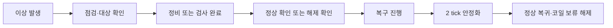

# 이상상황 조치·복귀와 부품 내구도

기존 진동·저압·출측 정체 3종에 우선 후보 4종을 추가했다. 실시간 화면에서 시나리오를 선택하면 원인 설비가 선택되고, 설비 상세 아래에 부품 내구도가 표시된다. 시연 제어 아래의 복구 흐름에서 순서대로 **조치 완료 (모의)**를 누른 후 **복구 진행**을 누른다. 일시정지 중이면 재개해야 안정화 시간이 진행된다.

## 정상 복귀 조건

| 시나리오 | 점검 | 조치 | 정상 확인 | 영향 |
| --- | --- | --- | --- | --- |
| 감속기 과열 | 오일량·상태·냉각 점검 | 가정한 냉각 문제 정비 | `gr_brg_temp`가 구성의 정상 범위로 복귀 | 첫 활성 `drive` 설비와 연결된 이송 설비 |
| 유압유 과열 | 유면·냉각·밸브 점검 | 가정한 냉각 성능 복구 | `hpu_oil_temp` 정상화, 압력·유량 확인 | 첫 활성 `hydraulic_supply` 설비와 연결 설비 |
| 감속기 누유 | 누유 위치·오일 상태 확인 | 가정한 씰 손상 정비·오일량 복구 | 모의 `gr_oil_leak=0` | 첫 활성 `drive` 설비와 연결된 이송 설비 |
| 영향 코일 검사·보류 | 보류 대상 코일 ID 확인 | 검사·필요 조치 및 재검사 합격 기록 | 보류 해제 가능 여부 확인 | 선택 시 라인 내 코일 전체를 영향 대상으로 가정 |

서버가 조치 순서를 검증한다. 미완료 조치가 있으면 복귀 요청을 거부하고, 진행 중인 새 시나리오를 다른 시나리오로 바꾸어 우회할 수 없다. 새 실행은 시연 초기화이므로 모든 조치·부품 상태를 초기화한다. 기존 3종의 간단 복귀 방식은 유지한다.

코일 보류 시 설비의 `fault_level`은 정상이다. 코일은 `quality_status=hold`인 동안 이동·배출되지 않으며 복귀 완료 후 `released`가 된다. 검사 실패·재작업 분기나 실제 승인자 권한 관리는 이번 범위에 포함하지 않았다.

**조치 버튼은 실제 정비나 센서 판정이 아니라 모의 완료 기록이다.** 마지막 정상 확인 조치가 합성 신호를 정상 범위로 되돌린다. 냉각의 실제 동특성이나 물리적 정비 성공을 계산하지 않는다. 온도 85/78, 2 tick 등은 시연 설정이며 제조사 임계값·현장 재가동 조건이 아니다.

## 부품 내구도

- 감속기: 베어링, 냉각 계통, 오일 씰
- 유압장치: 유압유 상태, 냉각 계통, 펌프 씰
- 롤러: 롤러 베어링
- 컨베이어: 이송 벨트, 구동 베어링

화면에는 모의 건전도(%), 누적 운전시간(h), 정비 횟수·최근 정비 시각을 표시한다. 해당 설비가 운전 중일 때만 1초당 0.001%p 감소한다. 70% 이상은 양호, 40~70% 미만은 주의, 40% 미만은 점검 필요로 표시한다. 이는 제조사 기준이 아닌 설명용 시연 분류다.

새 과열 시나리오는 해당 냉각 계통을 최대 35%, 누유 시나리오는 해당 씰을 최대 25%로 낮춘다. 정비 조치 완료 시 그 부품만 95%로 회복하고 누적 운전시간은 보존한다. 건전도 자체가 새로운 고장을 자동 발생시키지는 않는다. **잔여수명·교체 주기 예측이나 실측 상태 진단이 아니다.**

## 기록·호환성

- `/api/control`의 `recovery_action` 명령에 `action_id`를 전달한다.
- 스냅샷의 `recovery`, `components`, 코일의 `quality_status`를 저장해 기록 재생에서도 당시 상태를 보여준다.
- 조치 기록은 다음 운전 tick에서 저장된다. 일시정지 중 조치 후에는 재개해야 기록이 영속화된다.
- 모델 관측 어댑터에는 조치 정답을 포함한 `recovery`와 모의 내구도 `components`를 추가하지 않았다.
- 과거 스냅샷에 해당 필드가 없으면 기록 없음으로 표시한다.
- 저장된 `catalog/baseline` 구성은 서버 재시작 시 새 실행에만 4종을 보충한다. 과거 실행의 구성은 수정하지 않는다. 사용자 업로드 구성은 자동 변경하지 않는다.

## 근거

- [SEW‑EURODRIVE 고장 진단표](https://download.sew-eurodrive.com/download/html/31981496/en-EN/25440305419.html): 온도 상승·누유의 점검 후보.
- [Parker HY29-0035-M1/UK](https://www.parker.com/content/dam/Parker-com/Literature/PMDE/Service_Manuals/Vane_Pumps/HY29-0035-UK.pdf), 인쇄 36쪽: 비정상 발열 진단.
- [SAP Hold/Release](https://learning.sap.com/courses/configuring-sap-digital-manufacturing-for-execution-basic-data-and-configuration/controlling-production-buyoff-hold-release-): 제품 보류·해제 업무.

설비 연결 관계와 조치 순서·정비 결과는 프로젝트의 합성 설계다. 원인 후보 중 냉각 문제·씰 손상을 시연용으로 선택했으며, 관측 증상만으로 실제 원인을 확정한다는 의미가 아니다.
