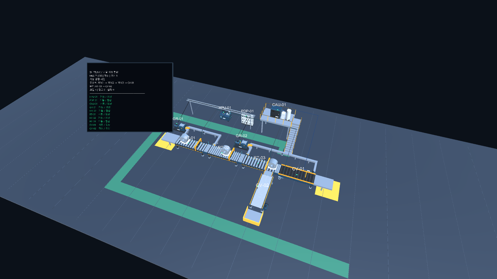

# 가상 공장 배치 개선 검증

사용자가 요청한 배치 분석의 7개 문제를 우선순위에 따라 수정했다. 현장 도면이 없는 합성 MES 시연 범위이며, 아래 치수는 실제 설비 치수가 아니다.

## 변경

1. HPU/PDP/CAU/GR 프리팹의 2.4배 확대를 제거했다. RT/CV만 기존 4.8m 앵커 간격으로 정규화한다. 기존 프리팹도 배율이 잘못됐으면 갱신한다.
2. HPU/PDP는 Z=8에 배치했다. GR은 담당 롤러의 입력측으로 옮겨 긴 전달축이 감속기 본체를 가로지르는 경로를 피했다.
3. CAU 바닥 높이 3.2m에 폭 4.8m, 깊이 2.8m 플랫폼을 설치했다. 계단 16단, 착지부와 난간을 추가했다.
4. 연결부 생성에서 `relations`와 `branches`를 합치고 중복을 제거한다. RT-03→CV-02 슈트는 별도 스크랩 출력 앵커와 CV-02 입력 앵커를 연결한다.
5. 구동축에 덮개·지지대를 추가하고 대상별 전달 경로를 분리했다. 유압 공급·회수는 2.8m, 전력 케이블은 3.1m 높이의 경로를 사용한다. 전력 트레이 길이는 공급 대상의 좌표 범위에서 계산한다.
6. MES 소재 진행은 `rt_speed`/`cv_speed`의 m/min 값을 4.8m 이송 길이에 적용한다. Unity 소재 이동도 good 품질의 같은 속도를 사용한다. 0/음수/비유한 값 또는 Unity의 누락·불량 품질에서는 임의 이동하지 않는다. 속도 신호가 없는 기존 MES 구성은 체류시간 방식을 유지한다.
7. 보행·정비 통로와 연결 통로, CAU 계단 진입로, 투입·반출 대기 구역과 이송 테이블, 스크랩 수거함을 추가했다. 수거함은 보행 통로 밖에 둔다.

## RED → GREEN

- RED 체크포인트: `976dff3` (`test: reproduce factory scale clearance branch and speed defects`).
- `python -B -m unittest tests.test_factory_transport -v`: 변경 전 속도 계산과 0/음수/NaN/Infinity 정지 조건에서 5개 실패를 재현했다. 변경 후 3개 테스트 통과.
- Unity `FactoryLayoutChecks.Run`: 변경 전 네이티브 배율, HPU/PDP·PDP/CAU 간섭, CAU 받침, 계단·난간, 스크랩 연결, 구역, 전력 경로와 소재 속도 검사 실패를 재현했다.
- 변경 후 같은 Unity 검사에서 배율, 설비 10대의 외곽 상자 45쌍, CAU 받침, 스크랩 연결, 소재 속도와 구역 검사를 통과했다.
- 저장된 렌더를 확인한 뒤 수거함과 보행 통로를 분리하고, 정비 통로와 계단 진입로를 연결했다.
- 추가 Unity 검사에서 유압·회수·전력·공압 선분과 연결 대상 외 설비의 외곽 상자 간 관통이 없고, 5개 통로·진입 구역의 평면 범위가 설비와 겹치지 않음을 확인했다.
- 최종 `FactoryLayoutChecks.Run`: **204개 조건 PASS, FAIL 0**. `FactoryMotionChecks.Run`도 PASS로 기존 롤러 수·회전·소재 객체 유지·대기·심각 고장·단절 정지를 확인했다.



## 실행한 검증

Python 3.12, 기존 `.test-deps` 환경에서 실행했다. 기본 Python 3.14와 기존 cp312 바이너리 의존성은 맞지 않아 기존 3.12 실행 파일을 사용했다. Unity는 설치된 6000.3.12f1로 실행했다.

```powershell
$env:PYTHONPATH = '.test-deps'
$factoryTests = (Get-ChildItem tests -Filter 'test_mes_*.py').FullName
& 'C:/Users/hyjuy/AppData/Local/Programs/Python/Python312/python.exe' -B -m coverage run --branch --source=shiftlink.mes.engine --data-file=tmp/factory-transport.coverage -m pytest @factoryTests tests/test_factory_transport.py tests/test_unity_mes.py tests/test_communication_integration.py -q
```

결과: **333 passed**. MES 엔진 분기 포함 커버리지 **94%**. Unity C# 커버리지 비율은 측정하지 않았다.

기존 센서 주입 검사 중 CV 적재율은 속도 기반 이송으로 정상 컨베이어가 이미 가득 찰 수 있었다. 해당 검사는 정상 범위 강제 대신 주입 전 적재율과 비교하여 다른 설비에 고장값이 주입되지 않았음을 검사하도록 수정했다.

`python -B scripts/check_unity_live.py`: **unity_exit_code=0**, MES sequence 12, PDA 선택 EQ-0004. 실제 Play Mode에서 임시 MES/PDA HTTP 연결과 상태 갱신을 확인했다. 실제 Jetson 서버에 제어 명령을 보내지 않았다.

Unity 로그·결과·렌더는 Git 제외 폴더 `unity/ShiftLinkFactory/Checks/`의 `layout-red.log`, `layout-green.log`, `layout-result.txt`, `layout-factory.png`, `live-check.json`에 있다.

## 한계

외곽 상자 검사는 정밀 메시·하중·기계 전달 검증을 대체하지 않는다. 플랫폼·기어 분배·받침·운반 테이블·통로는 시연용 형상이다. 크레인/지게차 운행, 절단과 스크랩 판정, 실제 기어비, 유압 손실, 시설 안전기준 적합성은 구현하거나 인증하지 않았다. 기존 스크랩 분기 데이터의 연결 형상을 수정했으며 MES에 임의의 불량 판정이나 절단 이벤트를 추가하지 않았다.
