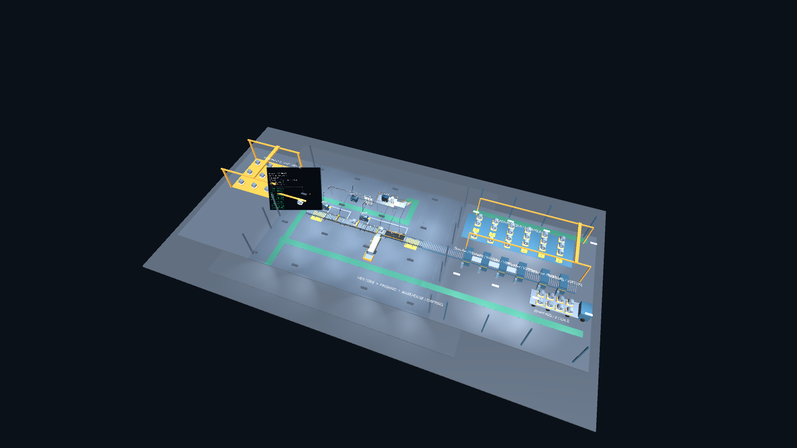
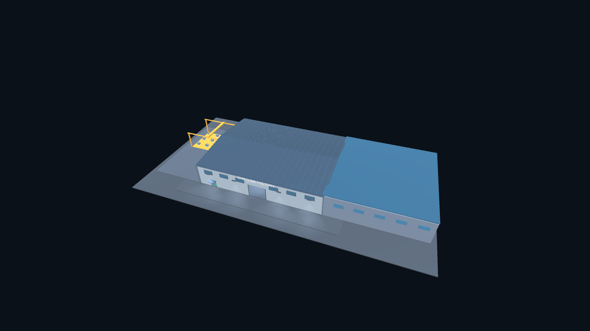

# 가상 공정 확장과 코일 반출·적재

요청에 따라 MES 공정 뒤에 가상 풀림·교정·슬리팅·재권취·검사·포장 라인을 연결했다. 32×34m 후단 생산동과 20×34m 원자재 야드 바닥을 추가했다. 기존 생산동과 후단 생산동의 실내 면적은 합계 2,584m²이며, 전체 부지는 100×54m이다. 후단 조명 8개, 원자재 크레인과 투입 장치, 보관대 24칸, 출하 트럭 8칸을 구성했다.

MES 말단 설비에서 사라진 코일은 운전 중인 스냅샷에 한해 반출로 추정하여 동일 객체·코일 이름을 후단으로 넘긴다. 중간 설비에서 사라진 소재는 반출로 처리하지 않는다. 풀림~재권취 구간에서는 이송 코일을 숨기고 강판 스트립과 권취 모델로 표현한다. 실제 절단·재권취의 물성이나 새로운 코일 번호 생성은 모델링하지 않는다.

후단은 MES 미등록 가상 공정이며 이동 속도는 2m/s로 표시한다. 원자재 투입 장치도 독립된 가상 시연으로 기존 MES 투입량을 변경하지 않는다. 보관과 출하 재고는 현재 Unity 세션에만 존재하며, 연결 해제·새 운전·구성 변경 때 비운다. 실제 MES 재고 API나 출하 지시를 전송하지 않는다.

## 사용

- `View factory interior`로 내부 공정을 본다.
- 기본 반출 목적지는 보관장이다. `Send next finished coils to truck`을 선택하면 이후 반출 코일을 트럭에 적재한다.
- `Load stored coils`로 보관 코일을 빈 트럭 슬롯에 보낸다.
- `Dispatch loaded truck`으로 트럭을 출하 문으로 이동시키고 다음 빈 트럭을 복귀시킨다.
- 트럭이 가득 차면 보관장으로 전환한다. 보관장도 가득 차면 코일을 대기시키며 공간이 생기면 다시 이동한다.
- MES 일시정지·연결 해제·심각 고장에서는 후단 이동도 정지한다.

## TDD 증거

- RED 체크포인트 `1e06c6f`: `FactoryLogisticsChecks.Run`에서 `FAIL: complete virtual finishing and shipping line installed`를 확인했다 (`Checks/logistics-red.log`).
- GREEN: `FactoryLogisticsChecks.Run`으로 동일 코일 객체 보존, 후단 경유 보관, 일시정지, 보관→트럭 이동, 트럭 만재 전환, 출하·빈 차량 복귀, 보관장 24칸 만재 시 무손실 대기 및 공간 확보 후 재개를 확인한다.
- 형상 검증은 후단 통로의 1.5m 폭과 2.2m 높이 공간 및 기존 통로 5개와 보관장 접근 통로를 검사한다. 투입 장치의 전체 24초 이동 주기 동안 간섭도 검사한다.
- 기존 `FactoryLayoutChecks.Run`과 실제 MES/PDA HTTP Play Mode 확인을 함께 실행한다. 상세 최종 결과는 아래에 기록한다.
- Unity C# 커버리지 비율은 측정하지 않았다. 실제 재고 영속성, 생산량, 물성, 공정 설계 및 산업 안전 기준의 인증은 이 가상 시연의 범위 밖이다.

최종 결과: `FactoryLogisticsChecks.Run` **919 PASS / FAIL 0** (`Checks/logistics-green.log`, `Checks/logistics-result.txt`), `FactoryLayoutChecks.Run` **518 PASS / FAIL 0** (`Checks/campus-layout-green.log`), `tests.test_factory_transport` **3 PASS**, `git diff --check` PASS. `scripts/check_unity_live.py`는 **Unity exit 0 / MES sequence 14 / PDA EQ-0004**로 통과했다. 최종 Unity 렌더를 직접 열어 내부·외관을 확인했다. 코일 이송은 기존 적재물 위 4m 높이를 거쳐 목표 슬롯 위에서 내려놓는다.

