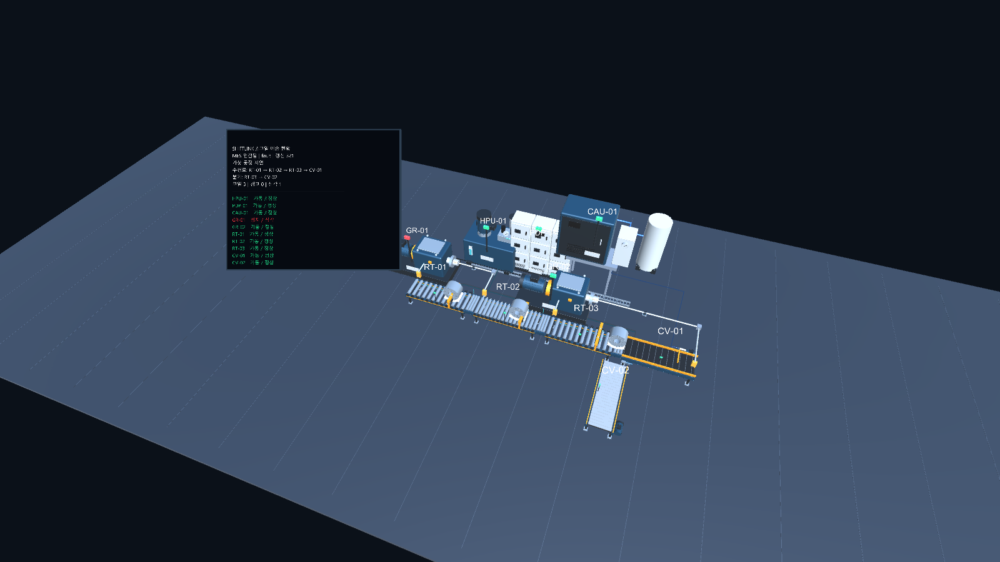
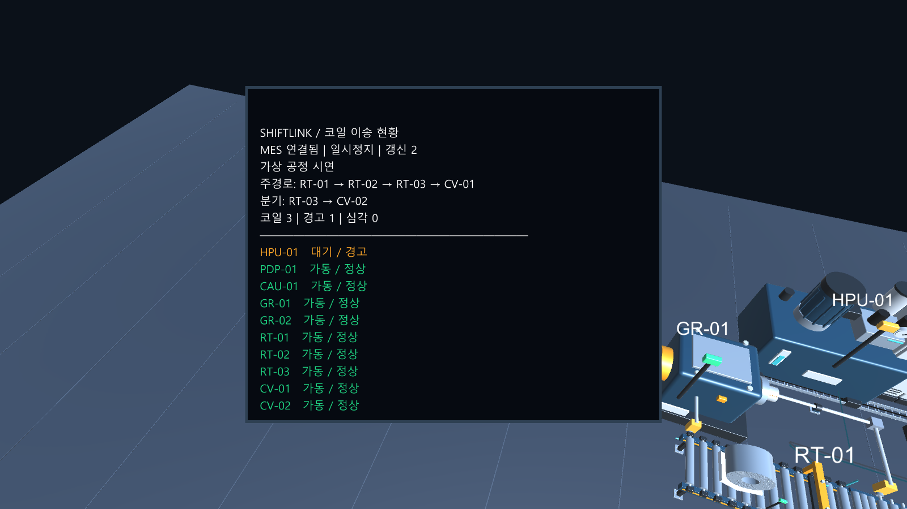

# Unity 공장 · MES/PDA 연동 PR 검증

검증일: 2026-10-06. 기준: origin/main에서 분리한 feat/unity-factory-mes-pda-20261006.
기존 작업 폴더의 변경과 인덱스는 유지하고, Unity 실행에 필요한 코드·FBX·Prefab·메타데이터를 별도 폴더에 모아 검증했다.

## 변경 범위

- Unity 6000.3.12f1 프로젝트와 기본 Factory 장면.
- MES 기준정보의 장비 10대와 6종 모델, 정상 소재 경로 및 분기 표시.
- MES 스냅샷의 장비 상태, 코일 ID/위치와 good 품질 속도 신호에 따른 표시·운동.
- 공장 안 한국어 현황 모니터와 확대창. 연결 끊김 때 이전 수치 숨김.
- PDA 최근 장비 인식 표시, Unity 장비 선택에서 PDA 수동 선택 화면으로 이동.
- 로컬 시연 실행 스크립트와 실제 Jetson 주소 지정. 개발 환경 HTTP 연결 허용.
- 구성·상태 입력 검증, PDA 링크, 장비 운동, 모니터, 실기기 연결 검증 코드.

## 별도 PR 폴더에서 실행한 검증

| 검증 | 실제 실행 | 결과 |
|---|---|---|
| 실제 HTTP MES/PDA 통신 | python -B -m unittest tests.test_unity_mes tests.test_communication_integration -v | 4개 PASS |
| PDA 장비 링크 및 기존 질의 계약 | node tests/unity_pda_link.cjs; node tests/mes_query_pda.cjs | PASS |
| JavaScript 문법 | node --check shiftlink/mes/web/pda.js | PASS |
| Unity 컴파일·장비·코일·선택·연결 끊김 | FactoryChecks.Run | exit 0 |
| 한국어 모니터 경로·분기·수치·경고·일시정지·연결 끊김 | FactoryMonitorChecks.Run | exit 0 |
| FBX 운동·대기·심각·연결 끊김·코일 유지 및 이동 | FactoryMotionChecks.Run | exit 0 |
| 실제 Jetson MES 연결 및 최신 sequence 표시 | FactoryJetsonChecks.Run | exit 0 |

Unity 검증에는 실제 Editor를 -batchmode -force-d3d11로 실행했다.
Jetson 검증 주소는 http://jetson-06:8000이며 제어 명령·인식 데이터를 전송하지 않았다.
PR 폴더 1차 결과:
PASS: Jetson MES http://jetson-06:8000; run=94661a4700624a9d9695d13e32af25c3; sequence=134; equipment=10; coils=4

## 화면

전체 화면은 실제 Jetson 상태, 모니터 근접 화면은 로컬 fixture의 경고/일시정지 상태를 렌더링했다.

## 실행

Jetson MES:
python -B scripts/run_unity_demo.py --mes-url http://jetson-06:8000

로컬 시연:
python -B scripts/run_unity_demo.py

## 한계

- 설비 배치·받침·기구 치수와 위치 보간은 합성 시연용 가정이다. 실제 현장 도면이나 압연 가공의 물리 검증을 수행한 것은 아니다.
- Pi 실물 카메라·PDA UI, 배포 빌드, 수치 코드 커버리지는 이번 검증에 포함하지 않았다.
- 실시간 검증 로그에 UnityEditor.Search.SearchDatabase의 ArgumentOutOfRangeException이 남지만, 공장 연결 검증은 통과했다.
- Unity 설치 파일, Library/Temp/UserSettings/Checks, 다운로드한 참고자료, 로컬 DB는 PR에 포함하지 않는다.

장면 중복 저장 정리 후 FactoryChecks.Run 및 FactoryJetsonChecks.Run을 다시 실행해 모두 exit 0을 확인했다.
기본 장면은 시작 객체만 남겨 173줄로 저장하며, 실제 MES 데이터로 런타임에 장비·모니터를 생성한다.
최종 실기기 결과: PASS: Jetson MES http://jetson-06:8000; run=94661a4700624a9d9695d13e32af25c3; sequence=321; equipment=10; coils=3
